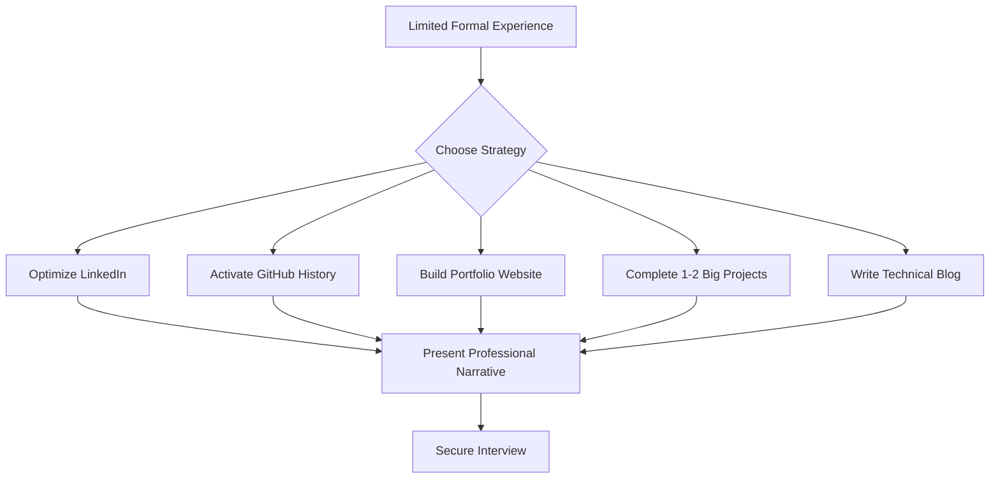

# Overcoming Lack of Experience in Job Applications

## Abstract

This document addresses a common concern among entry-level professionals and career changers: the perceived lack of sufficient experience when applying for technical positions. It outlines strategic approaches to demonstrate competence and initiative without relying solely on traditional employment history. The material covers mindset adjustment, alternative experience demonstration methods, and practical techniques for strengthening a professional profile.

---

## 1. Introduction

A frequent barrier encountered during job searches is the belief that one lacks the necessary experience to qualify for a desired position. This perception often discourages capable individuals from pursuing opportunities that could accelerate their professional growth. However, experience is not exclusively derived from formal employment at established companies. This document presents a systematic framework for identifying, creating, and showcasing relevant experience that resonates with recruiters and hiring managers.

---

## 2. The Mindset: Applying Strategically

### 2.1 The Principle of Upward Application

A fundamental error in job searching is applying exclusively to positions for which the candidate feels completely qualified. This approach limits professional growth and learning opportunities.

**Key Principle:** Apply to positions that appear challenging and slightly beyond current perceived capabilities.

A job description listing only familiar technologies and responsibilities offers minimal room for skill development. Conversely, a demanding role provides an environment conducive to accelerated learning and meaningful resume enhancement.

### 2.2 Understanding Job Postings

Job descriptions are frequently designed to filter applicant volume. Human resources personnel or non-technical recruiters often inflate requirements to discourage applications from candidates lacking confidence. Required years of experience may exceed actual job demands.

**Practical Implication:** A job posting perceived as unattainable should be evaluated as a potential opportunity rather than an automatic disqualification.

---

## 3. Demonstrating Experience Without Traditional Employment

Experience can be substantiated through multiple channels independent of prior job titles. The following five methods provide concrete evidence of capability.

### 3.1 LinkedIn Profile Optimization

A comprehensive LinkedIn profile serves as a dynamic record of professional activities. The following elements strengthen perceived experience:

- **Detailed Activity History:** Include all relevant engagements, even those outside the immediate target industry (e.g., management roles, teaching positions, entrepreneurial ventures). This demonstrates consistent initiative and skill accumulation.
- **Skill Endorsements:** Request endorsements from peers, mentors, or community members for key technical and professional skills.
- **Written Recommendations:** Secure brief testimonials attesting to work ethic, collaboration, or specific project contributions.
- **Content Publication:** Regularly share posts or articles related to the target field to demonstrate ongoing engagement and knowledge.

### 3.2 GitHub Activity and Open Source Contribution

GitHub functions as a verifiable portfolio of technical activity. It is relevant not only for software developers but also for designers, writers, and other roles where version-controlled collaboration is valuable.

**Key Strategies:**

1.  **Consistent Commit History:** A sustained history of commits (code uploads and modifications) signals active engagement. Daily contributions create a visible activity graph that recruiters may observe.

    ```python
    # Example: Simple Python script demonstrating a daily automation commit
    # This is a conceptual illustration of how automated activity might be generated
    import os
    from datetime import datetime

    def update_log_file():
        """
        Appends a timestamped entry to a log file.
        This action, when committed to Git, creates visible contribution history.
        """
        log_file_path = "activity_log.txt"
        current_time = datetime.now().strftime("%Y-%m-%d %H:%M:%S")
        
        with open(log_file_path, "a") as file:
            file.write(f"Engagement recorded: {current_time}\n")
        
        # After running, the file change is staged and committed to Git
        print("Log updated. Ready for commit.")

    if __name__ == "__main__":
        update_log_file()
    ```

2.  **Open Source Contributions:** Participating in open source projects demonstrates collaboration, version control proficiency, and the ability to work within an existing codebase. Contributions need not be extensive; updating documentation, fixing minor bugs, or adding small features are valuable starting points.

### 3.3 Personal Portfolio Website

A dedicated portfolio website serves as a centralized hub for professional presentation. It provides a platform to host and narrate project work.

**Recommended Approach:**

- **Simplicity:** The website need not be complex. A clean, navigable site built with basic HTML, CSS, and JavaScript is sufficient.
- **Content Focus:** The primary purpose is to showcase 1–2 significant projects (see Section 3.4) and provide context around their development.

### 3.4 High-Impact Projects (1–2 "Wow" Projects)

The most effective substitute for formal work experience is the completion of substantial, complex projects. Recruiters and hiring managers evaluate project depth and difficulty.

**Characteristics of an Effective Project:**

- **Complexity:** The project requires multiple technologies or components working in concert.
- **Duration:** The project represents sustained effort over days or weeks, not hours.
- **Problem-Solving:** The project addresses a non-trivial problem or implements a sophisticated feature set.

**Example: Full-Stack Web Application**

A comprehensive project description for a resume might include:

- **Frontend:** Developed using React.js with state management.
- **Backend:** RESTful API built with Node.js and Express.
- **Database:** PostgreSQL integration for secure user data storage, including hashed password management.
- **Authentication:** Session management with Redis caching.
- **Deployment:** Containerized deployment using Docker.

Listing such a project under "Experience" or "Projects" with a descriptive role title (e.g., "Lead Developer - Smart Brain Application") provides substantive talking points for interviews.

### 3.5 Technical Blogging

Maintaining a technical blog on platforms like Medium, Dev.to, or a personal site demonstrates communication skills and subject matter expertise.

**Implementation Steps:**

1.  Identify topics relevant to the target job or industry.
2.  Draft posts explaining concepts, documenting project learnings, or providing tutorials.
3.  Share posts on LinkedIn and other professional networks.

The existence of a blog focused on a required skill signals proactive learning and a capacity to articulate technical concepts.

---

## 4. Resume Strategy for Limited Formal Experience

### 4.1 Framing Non-Traditional Experience

Transferable skills from unrelated roles (e.g., customer service, management) are valuable. Communication, teamwork, and problem resolution are universally applicable competencies.

### 4.2 Managing Timelines

Avoid explicitly stating limited duration of experience (e.g., "6 months of coding"). This information is a disqualifier in initial resume screening, regardless of actual proficiency.

**Guidance:** Focus on describing capabilities and project outcomes. Be truthful if asked directly about timelines in an interview, but do not volunteer information that weakens the initial application.

### 4.3 Resume Objective

The sole purpose of a resume is to secure an interview. The document should present the candidate as a low-risk, high-potential individual with demonstrable experience in solving relevant problems.

---

## 5. Summary Flowchart

The following diagram illustrates the alternative pathways to demonstrating experience.



---

## 6. Conclusion

A lack of traditional employment history does not equate to a lack of experience. Initiative, demonstrated through self-directed projects, open source contributions, and professional content creation, provides compelling evidence of capability. By shifting focus from formal job titles to verifiable accomplishments, candidates can effectively position themselves for challenging roles that foster long-term career growth. The strategies outlined herein are designed to bridge the gap between potential and opportunity, ensuring that the initial screening barrier is overcome through proactive demonstration of relevant work.