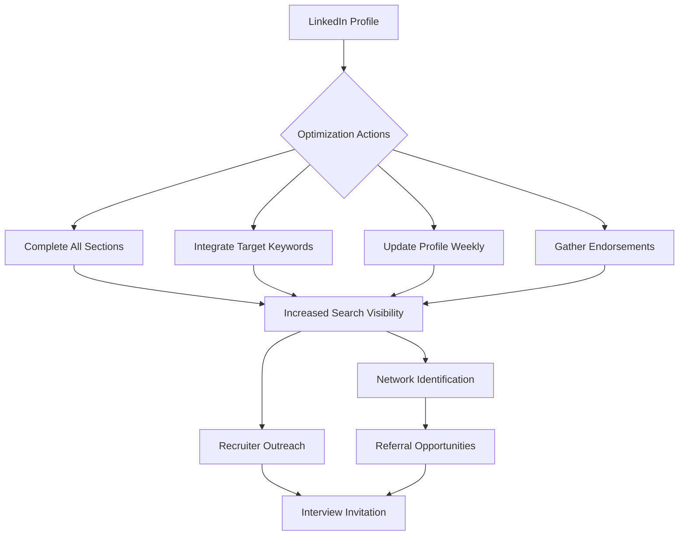

# Leveraging LinkedIn for Professional Advancement and Job Acquisition

## Abstract

LinkedIn has emerged as a pivotal platform within the contemporary job market, particularly for technology sector opportunities. This document provides a systematic guide to optimizing a LinkedIn profile, understanding recruiter search behavior, and utilizing the platform strategically to enhance visibility and secure interviews. Emphasis is placed on actionable techniques that differentiate candidates from the general applicant pool.

---

## 1. Introduction

LinkedIn functions as a dynamic, searchable professional repository that often supersedes the traditional static resume. It serves dual purposes: enabling candidates to apply directly for advertised positions and facilitating inbound interest from recruiters seeking specific skill sets. The effectiveness of the platform is contingent upon proper profile construction and ongoing maintenance. This document outlines a pragmatic approach to maximizing LinkedIn's utility for career development.

---

## 2. Assessing Platform Viability

The relevance of LinkedIn varies based on geographic location and industry sector. Prior to significant investment in profile development, a preliminary assessment is recommended.

**Procedure:**
1.  Utilize the LinkedIn job search functionality.
2.  Apply filters corresponding to the desired geographic location and job function.
3.  Evaluate the volume and quality of returned results.

A sufficient density of relevant job postings indicates that an optimized LinkedIn presence is a worthwhile investment of time and effort.

---

## 3. Core Strategies for LinkedIn Optimization

The following strategies constitute the foundation of an effective LinkedIn presence designed to attract recruiter attention and generate interview opportunities.

### 3.1 Profile Completeness and Resume Parity

A LinkedIn profile should mirror and, where possible, expand upon the content of a traditional resume.

- **Comprehensive Detail:** Populate all sections for which information is available, including work history, education, certifications, and volunteer experience.
- **Consistency:** Ensure alignment between the information presented on the LinkedIn profile and the corresponding resume document to maintain credibility.

### 3.2 Strategic Keyword Integration

Recruiters and talent acquisition specialists employ keyword searches to identify potential candidates. Profile content must be engineered to align with the search terms used for desired roles.

**Implementation:**
- Identify a set of core technical and professional competencies relevant to the target role (e.g., Python, React, MongoDB, Serverless Architecture, Firebase).
- Integrate these keywords naturally within the following sections:
    - Headline
    - About (Summary)
    - Experience Descriptions
    - Skills & Endorsements

By incorporating a diverse range of relevant technologies and methodologies, the probability of appearing in recruiter search results increases significantly.

### 3.3 Profile Update Frequency

LinkedIn algorithms and recruiter search tools often prioritize or highlight profiles that exhibit recent activity. A recently modified profile signals active engagement and potential availability for new opportunities.

**Tactical Approach:**
- Implement a weekly profile update cadence during active job search periods.
- Modifications need not be substantial; minor textual adjustments or the addition of a punctuation mark are sufficient to trigger the "updated profile" flag.
- This practice ensures visibility among recruiters specifically filtering for active candidates.

### 3.4 Endorsements and Recommendations

Social proof mechanisms within LinkedIn contribute to profile ranking and perceived credibility.

**Skills and Endorsements:**
- Curate a list of targeted skills that align with job search objectives.
- Solicit endorsements from professional connections to validate these competencies.
- A higher volume of endorsements can improve profile visibility in filtered searches.

**Recommendations:**
- Written recommendations from managers, colleagues, or academic supervisors provide qualitative validation of past performance.
- These testimonials, while not always read in entirety, contribute positively to the overall profile authority.

### 3.5 Networking and Referral Pathways

Direct application processes can be augmented by leveraging LinkedIn's network visualization capabilities to identify internal advocates.

**Process for Securing Referrals:**
1.  Identify a target organization (e.g., a specific technology company).
2.  Utilize the "People" tab within the company's LinkedIn page to view current employees.
3.  Filter results to identify:
    - Recruiters or Talent Acquisition personnel.
    - Employees in relevant departments.
4.  Analyze shared connections. A mutual contact provides a foundation for a warm introduction or a request for a referral.
5.  Engage professionally via connection requests or direct messaging (InMail), focusing on the value proposition and the context of the shared network.

This method transforms an unsolicited application into a vetted referral, significantly increasing the likelihood of interview selection.

---

## 4. Strategic Workflow Summary

The following diagram illustrates the integrated approach to using LinkedIn for job acquisition.

---

## 5. Conclusion

LinkedIn represents a critical component of a modern job search strategy, particularly within the technology sector. Its value proposition lies not merely in its function as a job board, but as a passive lead generation tool that operates continuously.

By adhering to the outlined practices—maintaining a complete and keyword-optimized profile, implementing regular updates, and strategically navigating professional networks—candidates can significantly enhance their discoverability. This methodology shifts the job search dynamic from a solely outbound effort to a hybrid model that includes inbound recruiter interest, thereby maximizing efficiency and improving the probability of securing interviews with minimal incremental effort.