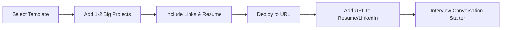

# The Role and Construction of a Professional Portfolio

## Abstract

A professional portfolio functions as a curated exhibition of significant projects and competencies, serving as a supplementary credential during the job application process. This document outlines the fundamental principles governing portfolio development, emphasizing efficiency over aesthetic complexity. The primary objective is to provide a publicly accessible reference point that substantiates technical capability and facilitates recruiter engagement.

---

## 1. Introduction

In the context of technical and creative job searches, a portfolio website serves as a centralized repository for demonstrating applied skills. Contrary to common misconceptions, the portfolio itself is not the primary evaluative artifact; rather, it is the vehicle through which substantive project work is conveyed. This document clarifies the strategic purpose of a portfolio and provides guidelines for its expedient creation.

---

## 2. Core Function of a Portfolio

### 2.1 Primary Purpose

The portfolio fulfills three essential functions:

1.  **Project Showcase:** It provides a dedicated space to present one or two high-impact projects (referred to as "big projects") that form the basis of interview discussions.
2.  **Online Presence Verification:** It offers a verifiable URL that recruiters can optionally visit to confirm a candidate's digital footprint.
3.  **Supplementary Information Hub:** It consolidates links to relevant professional profiles (e.g., GitHub, LinkedIn) and technical writing (e.g., blog posts).

### 2.2 Relationship to Interview Success

It is critical to note that the aesthetic or technical sophistication of the portfolio container rarely constitutes a deciding factor in hiring decisions for developers. The substantive content—the projects themselves—determines the portfolio's value. The portfolio exists to facilitate conversation about complex problem-solving and implementation details during interviews.

---

## 3. Portfolio Design and Content Guidelines

### 3.1 Recommended Content Structure

A standard and effective portfolio layout comprises the following minimal components:

- **About Section:** A concise introduction to the candidate.
- **Project Gallery:** A clean listing of one to two significant projects. Each entry should include:
    - Project title.
    - Brief description of functionality and technologies used.
    - Link to the live project or source code repository.
- **External Links:** Hyperlinks to GitHub profile, LinkedIn profile, and any relevant technical blog publications.
- **Resume Access:** Optionally, a downloadable PDF version of the current resume.

### 3.2 Design and Implementation Considerations

Given that the portfolio is a functional utility rather than a design masterpiece, the following approach is recommended:

- **Utilization of Templates:** Leverage freely available static site templates or portfolio generators to minimize development time.
- **Performance:** Ensure the website loads efficiently. Minimalist design with optimized assets contributes to a positive user experience.
- **Mobile Responsiveness:** Basic responsiveness ensures accessibility across devices.

### 3.3 Time Allocation Strategy

Significant time investment in custom portfolio design is discouraged for non-design roles. The primary development effort should be directed toward the creation and refinement of the projects housed within the portfolio.

**Guideline:** Allocate minimal time to the portfolio shell and maximum time to project depth and functionality.

---

## 4. Integration with Broader Job Search Strategy

### 4.1 Dissemination Channels

Once completed, the portfolio URL should be strategically distributed to increase visibility:

- **LinkedIn Profile:** Inclusion in the "Featured" section or contact information area.
- **Resume:** Placement in the header alongside contact details.
- **Community Platforms:** Sharing within professional or learning community boards (e.g., Zero to Mastery job board) for peer review and potential recruiter discovery.

### 4.2 Community Engagement

Participation in community channels dedicated to job hunting provides opportunities for:

- Receiving constructive feedback on portfolio presentation.
- Observing effective portfolio examples from peers.
- Accessing shared job leads and networking opportunities.

---

## 5. Summary Workflow

The following diagram illustrates the minimal viable process for portfolio development and its role in the interview pipeline.

---

## 6. Conclusion

A professional portfolio functions as a necessary but auxiliary component of the modern technical job application. Its construction should be approached with pragmatism: simplicity, speed, and clarity of content are paramount. The portfolio's true value is realized when the substantive projects it contains become the focal point of interview discussions, thereby demonstrating the candidate's practical expertise and problem-solving acumen. Excessive focus on the portfolio's superficial appearance detracts from the critical work of building the deep, complex projects that genuinely differentiate candidates in a competitive hiring landscape.