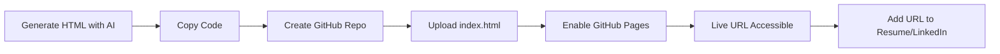

# Rapid Deployment of a Professional Portfolio Website Using GitHub Pages

## Abstract

This document provides a technical guide for establishing a minimal yet functional online portfolio website with minimal coding requirements. The methodology leverages freely available generative artificial intelligence tools for design generation and GitHub Pages for hosting. The process is designed to be accessible to individuals across all technical disciplines, enabling the swift creation of a professional online presence that can be iteratively improved as project work accumulates.

---

## 1. Introduction

A professional online portfolio serves as a critical differentiator in competitive job markets. It provides a verifiable and accessible demonstration of a candidate's work, initiative, and technical communication skills. Contrary to the perception that website creation necessitates advanced web development expertise, contemporary tools and platforms enable the rapid deployment of visually coherent portfolio sites.

This document outlines a streamlined workflow that combines AI-assisted design generation with free static site hosting via GitHub Pages. The objective is to establish a functional online presence within a short timeframe, which can subsequently be populated with substantive project content.

---

## 2. Strategic Rationale for a Minimal Portfolio

### 2.1 Perception and Professional Identity

The initial impression conveyed by a resume or application can be significantly augmented by the presence of a personal website. A portfolio signals proactivity and a commitment to professional development beyond mandatory requirements.

### 2.2 The Principle of Simplicity

Many distinguished professionals maintain straightforward, content-focused personal websites. The design of the portfolio container is secondary to the quality and depth of the projects it showcases. A clean, fast-loading, and mobile-responsive template suffices for the majority of technical roles.

### 2.3 Immediate Objectives

- Establish a publicly accessible URL that can be included on resumes, LinkedIn profiles, and email signatures.
- Create a placeholder structure capable of accommodating future project entries.
- Demonstrate familiarity with version control and basic web hosting concepts.

---

## 3. Step-by-Step Implementation Guide

The following procedure details the creation of a portfolio website using an AI text generation tool and GitHub Pages.

### 3.1 Generation of Website Template Using Artificial Intelligence

Modern large language models (LLMs) are capable of generating functional HTML, CSS, and JavaScript code based on natural language prompts. This approach circumvents the need for manual coding or design software.

**Procedure:**
1.  Access a generative AI platform (e.g., Claude, ChatGPT, or equivalent).
2.  Provide a prompt requesting a modern, responsive HTML portfolio template. A sample prompt structure is provided below:

    > "Generate a modern, responsive HTML portfolio website template with a clean design, subtle animations, and sections for an 'About Me' statement, project showcase, and contact links."

3.  Evaluate the generated output. If the initial design is unsatisfactory, refine the prompt with specific stylistic requests (e.g., "incorporate a card-based project layout," "use a minimalist color palette," "add hover effects to navigation links").
4.  Copy the complete HTML and embedded CSS/JavaScript code provided by the AI tool.

### 3.2 Hosting via GitHub Pages

GitHub Pages provides free static web hosting directly from a GitHub repository. The service supports HTML, CSS, and JavaScript files, making it ideal for portfolio deployment.

**Step 1: Create a GitHub Account and Repository**
- Navigate to `github.com` and create a free account if one does not exist.
- Create a new repository. The repository name must follow the convention `<username>.github.io`, where `<username>` is the exact GitHub username. This naming convention is mandatory for the root-level user site.
- Set repository visibility to **Public**.
- Optionally, initialize the repository with a `README.md` file.

**Step 2: Upload the Portfolio File**
- Within the repository, select **Add file** > **Create new file**.
- Name the file `index.html`. This is the default entry point for web servers.
- Paste the HTML code obtained from the AI tool into the file editor.
- Commit the changes directly to the `main` branch.

**Step 3: Configure GitHub Pages Deployment**
- Navigate to the repository **Settings** tab.
- Select **Pages** from the left sidebar menu.
- Under **Build and deployment**:
    - Set **Source** to `Deploy from a branch`.
    - Set **Branch** to `main` and directory to `/ (root)`.
    - Click **Save**.

**Step 4: Verification**
- GitHub initiates a build and deployment process. This typically completes within one to two minutes.
- Once deployment is successful, the URL `https://<username>.github.io` becomes accessible. A green notification banner confirming the site's live status will appear in the Pages settings menu.

### 3.3 Custom Domain Configuration (Optional)

Users who own a custom domain name (e.g., `firstnamelastname.com`) may configure it to point to the GitHub Pages site. This process involves:
1.  Adding the custom domain in the **Pages** settings under **Custom domain**.
2.  Configuring DNS records with the domain registrar to point to GitHub's servers. Detailed instructions are available in GitHub's official documentation.

---

## 4. Workflow Diagram

The following diagram illustrates the complete portfolio deployment pipeline.

---

## 5. Post-Deployment Actions

### 5.1 Integration with Professional Profiles

Upon successful deployment, the URL should be integrated into all professional communication channels:
- **Resume:** Include the URL in the header alongside contact information.
- **LinkedIn:** Add the website link to the **Contact Info** section or the **Featured** section.
- **Email Signature:** Append the URL to the signature block.

### 5.2 Community Feedback and Iteration

Sharing the portfolio within professional or learning communities (e.g., Discord servers, LinkedIn groups) facilitates constructive feedback. Observing variations generated by other individuals using similar AI prompts can inspire design improvements and content structuring.

### 5.3 Future Content Population

The portfolio template should be treated as a living document. As significant projects are completed, entries should be added to the project showcase section with:
- Descriptive titles.
- Concise summaries of technologies and problem domains.
- Links to live demos or source code repositories.

---

## 6. Conclusion

The establishment of a professional online portfolio does not require extensive web development expertise or significant time investment. By leveraging generative AI for design and GitHub Pages for hosting, individuals can create a credible and functional online presence within minutes. This foundational step distinguishes candidates in the application screening process and provides a scalable platform for showcasing future work. The portfolio serves as a cornerstone of a comprehensive job search strategy, shifting perception from that of a passive applicant to an engaged and proactive professional.