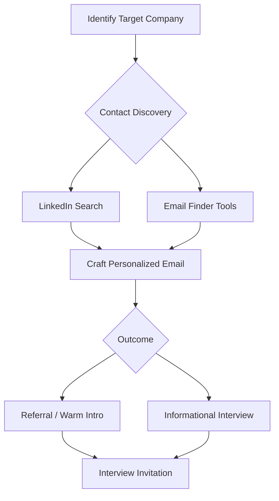

# Strategic Email Communication and Referral Networking for Job Acquisition

## Abstract

Traditional online job application channels exhibit limited efficacy relative to referral-based hiring mechanisms. This document examines the statistical significance of employee referrals in organizational recruitment and provides a systematic framework for initiating professional contact with key decision-makers. Methodologies for identifying appropriate contacts, crafting targeted communications, and circumventing conventional application barriers are detailed.

---

## 1. Introduction

The predominant approach to job seeking involves submission of applications through corporate career portals or aggregated job boards. While this method constitutes standard practice, empirical data indicates that it is suboptimal for securing interviews. A substantial proportion of organizational hires originate from internal referrals and professional networking. This document outlines a strategic alternative centered on direct email outreach and relationship cultivation to bypass initial screening filters and secure direct engagement with hiring stakeholders.

---

## 2. Statistical Context: The Efficacy of Referrals

Research conducted by Impact Group provides quantifiable insight into hiring channel effectiveness. Key findings include:

- **Referral Contribution:** Approximately 30% of all organizational hires are attributed to employee referrals.
- **Gender Distribution:** Among surveyed populations, 46% of men and 39% of women reported securing positions through networking channels.
- **Salary Correlation:** The effectiveness of networking as a job acquisition strategy increases proportionally with target compensation levels.

These figures underscore the critical advantage conferred by internal advocates within a target organization. The objective of the strategies outlined herein is to simulate or establish such advocacy even in the absence of pre-existing personal relationships.

---

## 3. Identification of Strategic Contacts

The initial phase involves identifying individuals within a target organization who possess the authority or influence to facilitate an interview process.

### 3.1 Leveraging LinkedIn for Contact Discovery

As detailed in the preceding documentation on LinkedIn optimization, the platform provides robust search and filtering capabilities.

**Procedure:**
1. Navigate to the target company's LinkedIn page.
2. Select the **People** tab to view current employees.
3. Apply filters to isolate relevant roles, including:
   - Technical Recruiters or Talent Acquisition Specialists.
   - Engineering Managers or Team Leads.
   - C-level Technology Executives (CTO, VP of Engineering).
4. Analyze the **Shared Connections** indicator to identify mutual contacts who may facilitate an introduction.

### 3.2 Email Discovery Tools

In scenarios where direct messaging via LinkedIn is not feasible or where email is preferred, specialized tools can extract or verify corporate email addresses.

| Tool Name | Primary Function |
| :--- | :--- |
| **Hunter.io** | Identifies email patterns associated with a corporate domain and verifies deliverability of specific addresses. |
| **Email Extractor Plugins** | Browser extensions that scrape visible email addresses from web pages and LinkedIn profiles. |

Utilizing these resources enables direct communication with gatekeepers and decision-makers.

---

## 4. Crafting Effective Outreach Communications

The content and framing of initial contact significantly influence response rates. The following templates and strategies are designed to elicit engagement.

### 4.1 The Referral Request Email

A concise, professional email requesting a brief conversation or referral. A proven structure, attributed to Patrick McKenzie, is as follows:

> **Subject:** Question regarding [Company Name] / [Specific Role or Technology]
>
> **Body:**
> Hi [Recipient Name],
>
> I hope this email finds you well. My name is [Your Name] and I'm a [Your Profession] with a background in [Brief Relevant Skill].
>
> I've been following [Company Name]'s work on [Specific Project or Product] and I'm impressed by [Specific Positive Observation]. I noticed on LinkedIn that you work on the [Team Name] team.
>
> I'm reaching out because I'm exploring opportunities at [Company Name]. Would you have 15 minutes in the coming week for a brief virtual coffee chat? I'd love to learn more about your experience working there and the engineering culture.
>
> If you're open to it, I would be grateful for your time.
>
> Best,
> [Your Name]
> [Link to Portfolio or LinkedIn]

**Rationale:** This message does not explicitly request a job. It solicits information and mentorship, which reduces pressure on the recipient and leverages the universal inclination to discuss one's own career journey.

### 4.2 Bypassing the Resume: Portfolio-First Approach

Instead of attaching a resume file in initial communications, direct the recipient to a personal portfolio website.

**Advantages:**
- **Visual Differentiation:** A portfolio demonstrates tangible work product, unlike a text-based resume.
- **Reduced Screening Bias:** Recruiters and managers are exposed to demonstrated capability before learning about tenure or formal titles.

The email should articulate a specific interest in the company's challenges and offer a concrete demonstration of relevant skills via the portfolio link.

### 4.3 Engaging Executive Leadership (Startup Context)

For smaller organizations or startups, direct outreach to the CEO or CTO can yield high response rates.

**Recommended Approach:**
- **Value Proposition:** Identify a technical problem the company may be facing (inferred from blog posts, product updates, or job descriptions).
- **Offer:** Propose to solve a small, defined problem or provide a technical analysis free of charge.
- **Exchange:** In return, request only an in-person or virtual interview.

**Example Language:** "I have experience with [Technology X]. I see you're scaling [Feature Y]. I'd be happy to draft a technical memo on how I'd approach [Specific Scaling Challenge]. You can keep the work. I'm just interested in learning more about the team."

### 4.4 Informational Interviews with Technical Staff

Targeting senior developers or engineering leads for "informational interviews" is an effective method for gaining internal visibility.

**Guidelines:**
- Do not ask for employment.
- Request a short meeting (in-person coffee or virtual call) to discuss their career trajectory and technical challenges at the organization.
- At the conclusion, if the conversation is positive, inquire: *"Is there anyone else on the team you think it would be valuable for me to speak with?"*

This technique often results in a warm introduction to a hiring manager.

---

## 5. Offline Networking Avenues

Digital outreach should be supplemented with in-person engagement where geographically feasible.

- **Industry Meetups:** Local technology or professional interest groups provide access to employees of target companies.
- **Hackathons:** Collaborative coding events offer opportunities to demonstrate skill in real-time to potential referrers.

---

## 6. Strategic Workflow Summary

The following diagram illustrates the referral-based interview acquisition pipeline.

---

## 7. Conclusion

The conventional job application process is characterized by high volume and low conversion rates. A strategic pivot toward referral acquisition and direct, personalized communication significantly enhances the probability of securing interviews. By utilizing tools for contact discovery, framing communications around learning and value contribution rather than solicitation, and leveraging employee incentive structures, candidates can bypass algorithmic screening and engage directly with human decision-makers. This methodology transforms the job search from a passive submission exercise into an active, targeted campaign for professional advancement.