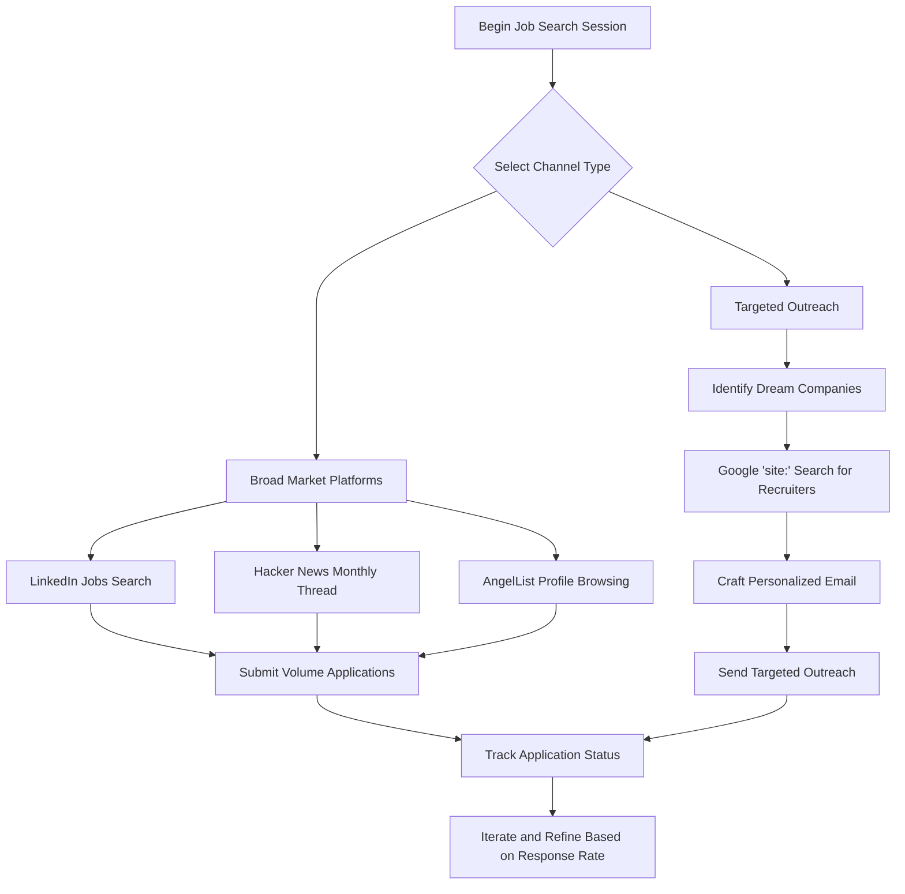

# Comprehensive Guide to Identifying and Accessing Employment Opportunities for Technical Professionals

## Abstract

The process of locating suitable employment opportunities within the technology sector requires a strategic understanding of the diverse platforms and methodologies available to candidates. This document provides an exhaustive examination of the primary channels through which software engineers, developers, and programmers can discover job openings. It evaluates the relative merits of generalist platforms, specialized communities, remote work aggregators, technical screening services, in-person networking events, and advanced search techniques. The objective is to equip candidates with a robust framework for optimizing their job search efforts, thereby increasing the probability of securing interviews with minimal wasted effort.

---

## 1. Introduction

### 1.1 The Nature of Technical Labor Markets

The contemporary technology labor market is characterized by a persistent and widespread demand for skilled engineering talent. Competencies in software development, systems architecture, data engineering, and related disciplines confer a significant advantage in the job acquisition process. Unlike many other professional domains, technical practitioners possess skills that are both quantifiable and demonstrable, enabling a degree of agency and geographic flexibility that is uncommon in other fields.

### 1.2 The Central Challenge

Despite favorable market conditions, the sheer volume of available job listings and recruitment platforms presents a distinct challenge: information overload and decision paralysis. A candidate who applies indiscriminately to hundreds of positions across dozens of websites may expend considerable effort with diminishing returns. The key to an efficient job search lies not in maximizing the quantity of applications submitted, but in strategically selecting channels that align with specific career objectives and personal preferences.

### 1.3 Document Objectives

This document aims to:

- Provide a detailed taxonomy of job discovery channels relevant to technical professionals.
- Analyze the strengths and limitations of each channel.
- Present actionable methodologies for targeted opportunity identification.
- Equip the reader with the knowledge necessary to allocate job search time and resources effectively.

---

## 2. Foundational Principle: Skill Development as a Multiplier

### 2.1 The Correlation Between Proficiency and Opportunity

A fundamental premise underlying any job search in the technology sector is that the quality and depth of one's technical skills directly influence the breadth of available opportunities. As an individual progresses from novice to intermediate and ultimately to expert levels of proficiency, the following phenomena occur:

- **Increased Inbound Interest:** Recruiters actively seek candidates with demonstrable expertise in specific, high-demand technologies.
- **Expanded Role Eligibility:** Senior and specialized positions, which often offer greater compensation and autonomy, become accessible.
- **Enhanced Negotiating Leverage:** Strong technical credentials provide a foundation for negotiating favorable terms of employment.

### 2.2 Continuous Improvement as a Strategic Imperative

Candidates should view skill enhancement as an ongoing, parallel process to active job seeking. Investment in learning new frameworks, contributing to open-source projects, or obtaining relevant certifications not only improves the resume but also increases the efficacy of the job search channels described below. A more skilled candidate will naturally convert a higher percentage of applications into interviews.

---

## 3. Taxonomy of Job Discovery Channels

The following sections provide a comprehensive analysis of the most effective platforms and methods for locating technical employment.

### 3.1 LinkedIn: The Professional Nexus

#### 3.1.1 Overview and Strategic Importance

LinkedIn serves as the preeminent professional networking and recruitment platform globally. For technical candidates, it fulfills a dual role: it is both a job aggregator with extensive filtering capabilities and a passive lead generation tool that attracts recruiter outreach. Given its widespread adoption among corporate and agency recruiters, LinkedIn should be considered a non-negotiable component of any comprehensive job search strategy, contingent only on geographic availability.

#### 3.1.2 Functional Capabilities for Job Seekers

- **Job Search Interface:** The platform provides a robust search engine allowing users to filter opportunities by job title, location, company, industry, experience level, and date posted.
- **Easy Apply Feature:** Many listings support one-click application submission using a stored LinkedIn profile, significantly reducing the time required per application.
- **Company Insights:** Candidates can research organizational culture, employee tenure, and recent hiring trends via company pages.
- **Connection Mapping:** The platform visualizes professional networks, enabling candidates to identify mutual connections who may facilitate warm introductions to hiring managers.

#### 3.1.3 Recruiter Search Dynamics

Recruiters utilize LinkedIn Recruiter, a specialized toolset, to source candidates. Their search parameters typically include:

- **Keyword Matches:** Technical terms such as "React," "Python," "AWS," or "Kubernetes."
- **Location Proximity:** Geographic radius searches for hybrid or on-site roles.
- **Profile Activity:** Recruiters often filter for profiles that have been recently updated, interpreting this as a signal of active job-seeking behavior.
- **Skill Endorsements and Recommendations:** Profiles with validated skills and written testimonials are prioritized in search results.

#### 3.1.4 Geographic Considerations

While LinkedIn enjoys near-universal adoption in North America, Europe, and parts of Asia, regional variations exist. Candidates in locations with lower LinkedIn penetration should verify the density of relevant job postings before committing significant time to profile optimization. This verification is performed by executing sample job searches with appropriate filters and evaluating the volume of returned results.

---

### 3.2 Hacker News: The Engineering Community Hub

#### 3.2.1 Platform Description

Hacker News is a social news aggregator operated by Y Combinator, a prominent startup accelerator. The platform's user base consists disproportionately of software engineers, founders, and venture capitalists. The commentary and content reflect the interests and concerns of the technology industry's technical core.

#### 3.2.2 The "Who is Hiring" Monthly Thread

On the first business day of each calendar month, an automated post titled "Who is Hiring?" (or "Who wants to be hired?") appears on Hacker News. This thread has become an institution within the engineering community.

**Characteristics of the Thread:**

- **Direct Company Participation:** Job listings are posted as comments by company representatives, typically engineers or technical founders, rather than HR personnel.
- **Transparency and Detail:** Listings often include specific technical stacks, salary ranges, equity components, and explicit remote work policies.
- **Startup and SMB Focus:** The majority of participating companies are early-stage startups, growth-stage technology firms, or small-to-medium-sized businesses with a strong engineering culture.
- **Global Reach:** While many listings originate from technology hubs such as San Francisco, New York, and London, remote positions open to international candidates are common.

#### 3.2.3 Strategic Utilization

Candidates should monitor the "Who is Hiring?" thread on a monthly basis. The thread can be located by navigating to `news.ycombinator.com` and searching for the exact phrase "Who is hiring?" or by visiting the "Ask" section and sorting by date.

**Best Practices:**

- Read the thread in its entirety, as many compelling opportunities are buried deep within the comments.
- Note the application instructions provided by each poster. Some may request a direct email, while others provide a link to an applicant tracking system.
- Tailor applications to reflect the specific technical stack and company culture described in the listing.

---

### 3.3 AngelList (Wellfound): The Startup Ecosystem Marketplace

#### 3.3.1 Platform Specialization

AngelList, recently rebranded as Wellfound, is a platform explicitly designed to connect talent with startup companies. It differentiates itself from generalist job boards through a focus on transparency regarding compensation and equity, as well as a streamlined profile-based application process.

#### 3.3.2 Key Features for Job Seekers

- **Compensation Transparency:** Job listings routinely disclose salary bands and equity grant percentages, enabling candidates to make informed comparisons across opportunities.
- **Profile-Driven Applications:** Candidates create a comprehensive profile detailing their skills, work history, and project portfolio. Startups can then discover candidates through search or invite them to apply for specific roles.
- **Direct Founder Engagement:** In smaller startups, initial outreach may originate directly from founders or C-level executives, accelerating the hiring timeline.
- **Remote and International Listings:** A significant proportion of listed roles are designated as remote-friendly, often with explicit time zone overlap requirements.

#### 3.3.3 Suitability Assessment

AngelList is particularly well-suited for:

- Candidates specifically seeking employment at venture-backed, high-growth startups.
- Individuals interested in roles with significant equity upside potential.
- Job seekers who prefer a transparent, data-rich application environment.

---

### 3.4 Remote-Specific Job Aggregators

#### 3.4.1 The Rise of Distributed Work

The COVID-19 pandemic accelerated a pre-existing trend toward distributed and remote work arrangements. For technical professionals, this shift has decoupled employment from geographic proximity to corporate headquarters. Remote-specific job boards have emerged to curate and validate opportunities that are explicitly open to candidates regardless of physical location.

#### 3.4.2 Value Proposition for Candidates

- **Geographic Arbitrage:** Candidates residing in regions with lower costs of living can access compensation packages benchmarked to major technology hubs.
- **Expanded Opportunity Pool:** The candidate is no longer limited to companies with a physical presence in their city or country.
- **Flexibility and Autonomy:** Remote roles often entail greater control over work schedules and environments.

#### 3.4.3 Representative Platforms

While this document does not endorse specific commercial services, several well-regarded remote job boards exist, including services that aggregate listings from across the web and those that manually curate and verify remote positions. Candidates are advised to explore multiple such platforms to maximize coverage.

#### 3.4.4 Considerations for Remote Candidates

- **Time Zone Overlap:** Many remote positions require a minimum number of overlapping working hours with team members in other time zones.
- **Communication Skills:** Remote work places a premium on written communication and asynchronous collaboration.
- **Self-Discipline:** Success in a remote environment requires robust time management and the ability to work independently.

---

### 3.5 Technical Screening and Talent Matching Platforms

#### 3.5.1 The Reverse Application Model

A distinct category of platforms operates on a reverse application model. Instead of candidates applying to individual companies, candidates complete standardized technical assessments. The platform then evaluates performance and presents vetted candidate profiles to partner companies seeking specific skill sets.

#### 3.5.2 Operational Mechanism

1.  **Candidate Registration:** The candidate creates an account and provides basic professional information.
2.  **Skill Assessment:** The candidate completes one or more timed coding challenges, algorithmic problems, or domain-specific quizzes.
3.  **Profile Generation:** The platform assigns a score or rank based on assessment performance and creates a profile summarizing technical competencies.
4.  **Employer Matching:** Partner companies search the platform's candidate database or receive algorithmic recommendations. Interested employers then initiate contact with candidates.

#### 3.5.3 Advantages and Disadvantages

| Aspect | Evaluation |
| :--- | :--- |
| **Advantage** | Access to reputable employers who value demonstrated technical ability over pedigree. |
| **Advantage** | Reduction of initial application overhead once the assessment is completed. |
| **Disadvantage** | Significant upfront time investment required to complete assessments. |
| **Disadvantage** | Performance under timed, algorithmic conditions may not accurately reflect day-to-day engineering capability. |

#### 3.5.4 Suitability Recommendation

This channel is most appropriate for candidates who:

- Perform confidently in standardized testing environments.
- Possess strong algorithmic and data structure fundamentals.
- Are willing to invest a substantial block of time in a single assessment with the expectation of multiple employer inquiries.

---

### 3.6 In-Person and Virtual Networking Events

#### 3.6.1 The Role of Community Engagement

Local and virtual meetups, conferences, and hackathons provide opportunities for direct, interpersonal engagement with practicing engineers and hiring managers. While digital applications are scalable, a personal introduction or referral remains the most effective path to an interview.

#### 3.6.2 Types of Networking Venues

| Venue Type | Description | Typical Attendees |
| :--- | :--- | :--- |
| **Technology Meetups** | Regular gatherings focused on a specific technology (e.g., Python, JavaScript, DevOps). | Practicing engineers, local tech enthusiasts, occasional recruiters. |
| **Hackathons** | Time-bound collaborative coding events, often sponsored by companies seeking talent. | Students, early-career developers, startup employees. |
| **Industry Conferences** | Larger, multi-day events featuring keynotes, workshops, and career fairs. | Professionals across experience levels, corporate recruiters. |

#### 3.6.3 Strategic Networking Objectives

- **Information Gathering:** Learn about unadvertised job openings, team culture, and technical challenges at specific companies.
- **Referral Acquisition:** Establish a sufficient rapport with an attendee such that they are willing to submit an internal referral on the candidate's behalf.
- **Market Intelligence:** Understand which technologies and skills are currently in demand within the local ecosystem.

#### 3.6.4 Personal Suitability Considerations

Networking efficacy varies significantly based on individual personality and communication style. Some individuals thrive in social environments and derive genuine satisfaction from building professional relationships. Others may find structured networking events to be inauthentic or draining. Candidates should assess their own comfort level and, if networking is not a natural fit, focus their efforts on the digital channels described elsewhere in this document.

---

### 3.7 Advanced Search Operators for Targeted Recruiter Identification

#### 3.7.1 The Principle of Direct Targeting

Applying to a job posting via a company's career portal places the candidate in a queue with potentially hundreds of other applicants. A more direct approach involves identifying the specific recruiter or hiring manager responsible for the desired role and initiating personalized communication.

#### 3.7.2 Search Engine Query Construction

The `site:` operator restricts search engine results to a specified domain. This operator, combined with relevant keywords, enables the identification of individuals associated with a target company.

**Syntax Pattern:**
```
site:linkedin.com/in "Company Name" "Recruiter" OR "Talent Acquisition" OR "Technical Recruiter"
```

**Practical Example:**
To identify recruiters responsible for technical hiring at a hypothetical company named "TechCorp," the following Google search query would be executed:
```
site:linkedin.com/in "TechCorp" "Technical Recruiter" OR "University Recruiter"
```

#### 3.7.3 Interpretation of Results

The search engine will return a list of LinkedIn profile URLs belonging to individuals whose public profiles contain the specified company name and recruiter-related keywords. The candidate can then:

1.  Visit the identified LinkedIn profiles.
2.  Determine the most appropriate contact based on their stated focus area (e.g., University Recruiting, Senior Engineering Recruiting).
3.  Utilize the outreach strategies detailed in the separate documentation on Strategic Email Communication.

#### 3.7.4 Advantages of Targeted Outreach

- **Reduced Competition:** The candidate bypasses the high-volume online application funnel.
- **Personalization:** Communication can be tailored to the specific recruiter and their area of responsibility.
- **Memorability:** A direct, well-crafted email is more likely to be remembered than one application among hundreds in an applicant tracking system.

---

## 4. Quantitative Framework: The Probabilistic Nature of Job Hunting

### 4.1 Understanding Conversion Rates

The job search process, particularly when conducted through broad, impersonal channels, is governed by probabilistic outcomes. A commonly cited benchmark is that the conversion rate from unsolicited application to initial interview is approximately **2%** . This figure is an estimate and varies based on factors such as industry demand, candidate seniority, and resume quality. However, it serves as a useful heuristic for planning purposes.

### 4.2 Volume Application vs. Targeted Application

**Volume Application Strategy:**

- **Premise:** Given a low per-application conversion rate, securing an interview requires submitting a large number of applications.
- **Calculation:** At a 2% conversion rate, a candidate should anticipate submitting approximately 50 applications to generate a single interview opportunity.
- **Appropriate Context:** This approach is most applicable when the candidate's objective is broad market entry and they lack strong preferences regarding employer or specific role.

**Targeted Application Strategy:**

- **Premise:** Effort invested in personalized outreach to a smaller number of high-fit companies yields a significantly higher conversion rate.
- **Mechanism:** Activities include identifying specific recruiters, crafting tailored emails, and leveraging portfolio projects relevant to the company's domain.
- **Conversion Rate Impact:** While precise figures are elusive, personalized outreach can increase conversion rates to 10-20% or higher, depending on execution quality.

### 4.3 Strategic Implication

Candidates are advised to adopt a hybrid approach:

1.  **Maintain a Baseline of Volume Applications:** Submit applications to a curated set of job board listings to ensure a steady pipeline of potential opportunities.
2.  **Execute a Parallel Targeted Campaign:** Dedicate a portion of job search time to the high-effort, high-reward activities of identifying and contacting specific individuals at preferred companies.

This dual strategy mitigates the risk of over-indexing on either approach and maximizes the probability of securing interviews within a given timeframe.

---

## 5. Decision Framework and Workflow Integration

The following diagram illustrates a recommended workflow for integrating the various job discovery channels into a cohesive search strategy.



---

## 6. Summary and Concluding Remarks

### 6.1 Recapitulation of Key Resources

| Channel Category | Primary Platform(s) | Best Suited For |
| :--- | :--- | :--- |
| **Professional Networking** | LinkedIn | All technical candidates; broad market coverage. |
| **Engineering Community** | Hacker News | Startup and SMB roles; direct founder engagement. |
| **Startup Ecosystem** | AngelList (Wellfound) | Venture-backed startup roles with transparent compensation. |
| **Remote Opportunities** | Specialized Remote Job Boards | Candidates seeking geographic flexibility. |
| **Talent Matching** | Technical Screening Platforms | Candidates confident in standardized assessments. |
| **In-Person Engagement** | Local Meetups, Hackathons | Relationship-oriented candidates; referral acquisition. |
| **Direct Targeting** | Google Search with `site:` operator | High-value, targeted outreach to specific companies. |

### 6.2 Final Guidance

The technology job market, while robust, rewards strategic intentionality. Candidates who invest time in understanding the distinct characteristics of each job discovery channel and who allocate their efforts in alignment with their personal strengths and career objectives will consistently outperform those who apply indiscriminately. The ultimate goal is not merely to find any job, but to secure a position that provides a platform for sustained professional growth and fulfillment. By adopting the methodologies outlined in this document, the candidate positions themselves to navigate the job search landscape with clarity, efficiency, and a higher probability of success.