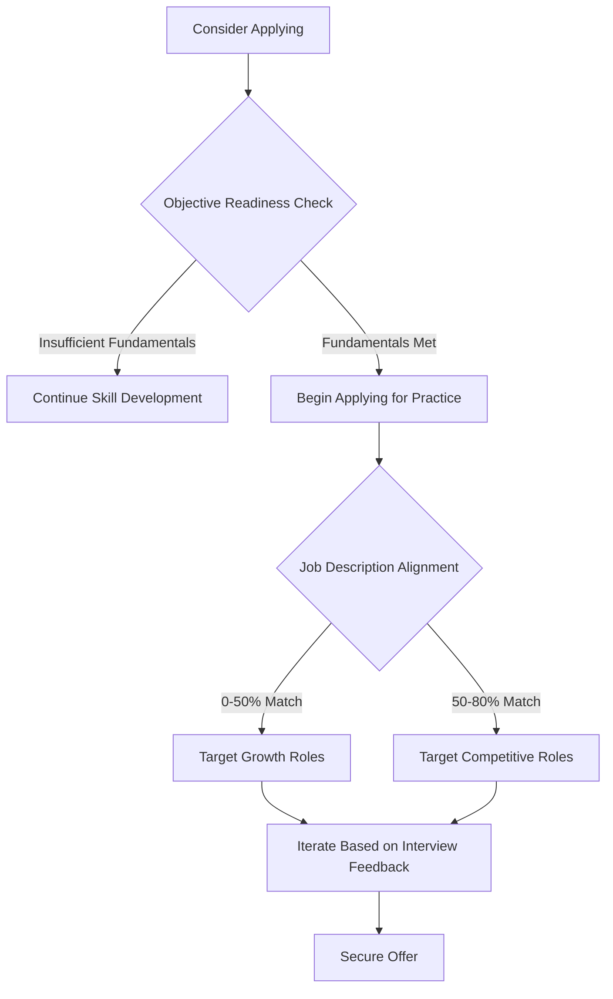

# Determining Optimal Timing for Job Application Initiation in Technical Fields

## Abstract

The question of when to commence job applications is a source of considerable anxiety for individuals entering the technology workforce. This document provides a structured analysis of the factors influencing application readiness, addressing both the psychological barriers associated with imposter syndrome and the objective skill thresholds necessary for competitive candidacy. It presents a dual framework: an immediate-action philosophy for interview practice and a competency-based checklist for assessing substantive preparedness. The objective is to guide candidates toward timely and strategic engagement with the job market.

---

## 1. Introduction

A pervasive concern among aspiring software engineers and developers is the determination of the appropriate moment to begin submitting job applications. This uncertainty is frequently exacerbated by the phenomenon of imposter syndrome, wherein individuals doubt their own competence and fear exposure as frauds despite possessing relevant skills. Compounding this internal doubt is the external perception of job descriptions, which often list extensive requirements that appear unattainable to newcomers.

This document addresses these concerns through a bifurcated response: a short-term, action-oriented perspective and a longer-term, competency-based assessment framework. The discussion aims to equip candidates with the clarity necessary to transition from perpetual preparation to active market participation.

---

## 2. The Short Answer: Commence Applications Immediately

### 2.1 Reframing the Interview as a Skill

The most direct response to the question of timing is to begin applying **now**. This recommendation is predicated on the understanding that interviewing is a discrete, learnable skill rather than a binary pass-or-fail event.

- **Skill Acquisition:** Proficiency in interviewing, like proficiency in coding, improves with deliberate practice. Each interaction with a recruiter or hiring manager provides valuable experiential data regarding question patterns, communication clarity, and personal presentation.
- **Desensitization:** Early and frequent interview attempts reduce the anxiety associated with high-stakes evaluations. The process becomes familiar, enabling the candidate to perform closer to their actual ability level.
- **Immediate Feedback Loop:** Rejections encountered early in the process are not terminal failures; they are diagnostic tools indicating areas for improvement in either technical knowledge or communication strategy.

### 2.2 The Inevitability of "No"

A complementary principle is the recognition that inaction guarantees a negative outcome. The adage "If you never ask, the answer is always no" applies directly to job seeking. Postponing applications until a state of perceived perfect readiness effectively removes the candidate from consideration for all current opportunities.

---

## 3. The Longer Answer: Assessing Foundational Readiness

While immediate application is advised for practice purposes, the pursuit of a successful outcome necessitates a baseline of technical competence. The long answer establishes the minimum viable criteria for applying to roles with a reasonable expectation of eventual success.

### 3.1 Deconstructing Job Descriptions

A significant barrier to application initiation is the interpretation of job postings as strict prerequisites rather than aspirational guidelines.

**Common Misconception:** Candidates believe they must satisfy every listed requirement and possess the stated number of years of experience to be considered.

**Reality of Recruitment Practice:**
- **Candidate Filtering Mechanism:** Job descriptions are often intentionally inflated by human resources departments to deter applications from individuals lacking confidence. This reduces the volume of applications requiring manual review.
- **Guideline Function:** The description outlines the anticipated scope of work and the technologies the team utilizes. It represents the problem space the candidate will operate within, not necessarily a checklist of prior accomplishments.
- **Growth Imperative:** A role for which the candidate meets 100% of the stated qualifications offers limited room for professional development. Candidates should target positions that include a subset of unfamiliar technologies or responsibilities to stimulate learning and career progression.

### 3.2 Objective Readiness Criteria

A candidate should possess a demonstrable foundation before expecting to convert applications into interviews. The following checklist serves as a pragmatic assessment tool.

#### 3.2.1 Foundational Computer Science Knowledge

- **Data Structures:** Working knowledge of fundamental structures including arrays, linked lists, stacks, queues, hash tables, trees, and graphs.
- **Algorithms:** Understanding of basic searching, sorting, and traversal algorithms, along with the ability to analyze time and space complexity using Big O notation.

#### 3.2.2 Domain-Specific Project Capability

- **Independent Construction:** The ability to conceive, architect, and build a functional application beyond the scope of a tutorial-driven "Hello World" example.
- **Problem-Solving Autonomy:** Demonstrated capacity to research solutions, debug errors, and integrate external libraries or APIs without step-by-step guidance.

#### 3.2.3 High-Impact Portfolio Projects (1-2 Substantial Works)

- **Complexity Threshold:** The candidate has completed one or two significant projects that integrate multiple technologies (e.g., a full-stack web application with a frontend framework, a RESTful API, and a persistent database).
- **Relevance to Target Role:** The technologies utilized in these projects align substantively with the requirements specified in the job descriptions being targeted.

### 3.3 The Holistic Evaluation of Candidates

It is essential to recognize that hiring decisions in technical fields are not determined solely by a ranked list of technical proficiencies. Once a candidate meets the minimum technical bar—the threshold at which they can contribute to the codebase with reasonable support—non-technical factors become decisive.

**Differentiating Factors Beyond Technical Baseline:**
- Communication clarity and conciseness.
- Demonstrated eagerness to learn and adapt.
- Cultural alignment with the team and organization.
- Evidence of initiative and self-direction (e.g., personal projects, open source contributions).

Candidates with less experience frequently secure offers over more seasoned competitors by excelling in these interpersonal and qualitative dimensions.

---

## 4. Readiness Assessment Framework

The following diagram illustrates the decision-making process for initiating job applications.

---

## 5. Summary and Recommendations

### 5.1 Key Takeaways

1.  **Do Not Wait for Perfect Readiness:** The ideal moment to begin applying is the present. Each interview, regardless of outcome, is a learning opportunity that refines a critical professional skill.
2.  **Interpret Job Descriptions Strategically:** View postings as directional guides rather than rigid barriers. A gap between current skills and stated requirements indicates an opportunity for growth.
3.  **Establish a Technical Foundation:** Ensure mastery of core computer science concepts and the completion of one or two substantive projects before expecting positive responses from employers.
4.  **Recognize the Holistic Nature of Hiring:** Technical ability is a gatekeeper; communication, attitude, and cultural fit are often the deciding factors.

### 5.2 Concluding Statement

The transition from learner to employed professional is accelerated by proactive engagement with the hiring ecosystem. By reframing interviews as a skill to be practiced and by maintaining a realistic assessment of one's own capabilities against objective criteria, candidates can overcome the paralysis induced by imposter syndrome. The optimal strategy is to begin applying immediately while simultaneously continuing to strengthen foundational knowledge and project portfolio depth.