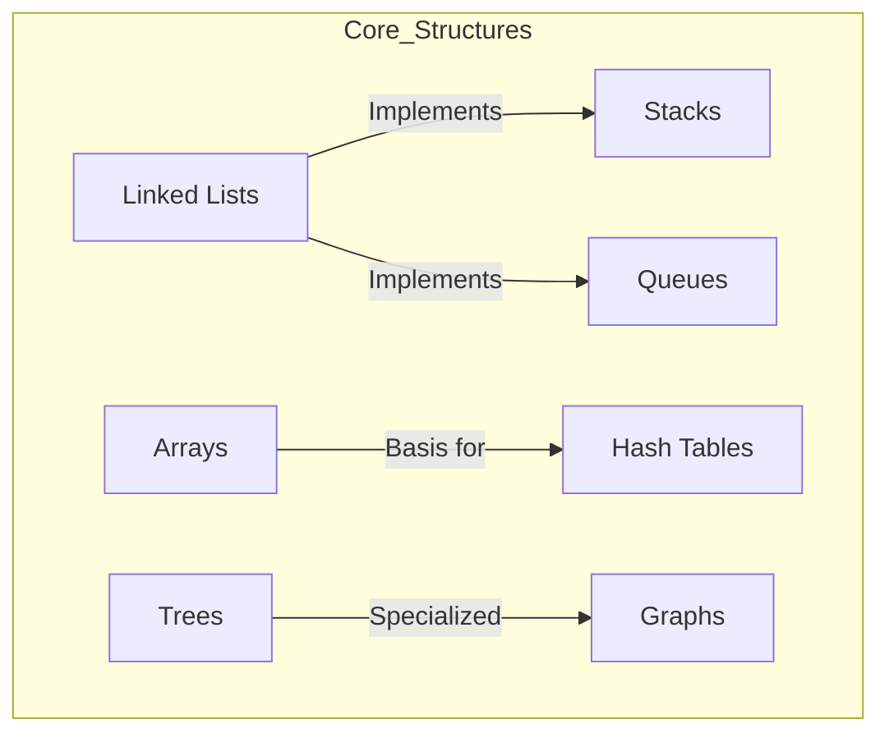

# Essential Data Structures for Technical Interviews

## 1. Introduction

The theoretical landscape of data structures is extensive, encompassing hundreds of specialized variants. However, for the purpose of technical interviews and the majority of practical software engineering tasks, only a select subset is consistently relevant. Mastery of these fundamental structures and the ability to articulate their appropriate use cases provides a significant competitive advantage.

## 2. Core Data Structures: The Essential Set

The following data structures represent approximately 90% of the structures encountered in algorithmic problem-solving and system design discussions. This curriculum focuses exclusively on this manageable yet powerful set.

### 2.1 Primary Structures

| Data Structure      | Description                                                                 |
| :------------------ | :-------------------------------------------------------------------------- |
| **Arrays**          | Contiguous block of memory storing elements accessible via index.            |
| **Linked Lists**    | Sequential collection of nodes where each node points to the next.           |
| **Stacks**          | Linear structure following Last-In-First-Out (LIFO) principle.               |
| **Queues**          | Linear structure following First-In-First-Out (FIFO) principle.              |
| **Hash Tables**     | Key-value pair mapping using hashing function for efficient lookup.          |
| **Trees**           | Hierarchical structure with a root node and child subtrees.                  |
| **Graphs**          | Set of vertices connected by edges representing relationships.               |

### 2.2 Hierarchical Relationships

Several of these structures are conceptually related or serve as foundational building blocks for others:

- **Linked Lists** form the underlying mechanism for implementing **Stacks** and **Queues**.
- **Trees** are specialized acyclic **Graphs**.
- **Hash Tables** are often built using **Arrays** combined with collision resolution mechanisms.

## 3. Language-Specific Availability

Different programming languages provide varying levels of native support for these data structures. It is important to distinguish between **primitive data types** and **structural data types**.

### 3.1 Primitive Data Types (Example: JavaScript)

Primitive types represent single values and are the atomic units stored within data structures.

- `number`
- `string`
- `boolean`
- `undefined`
- `null`

### 3.2 Built-in Data Structures Across Languages

The following table illustrates the native availability of common data structures across popular programming languages.

| Data Structure      | JavaScript       | Java             | Python           | C++ (STL)        |
| :------------------ | :--------------- | :--------------- | :--------------- | :--------------- |
| **Array**           | Yes (Dynamic)    | Yes (Fixed/ArrayList) | Yes (List)   | Yes (std::vector, std::array) |
| **Linked List**     | No (Buildable)   | Yes (LinkedList) | No (Buildable)   | Yes (std::list)  |
| **Stack**           | No (Buildable)   | Yes (Stack)      | Yes (List as Stack) | Yes (std::stack) |
| **Queue**           | No (Buildable)   | Yes (Queue)      | Yes (collections.deque) | Yes (std::queue) |
| **Hash Table**      | Yes (Object/Map) | Yes (HashMap)    | Yes (dict)       | Yes (std::unordered_map) |
| **Priority Queue**  | No (Buildable)   | Yes (PriorityQueue) | Yes (heapq)   | Yes (std::priority_queue) |

**Key Observation:**  
Even when a language does not provide a particular data structure natively, it invariably supplies the primitive types and base structures (such as arrays and objects) necessary to construct custom implementations.

## 4. Building Custom Data Structures

The absence of a built-in structure does not constitute a limitation. Software engineers frequently implement custom data structures tailored to specific problem constraints.

**Example:**  
JavaScript does not include a native **Stack** class. However, a stack can be readily implemented using an array and adhering to the LIFO principle with `push()` and `pop()` operations.

```javascript
// Custom Stack implementation using a JavaScript Array
class Stack {
    constructor() {
        this.items = []; // Internal storage using built-in array
    }
    
    // Push element onto the stack (LIFO)
    push(element) {
        this.items.push(element);
    }
    
    // Pop element from the stack
    pop() {
        if (this.isEmpty()) {
            return null; // Underflow condition
        }
        return this.items.pop();
    }
    
    // Peek at top element without removing
    peek() {
        return this.items[this.items.length - 1];
    }
    
    // Check if stack is empty
    isEmpty() {
        return this.items.length === 0;
    }
}
```

## 5. Mental Model: Data Structure Relationship Map

Visualizing the connections between these structures aids in long-term retention and facilitates quick recall during interviews. The following diagram illustrates the core set and their interrelationships.



**Note:** Structures marked with a "🎁" emoji in the course map indicate topics covered in detail within this curriculum.

## 6. Conclusion

The list of data structures relevant for technical interviews is concise and manageable. By focusing on **Arrays**, **Linked Lists**, **Stacks**, **Queues**, **Hash Tables**, **Trees**, and **Graphs**, learners acquire the vocabulary and toolkit necessary to solve a vast array of computational problems. Understanding both the native availability within a chosen language and the ability to construct missing structures empowers the engineer to approach any algorithmic challenge with confidence.