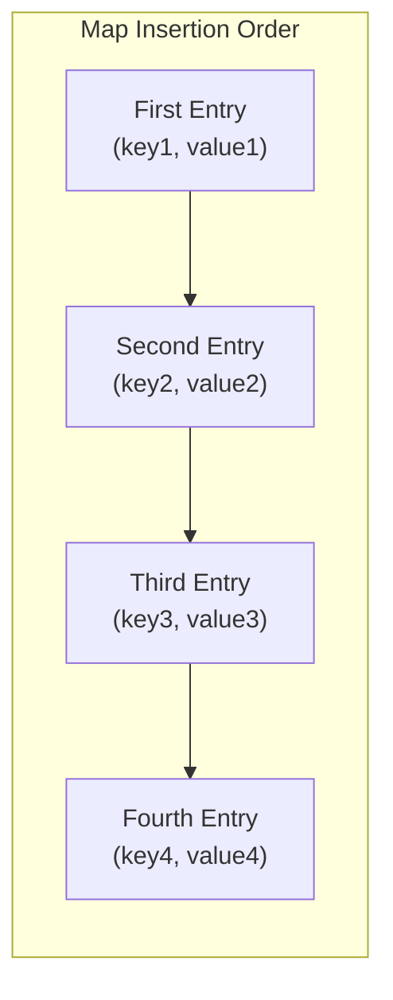

# Hash Table Implementations: Language Variations and Advanced Features

## 1. Introduction to Hash Table Flexibility

Hash tables, as abstract data structures, exhibit significant variation in their implementation across different programming languages. Despite these differences, a fundamental characteristic persists: the ability to store **key-value pairs** where both components may comprise diverse data types.

### 1.1 Supported Value Types

Hash tables accommodate a wide spectrum of value types, including:

- Primitive data types (numbers, strings, booleans)
- Complex objects and nested structures
- Arrays and collections
- Functions and callable entities
- References to other data structures

This versatility enables hash tables to serve as foundational containers for complex data organization.

## 2. JavaScript Object as a Hash Table

In JavaScript, the standard `Object` serves as the most basic implementation of a hash table.

### 2.1 Key Type Restriction

Despite the broad flexibility regarding values, JavaScript `Object` imposes a critical constraint on keys:

> **All keys are coerced to strings, regardless of their original type.**

```javascript
// JavaScript Object key stringification example
const user = {};

// Numeric key becomes string "123"
user[123] = "numeric key";

// Function key becomes string representation
const funcKey = function() { return "hello"; };
user[funcKey] = "function key";

// Both keys are stored as strings
console.log(Object.keys(user)); // Output: ["123", "function() { return "hello"; }"]
```

### 2.2 Unordered Nature

Standard JavaScript objects do not guarantee insertion order. The internal hash function distributes entries across memory locations, resulting in **non-deterministic iteration order**.

```
Insertion Sequence:  ["Lisa Smith", "John Smith", "Sandra Doe"]
Possible Iteration:  ["John Smith", "Lisa Smith", "Sandra Doe"]
```

This behavior stems from the underlying hashing mechanism that places items based on computed hash values rather than temporal sequence.

## 3. ES6 Map Data Structure

ECMAScript 2015 (ES6) introduced the `Map` object, addressing key limitations of standard JavaScript objects.

### 3.1 Declaration and Instantiation

```javascript
// Creating a new Map instance
const dataMap = new Map();

// Adding entries
dataMap.set("name", "Alice");
dataMap.set(42, "numeric key");
dataMap.set(true, "boolean key");

// Retrieving values
console.log(dataMap.get(42)); // Output: "numeric key"
```

### 3.2 Support for Any Data Type as Key

Unlike standard objects, `Map` permits **keys of any data type** without automatic string coercion.

```javascript
const map = new Map();

// Function as key
const greet = () => "Hello";
map.set(greet, "Function key example");

// Array as key
const coordinates = [10, 20];
map.set(coordinates, "Location data");

// Object as key
const userRef = { id: 1 };
map.set(userRef, { name: "John Doe" });

console.log(map.get(greet));        // Output: "Function key example"
console.log(map.get(coordinates));  // Output: "Location data"
```

### 3.3 Preservation of Insertion Order

The `Map` structure maintains the **chronological sequence of insertion**, ensuring predictable iteration behavior.



```javascript
const orderedMap = new Map();

orderedMap.set("first", 1);
orderedMap.set("second", 2);
orderedMap.set("third", 3);

// Iteration follows insertion order
for (const [key, value] of orderedMap) {
    console.log(`${key}: ${value}`);
}
// Output:
// first: 1
// second: 2
// third: 3
```

### 3.4 Comparison: Object vs. Map

| Feature | Object | Map |
|---------|--------|-----|
| Key Data Types | Strings only (coerced) | Any data type |
| Insertion Order | Not guaranteed | Guaranteed |
| Size Retrieval | `Object.keys(obj).length` | `map.size` property |
| Iteration Protocol | Requires `Object.entries()` | Directly iterable |
| Performance with Frequent Additions | Slower | Optimized |

## 4. ES6 Set Data Structure

The `Set` object represents a specialized hash table variant that stores **only keys without associated values**.

### 4.1 Core Functionality

A `Set` maintains a collection of unique elements, leveraging hash-based storage for efficient membership testing.

```javascript
// Set creation and usage
const uniqueIds = new Set();

// Adding elements (keys only)
uniqueIds.add("user_001");
uniqueIds.add("user_002");
uniqueIds.add("user_001"); // Duplicate ignored

console.log(uniqueIds.size); // Output: 2

// Membership testing
console.log(uniqueIds.has("user_001")); // Output: true
console.log(uniqueIds.has("user_003")); // Output: false

// Iteration
for (const id of uniqueIds) {
    console.log(id);
}
// Output:
// user_001
// user_002
```

### 4.2 Properties Inherited from Map

Similar to `Map`, the `Set` data structure:

- Accepts values of any data type
- Maintains insertion order
- Provides direct iteration capabilities

### 4.3 Use Cases

- Removing duplicates from collections
- Tracking unique identifiers
- Implementing mathematical set operations
- Membership testing in O(1) average time

## 5. Cross-Language Hash Table Variants

Most programming languages provide multiple hash table implementations with varying characteristics.

| Language | Basic Hash Table | Ordered Variant | Key-Only Variant |
|----------|-----------------|-----------------|------------------|
| JavaScript | `Object` | `Map` | `Set` |
| Python | `dict` | `collections.OrderedDict` | `set` |
| Java | `HashMap` | `LinkedHashMap` | `HashSet` |
| C# | `Dictionary<TKey,TValue>` | `OrderedDictionary` | `HashSet<T>` |
| C++ | `std::unordered_map` | N/A (use `std::map`) | `std::unordered_set` |

## 6. Practical Implications

### 6.1 Choosing the Appropriate Structure

**Use standard object when:**
- Keys are exclusively strings
- Insertion order is irrelevant
- Simple key-value storage suffices

**Use Map when:**
- Keys may be non-string types
- Insertion order must be preserved
- Frequent additions and deletions occur
- Direct iteration is required

**Use Set when:**
- Only unique keys need tracking
- Associated values are unnecessary
- Duplicate elimination is required

### 6.2 Performance Considerations

All discussed structures provide **average O(1) time complexity** for core operations:

- Insertion: O(1)
- Deletion: O(1)
- Lookup: O(1)
- Membership testing: O(1)

The constant factors may vary based on implementation details, but the asymptotic behavior remains consistent.

## 7. Summary

Hash tables manifest in language-specific forms with nuanced behavioral differences. While JavaScript objects impose string-only key restrictions, ES6 `Map` and `Set` provide enhanced capabilities including arbitrary key types and insertion order preservation. Understanding these distinctions enables informed selection of the optimal data structure for specific programming scenarios. The fundamental hashing mechanism underpinning all variants ensures constant-time average performance for essential operations, reinforcing the hash table's status as a cornerstone of efficient algorithm design.