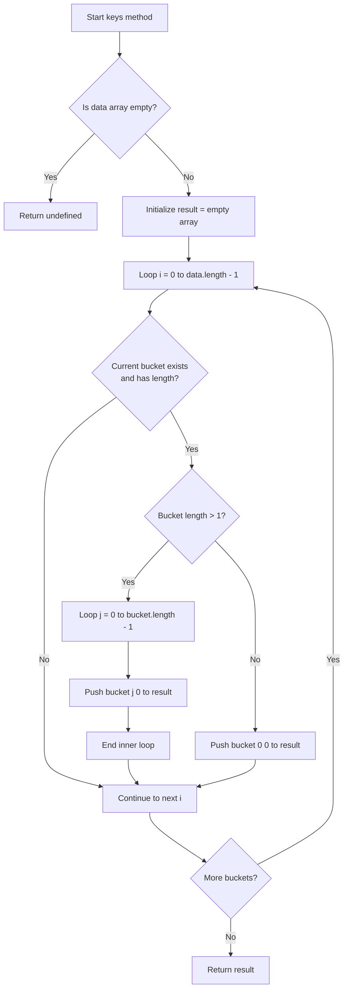

# Hash Table Keys Retrieval: Handling Collisions

## 1. Problem Statement

The `keys()` method in a hash table implementation must return an array containing all keys stored within the data structure. A naive implementation that simply iterates through the underlying array and extracts the first element of each occupied bucket fails when **collision resolution via separate chaining** is employed. In such cases, each bucket may contain multiple key-value pairs, all of which must be included in the result set.

### 1.1 Naive Approach Limitation

Consider a hash table with the following state after several insertions:

```
Hash Table (size = 5)
---------------------
Index 0: [ ["apple", 100] ]
Index 1: undefined
Index 2: [ ["banana", 200], ["grape", 300] ]  // Collision bucket
Index 3: [ ["orange", 150] ]
Index 4: undefined
```

A simplistic method returning only the first key of each bucket would incorrectly omit `"grape"` from the result.

## 2. Enhanced Keys Method Implementation

### 2.1 Algorithm Logic

The enhanced `keys()` method addresses collisions by:

1. Validating the existence of data within the hash table
2. Iterating through each index of the storage array
3. For non-empty buckets, checking whether multiple entries exist
4. Extracting keys from all entries within collision buckets
5. Compiling a comprehensive result array

### 2.2 Code Implementation

```javascript
keys() {
    // Guard clause: return undefined if hash table is empty
    if (!this.data.length) {
        return undefined;
    }
    
    let result = [];
    
    // Iterate through all memory cells (buckets)
    for (let i = 0; i < this.data.length; i++) {
        // Check if current bucket exists and contains entries
        if (this.data[i] && this.data[i].length) {
            // Bucket contains multiple entries (collision occurred)
            if (this.data[i].length > 1) {
                // Iterate through each key-value pair in the collision chain
                for (let j = 0; j < this.data[i].length; j++) {
                    // Push the key (index 0 of the pair) to result
                    result.push(this.data[i][j][0]);
                }
            } else {
                // Single entry bucket: push the key directly
                result.push(this.data[i][0][0]);
            }
        }
    }
    
    return result;
}
```

### 2.3 Algorithm Flowchart



## 3. Step-by-Step Execution Trace

For the sample hash table state presented earlier:

| Iteration (i) | Bucket Content | Length Check | Action Taken | Result After Iteration |
|---------------|----------------|--------------|--------------|------------------------|
| 0 | `[ ["apple", 100] ]` | `length = 1` | Push `data[0][0][0]` | `["apple"]` |
| 1 | `undefined` | Fails existence check | Skip | `["apple"]` |
| 2 | `[ ["banana", 200], ["grape", 300] ]` | `length > 1` | Loop j=0: push `"banana"`; j=1: push `"grape"` | `["apple", "banana", "grape"]` |
| 3 | `[ ["orange", 150] ]` | `length = 1` | Push `data[3][0][0]` | `["apple", "banana", "grape", "orange"]` |
| 4 | `undefined` | Fails existence check | Skip | Final result |

## 4. Time Complexity Analysis

| Scenario | Complexity | Explanation |
|----------|------------|-------------|
| Best Case | O(n) | Where n is the size of the storage array; each bucket contains at most one entry |
| Worst Case | O(n + m) | Where m is the total number of stored entries; accounts for traversing all collision chains |
| Average Case | O(n + α·n) | Where α is the load factor; simplifies to O(n) for bounded α |

The method requires examining every index of the underlying array regardless of occupancy, establishing a lower bound of O(n) where n equals the allocated table size.

## 5. Integration with Hash Table Class

The `keys()` method integrates seamlessly with the previously defined `HashTable` class:

```javascript
class HashTable {
    constructor(size) {
        this.data = new Array(size);
    }

    _hash(key) {
        let hash = 0;
        for (let i = 0; i < key.length; i++) {
            hash = (hash + key.charCodeAt(i) * i) % this.data.length;
        }
        return hash;
    }

    set(key, value) {
        const address = this._hash(key);
        if (!this.data[address]) {
            this.data[address] = [];
        }
        this.data[address].push([key, value]);
        return this.data;
    }

    get(key) {
        const address = this._hash(key);
        const currentBucket = this.data[address];
        if (currentBucket) {
            for (let i = 0; i < currentBucket.length; i++) {
                if (currentBucket[i][0] === key) {
                    return currentBucket[i][1];
                }
            }
        }
        return undefined;
    }

    keys() {
        if (!this.data.length) {
            return undefined;
        }
        let result = [];
        for (let i = 0; i < this.data.length; i++) {
            if (this.data[i] && this.data[i].length) {
                if (this.data[i].length > 1) {
                    for (let j = 0; j < this.data[i].length; j++) {
                        result.push(this.data[i][j][0]);
                    }
                } else {
                    result.push(this.data[i][0][0]);
                }
            }
        }
        return result;
    }
}
```

### 5.1 Usage Demonstration

```javascript
const ht = new HashTable(10);

ht.set('apple', 100);
ht.set('banana', 200);
ht.set('grape', 300);  // Assume collision with 'banana'
ht.set('orange', 150);

console.log(ht.keys());  // Output: ['apple', 'banana', 'grape', 'orange']
```

## 6. Edge Cases and Considerations

### 6.1 Empty Hash Table
When no elements have been inserted, the method returns `undefined` after the initial length check.

### 6.2 Sparse Storage
Unoccupied array indices are safely skipped, preventing `TypeError` exceptions.

### 6.3 Single-Element Buckets
The conditional branch specifically handles buckets with exactly one entry to avoid unnecessary nested iteration.

## 7. Summary

The enhanced `keys()` method provides a robust solution for retrieving all keys from a hash table that implements separate chaining for collision resolution. By explicitly traversing each bucket and examining all entries within collision chains, the method ensures comprehensive key collection regardless of the distribution patterns produced by the hash function. This implementation exemplifies the additional considerations required when working with probabilistic data structures where worst-case scenarios may arise from hash collisions.