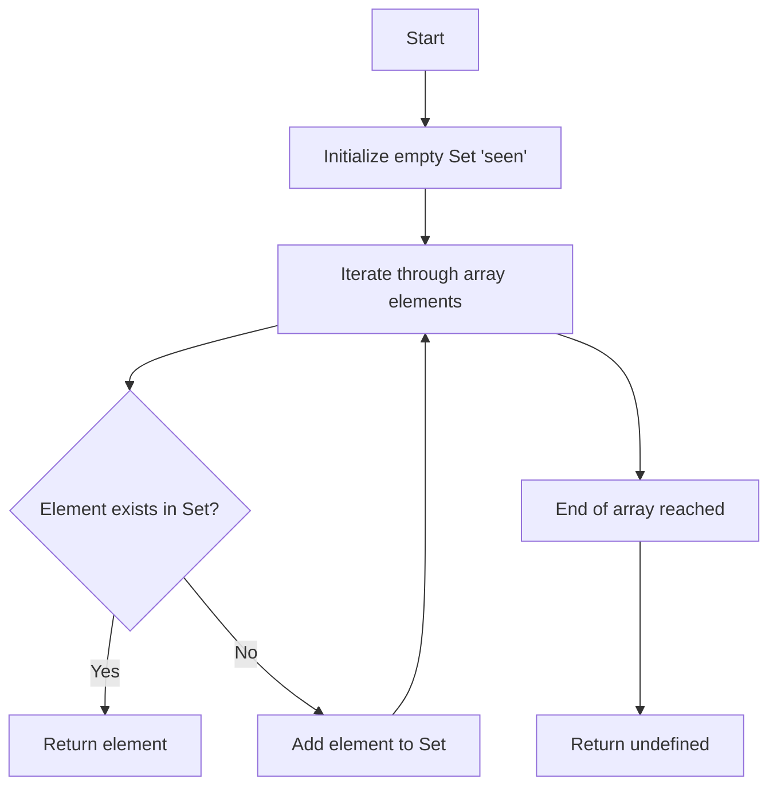

# First Recurring Character Problem

## 1. Problem Statement

Given an array of elements (typically integers or characters), identify the **first recurring character**—the element that appears more than once, with the smallest index distance between its first and second occurrence.

If no element repeats, return `undefined` or an equivalent indicator.

This problem is a classic algorithmic challenge frequently encountered in technical interviews, including those conducted by Google.

## 2. Formal Definition

**Input:** An array `A` of length `n` containing elements of any comparable type.

**Output:** The element that appears twice with the minimal gap between its first and second occurrence. If all elements are distinct, return `undefined`.

**Constraints:**
- The array may contain duplicate elements.
- The array may be empty.
- The array may contain elements of mixed types (though typically homogeneous).

## 3. Illustrative Examples

### 3.1 Example 1: Standard Case

```
Input:  [2, 5, 1, 2, 3, 5, 1, 2, 4]
Output: 2
```

**Explanation:** Traversing the array:
- Element `2` appears at index `0` and again at index `3`.
- Element `5` appears at index `1` and again at index `5`.
- Element `1` appears at index `2` and again at index `6`.
The first repeat occurs for `2` at index `3`.

### 3.2 Example 2: Immediate Repeat

```
Input:  [2, 1, 1, 2, 3, 5, 1, 2, 4]
Output: 1
```

**Explanation:** Element `1` repeats at index `2`, which is earlier than the repeat of `2` at index `3`.

### 3.3 Example 3: No Repetition

```
Input:  [2, 3, 4, 5]
Output: undefined
```

**Explanation:** All elements are unique; therefore, no recurring character exists.

### 3.4 Example 4: Empty Array

```
Input:  []
Output: undefined
```

**Explanation:** An empty array contains no elements to recur.

## 4. Solution Approaches

### 4.1 Brute Force (Naive) Approach

#### 4.1.1 Algorithm Description

Compare each element with all subsequent elements to find the first pair with identical values.

```
For i from 0 to n-1:
    For j from i+1 to n-1:
        If A[i] equals A[j]:
            Return A[i]
Return undefined
```

#### 4.1.2 Time and Space Complexity

| Metric | Value |
|--------|-------|
| Time Complexity | O(n²) |
| Space Complexity | O(1) |

The nested loops result in quadratic time complexity, making this approach impractical for large datasets.

#### 4.1.3 JavaScript Implementation

```javascript
function firstRecurringCharacterNaive(arr) {
    for (let i = 0; i < arr.length; i++) {
        for (let j = i + 1; j < arr.length; j++) {
            if (arr[i] === arr[j]) {
                return arr[i];
            }
        }
    }
    return undefined;
}
```

### 4.2 Optimized Approach Using Hash Table

#### 4.2.1 Algorithm Description

Utilize a hash set (or hash table) to track seen elements during a single traversal. The moment an element is encountered that already exists in the set, it is the first recurring character.

```
Initialize an empty hash set `seen`
For each element `x` in array:
    If `x` exists in `seen`:
        Return `x`
    Else:
        Insert `x` into `seen`
Return undefined
```

#### 4.2.2 Algorithm Flowchart



#### 4.2.3 Time and Space Complexity

| Metric | Value |
|--------|-------|
| Time Complexity | O(n) average case |
| Space Complexity | O(n) worst case |

The hash set operations (insertion and lookup) execute in average O(1) time, yielding linear overall time complexity.

#### 4.2.4 JavaScript Implementation

```javascript
function firstRecurringCharacterOptimized(arr) {
    // Hash set to store encountered elements
    const seen = new Set();
    
    for (let i = 0; i < arr.length; i++) {
        const element = arr[i];
        
        // Check if element has been seen before
        if (seen.has(element)) {
            return element; // First recurring character found
        }
        
        // Mark element as seen
        seen.add(element);
    }
    
    // No recurring character found
    return undefined;
}
```

**Alternative Using Plain Object (for Older Environments):**

```javascript
function firstRecurringCharacterObject(arr) {
    const seen = {}; // Object acting as hash map
    
    for (let i = 0; i < arr.length; i++) {
        const element = arr[i];
        
        // Check if property exists on object
        if (seen.hasOwnProperty(element)) {
            return element;
        }
        
        // Store element as key with arbitrary value
        seen[element] = true;
    }
    
    return undefined;
}
```

## 5. Comparative Analysis

| Approach | Time Complexity | Space Complexity | Suitable For |
|----------|-----------------|------------------|--------------|
| Brute Force | O(n²) | O(1) | Small arrays only |
| Hash Table | O(n) | O(n) | General purpose, large arrays |

The hash table solution represents the optimal trade-off between time and space for most practical scenarios.

## 6. Edge Cases and Considerations

### 6.1 Empty Array
Both implementations correctly return `undefined` after processing zero elements.

### 6.2 Array with Single Element
No recurrence possible; returns `undefined`.

### 6.3 Non-Primitive Elements
If array contains objects or arrays as elements, equality comparison uses reference equality. The `Set` approach works correctly for reference-based comparison.

### 6.4 Performance with Large Datasets
The O(n) solution scales linearly, handling arrays of significant size efficiently.

## 7. Common Variations in Interview Settings

### 7.1 First Recurring Character with Index Return
Return the index of the second occurrence instead of the element value.

### 7.2 All Recurring Characters
Identify all elements that appear more than once.

### 7.3 First Non-Recurring Character
Find the first element that appears only once in the array.

Each variation can be solved with appropriate modifications to the hash table approach.

## 8. Summary

The **First Recurring Character** problem tests fundamental understanding of:

- Hash-based data structures (`Set`, `Map`, or object properties)
- Time-space trade-off analysis
- Array traversal techniques

The optimal solution leverages a hash set to achieve linear time complexity, demonstrating the practical utility of hash tables in solving algorithmic challenges efficiently.