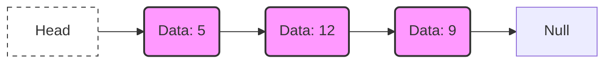
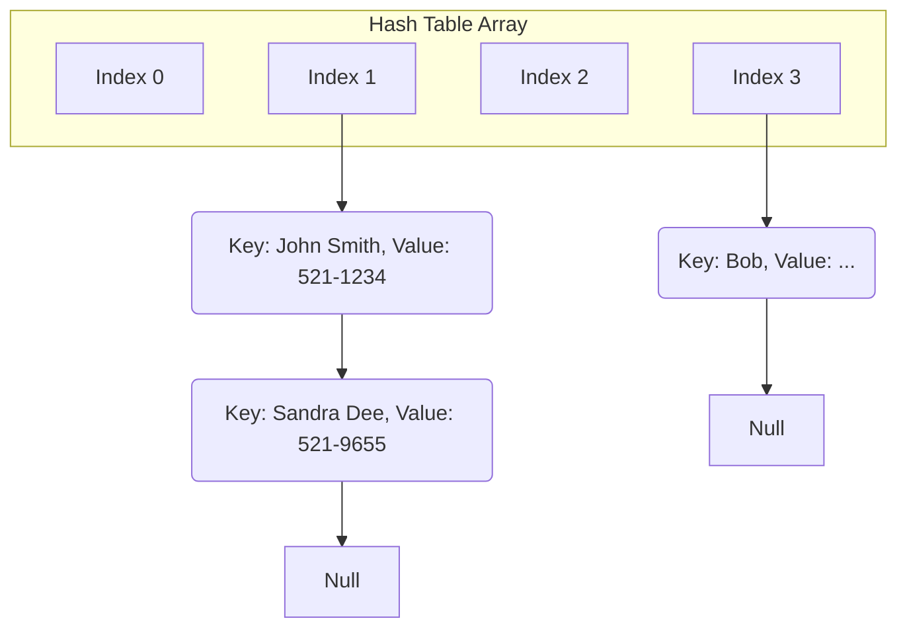

# Introduction to Linked Lists

## 1. Background and Motivation

Data structures are fundamental building blocks in computer science, each designed to address specific computational requirements. The choice of a data structure significantly impacts the efficiency of algorithms in terms of time and space complexity. This document examines the limitations of arrays and hash tables, leading to the necessity of linked lists as an alternative data structure.

## 2. Limitations of Arrays

Arrays, both static and dynamic, suffer from inherent constraints due to their contiguous memory allocation model.

### 2.1 Static Arrays

- Fixed size determined at compile time.
- Memory allocated in a single contiguous block.
- Resizing is impossible without creating a new array and copying elements.

### 2.2 Dynamic Arrays (e.g., `ArrayList` in Java)

- Overcome the fixed-size limitation by automatically resizing.
- When capacity is exhausted, a new, larger block of memory is allocated.
- All existing elements are copied to the new memory location.

**Performance Implication of Resizing**

The resizing operation occurs occasionally but carries a time complexity of **O(n)** , where `n` is the number of elements. This introduces latency spikes, which may be unacceptable in real-time or performance-critical applications.

### 2.3 Insertion and Deletion Overhead

- Arrays excel at random access (O(1) time complexity).
- Inserting or deleting an element at any position other than the end requires shifting subsequent elements.
- **Worst-case time complexity:** O(n) for insertion or deletion at the beginning.
- **Example:** Inserting an element at index 0 of a 1,000-element array requires shifting all 1,000 elements one position to the right.

## 3. Hash Tables and Their Shortcomings

Hash tables provide efficient average-case O(1) insertion, deletion, and lookup by using a hash function to map keys to indices.

### 3.1 Advantages Over Arrays

- Elements are not required to be stored contiguously.
- The hash function abstracts away manual memory management concerns.
- Excellent performance for unordered key-value storage.

### 3.2 The Ordering Problem

- Hash tables do **not** maintain the order of insertion.
- Iterating over a hash table yields elements in an arbitrary sequence determined by the hash function and internal table structure.
- When ordered traversal or consistent sequence is required, hash tables alone are insufficient.

## 4. Introduction to Linked Lists

A linked list is a linear data structure where elements, called **nodes**, are stored at non-contiguous memory locations. Each node contains the data and a reference (or pointer) to the next node in the sequence.

This design directly addresses the shifting overhead of arrays and provides a foundation for ordered, dynamic collections.

### 4.1 Fundamental Structure of a Node

The following Java code illustrates a simple node structure for a **singly linked list**:

```java
/**
 * Represents a single node in a singly linked list.
 */
public class Node {
    // Data stored in the node (can be any object type)
    public int data;
    
    // Reference to the next node in the sequence
    public Node next;

    /**
     * Constructor to create a new node.
     * @param data The value to store.
     */
    public Node(int data) {
        this.data = data;
        this.next = null; // By default, the node does not point to anything
    }
}
```

### 4.2 Visual Representation

A simple conceptual diagram of a singly linked list with three nodes:



*Diagram Explanation:* The `Head` pointer marks the start of the list. Each node holds data and a reference (`next`) to the subsequent node. The final node points to `Null`, signifying the end of the list.

## 5. Application: Collision Resolution in Hash Tables

Linked lists are commonly employed as a collision resolution mechanism in hash table implementations, a technique known as **Separate Chaining**.

- When two distinct keys hash to the same index (a collision), the hash table bucket does not store a single value.
- Instead, the bucket stores the head pointer of a linked list.
- All entries that hash to that index are appended to the linked list.

This approach allows a hash table to store multiple entries at a single index without requiring complex probing algorithms or rehashing of the entire table.



## 6. Trade-offs and Considerations

While linked lists solve specific problems associated with arrays, they are not a universal replacement. Each data structure presents trade-offs.

| Feature | Array | Linked List |
| :--- | :--- | :--- |
| **Memory Layout** | Contiguous blocks | Non-contiguous nodes |
| **Access Time** | O(1) Random Access | O(n) Sequential Access |
| **Insert/Delete (Start)**| O(n) | O(1) |
| **Insert/Delete (End)** | O(1) amortized / O(n) worst | O(n) without tail pointer, O(1) with tail pointer |
| **Memory Overhead** | Minimal (just data) | Extra pointer per element (4-8 bytes per node in Java) |

### 6.1 Primary Disadvantages of Linked Lists

- **No Random Access:** Accessing the i-th element requires traversing the list from the head, resulting in O(n) time complexity.
- **Memory Overhead:** Each node stores additional reference variables, increasing memory consumption compared to arrays storing primitive types.
- **Cache Locality:** Nodes are scattered in memory, leading to poor CPU cache performance. Iterating a linked list is often slower than iterating an array due to cache misses.

## 7. Upcoming Topics

The following sections will provide a detailed examination of the two primary variants of linked lists:

- **Singly Linked Lists:** Nodes contain a single reference to the next node.
- **Doubly Linked Lists:** Nodes contain references to both the next and the previous nodes, enabling bidirectional traversal.

These subsequent notes will cover insertion, deletion, traversal algorithms, and complexity analysis for each type.