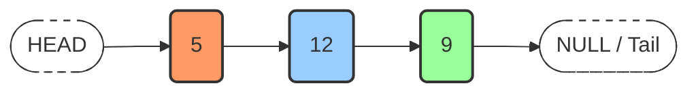

# Linked Lists: Fundamental Concepts and Structure

## 1. Definition and Core Principles

A **linked list** is a linear data structure consisting of a sequence of elements called **nodes**, where each node contains data and a reference (or pointer) to the next node in the sequence. Unlike arrays, linked list elements are not stored contiguously in memory. The logical ordering is maintained through these explicit links between nodes.

The term "linked" directly refers to this characteristic: each element is connected to its successor, forming a chain-like structure.

## 2. Anatomy of a Node

A node is the fundamental building block of a linked list. It comprises two distinct components:

- **Value (Data Field):** The actual information stored within the node. This can be a primitive data type (integer, character, string) or a reference to a complex object.
- **Pointer (Next Reference):** A reference variable that stores the memory address of the subsequent node in the list.

### 2.1 Node Implementation in JavaScript

Although JavaScript does not include a native linked list implementation, the node structure can be easily defined using a class.

```javascript
/**
 * Represents a single node in a singly linked list.
 */
class Node {
    /**
     * Creates a new node.
     * @param {*} value - The data to store in the node.
     */
    constructor(value) {
        this.value = value; // The data stored in the node
        this.next = null;   // Reference to the next node; initially null
    }
}

// Example usage:
const node1 = new Node(5);
const node2 = new Node(10);
node1.next = node2; // Linking node1 to node2

console.log(node1.value); // Output: 5
console.log(node1.next.value); // Output: 10
```

## 3. Key Terminology

Understanding the following terms is essential for working with linked lists:

| Term | Description |
| :--- | :--- |
| **Head** | The first node in the linked list. It serves as the entry point for traversing the entire list. |
| **Tail** | The last node in the linked list. Its `next` pointer is set to `null`, signifying the end of the sequence. |
| **Null-Terminated** | A property indicating that the final node's pointer references `null`. This provides an explicit termination condition for traversal algorithms. |

### 3.1 Clarification on Tail Definition

In some contexts, the term "tail" may refer to any node following the head. However, in standard data structure terminology, the **tail** specifically denotes the terminal node of the list. This document adheres to the latter definition.

## 4. Visual Representation of a Singly Linked List

The following diagram illustrates a linked list containing three integer values: `5`, `12`, and `9`.



*Interpretation:* The `HEAD` pointer provides access to the first node. Each node contains a value and an arrow pointing to its successor. The final node points to `NULL`, marking the tail.

## 5. Memory Representation and Pointers

A **pointer** is a variable that holds the memory address of another variable or data structure. In linked lists, the `next` field within a node acts as a pointer to the subsequent node's location in memory.

Consider a grocery list stored as a linked list. A pseudocode representation might appear as:

```
Apples --> Grapes --> Pears --> null
```

However, the actual memory representation involves non-contiguous addresses. A more accurate depiction is shown below:

```
Memory Address:  0x947       0xA3F       0x2C1
Value:          "Apples"    "Grapes"    "Pears"
Next Pointer:   0xA3F       0x2C1       null
```

*Explanation:* The node containing `"Apples"` resides at address `0x947`. Its `next` pointer stores the value `0xA3F`, which is the memory address where the node containing `"Grapes"` is located. This chain continues until the final node, where the `next` pointer holds the special value `null`.

## 6. Linked Lists in Programming Languages

### 6.1 Language Support

- **Java, C++, Python:** These languages provide built-in linked list implementations within their standard libraries (e.g., `java.util.LinkedList`, `std::list`, `collections.deque`).
- **JavaScript:** The language does **not** include a native linked list data structure. Developers must construct linked lists manually using objects and references.

### 6.2 Building Custom Linked Lists

The absence of a built-in linked list in JavaScript is not a limitation but an opportunity to understand the underlying mechanics. By defining a `Node` class and a `LinkedList` class to manage operations (insertion, deletion, traversal), a fully functional linked list can be implemented. The subsequent sections will detail the construction of such a data structure.

## 7. Characteristics and Applications

### 7.1 Fundamental Properties

- **Dynamic Size:** Linked lists can grow or shrink at runtime without the need for pre-allocation or resizing operations.
- **Efficient Insertions/Deletions:** Adding or removing nodes at the beginning or middle of the list requires only pointer manipulation, achieving O(1) time complexity once the position is located.
- **Sequential Access:** Accessing an arbitrary element by index requires traversal from the head, resulting in O(n) time complexity.

### 7.2 Common Use Cases

- Implementation of **stacks** and **queues**.
- **Hash table collision resolution** via separate chaining.
- Representing **polynomials** or sparse matrices.
- Undo functionality in software applications (using doubly linked lists).

## 8. Summary

A linked list is a foundational dynamic data structure that overcomes the contiguous memory constraints of arrays. It organizes data through a series of interconnected nodes, each containing a value and a reference to the next node. The list is anchored by a **head** pointer and terminated by a **tail** node pointing to `null`. While JavaScript lacks a native implementation, the structure can be readily constructed using custom classes, providing a valuable exercise in understanding pointers and dynamic memory management.