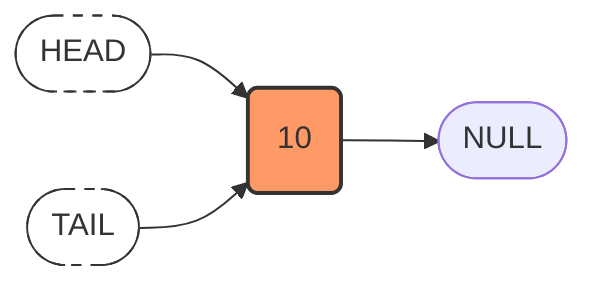
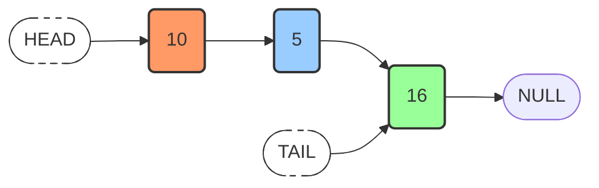

# Implementation of a Singly Linked List in JavaScript: Construction and Append Operation

## 1. Introduction

This document presents the step-by-step implementation of a singly linked list data structure in JavaScript. The focus is on constructing the foundational `LinkedList` class, including its node structure and the core `append` method for adding elements to the end of the list. JavaScript does not provide a native linked list implementation; therefore, a custom class-based approach is adopted.

## 2. Node Structure Definition

A linked list comprises individual **nodes**, each serving as a container for data and a reference to the subsequent node. In JavaScript, a node can be represented as a plain object with two properties:

| Property | Description |
| :--- | :--- |
| `value` | The actual data stored in the node. |
| `next` | A pointer (reference) to the next node in the sequence. For the terminal node, this is `null`. |

### 2.1 Example Node Object

```javascript
// Example of a node object literal
const nodeExample = {
    value: 10,
    next: null
};
```

However, for scalability and reusability, a `Node` class is typically defined.

## 3. LinkedList Class: Constructor

The `LinkedList` class encapsulates the list's state and behavior. The constructor initializes the list with a single node based on the provided value.

```javascript
/**
 * Represents a node in the singly linked list.
 */
class Node {
    constructor(value) {
        this.value = value;
        this.next = null; // Pointer to the next node; null by default
    }
}

/**
 * Represents the singly linked list data structure.
 */
class LinkedList {
    /**
     * Constructs a new linked list with a single node.
     * @param {*} value - The value to initialize the head node.
     */
    constructor(value) {
        // Create the head node
        this.head = new Node(value);
        
        // Since there is only one node, the tail is the same as the head
        this.tail = this.head;
        
        // Track the number of nodes in the list
        this.length = 1;
    }
}
```

### 3.1 Explanation of Constructor Logic

- A new `Node` instance is created using the `value` argument.
- The `head` property stores a reference to this initial node.
- The `tail` property is set to the same node because the list contains exactly one element.
- The `length` property is initialized to `1`.

### 3.2 Initial State Visualization

The following diagram depicts the state of the linked list immediately after instantiation with the value `10`.



*Observation:* Both `head` and `tail` pointers reference the same node, whose `next` pointer is `null`.

## 4. The Append Method

The `append` method adds a new node to the end (tail) of the linked list. The operation involves creating a new node, linking the current tail node to the new node, and updating the `tail` reference.

### 4.1 Algorithm for Append

1. Create a new node with the given `value`.
2. Set the `next` pointer of the current `tail` node to reference the new node.
3. Update the `tail` property of the linked list to point to the new node.
4. Increment the `length` of the list.

### 4.2 Implementation in JavaScript

```javascript
class LinkedList {
    constructor(value) {
        this.head = new Node(value);
        this.tail = this.head;
        this.length = 1;
    }

    /**
     * Appends a new node with the specified value to the end of the list.
     * @param {*} value - The value to be added.
     * @returns {LinkedList} - The updated linked list instance (for method chaining).
     */
    append(value) {
        // Step 1: Create a new node
        const newNode = new Node(value);
        
        // Step 2: Link the current tail node to the new node
        this.tail.next = newNode;
        
        // Step 3: Update the tail reference to the new node
        this.tail = newNode;
        
        // Step 4: Increment the length counter
        this.length++;
        
        // Return the list instance to allow method chaining (optional)
        return this;
    }
}
```

### 4.3 Usage Example

```javascript
// Instantiate the linked list with initial value 10
const myLinkedList = new LinkedList(10);

// Append additional values to build the sequence: 10 -> 5 -> 16
myLinkedList.append(5);
myLinkedList.append(16);

console.log(myLinkedList);
```

**Expected Output (Simplified):**

```
LinkedList {
  head: Node { value: 10, next: Node { value: 5, next: [Node] } },
  tail: Node { value: 16, next: null },
  length: 3
}
```

### 4.4 Post-Append Visualization

After executing `append(5)` and `append(16)`, the linked list structure appears as follows:



## 5. Time Complexity Analysis

| Operation | Time Complexity | Justification |
| :--- | :--- | :--- |
| **Constructor** | O(1) | Constant number of operations irrespective of input size. |
| **Append** | O(1) | Direct access to the `tail` node eliminates the need for traversal. Only pointer reassignments are performed. |

**Note:** The efficiency of `append` is contingent upon maintaining a `tail` reference. Without this reference, appending would require traversing the entire list to find the last node, resulting in O(n) time complexity.

## 6. Summary

- A **linked list** in JavaScript can be implemented using classes for `Node` and `LinkedList`.
- The `constructor` initializes the list with a single node, establishing both `head` and `tail` pointers.
- The `append` method efficiently adds nodes to the end of the list in O(1) time by leveraging the `tail` pointer.
- Tracking the `length` property provides O(1) access to the number of elements without requiring traversal.

The completed implementation provides a foundation for further linked list operations such as prepend, insert, delete, and traversal, which will be addressed in subsequent sections.