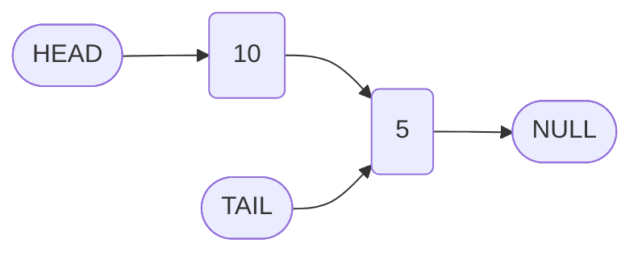
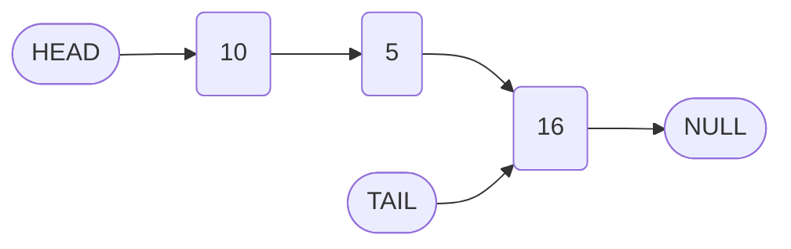
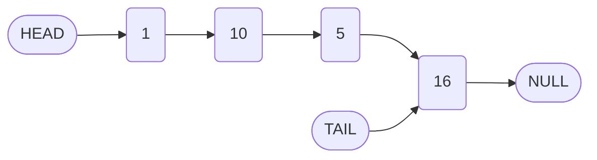

# Implementation of Singly Linked List Operations: Append Method and Prepend Challenge

## 1. Introduction

This document continues the implementation of a singly linked list data structure in JavaScript. Building upon the foundational `LinkedList` class and `Node` class previously established, this section provides a detailed explanation of the `append` method and introduces the `prepend` method as an exercise for further understanding.

## 2. Review of the Node and LinkedList Classes

The following foundational classes serve as the basis for all subsequent operations.

```javascript
/**
 * Represents a single node in the linked list.
 */
class Node {
    constructor(value) {
        this.value = value; // Data stored in the node
        this.next = null;   // Pointer to the next node
    }
}

/**
 * Represents the singly linked list data structure.
 */
class LinkedList {
    constructor(value) {
        this.head = new Node(value);
        this.tail = this.head;
        this.length = 1;
    }
}
```

## 3. The Append Method

The `append` method adds a new node to the end (tail) of the linked list. This operation requires updating the pointer of the current tail node and then reassigning the tail reference.

### 3.1 Algorithm Steps

1. Create a new node instance with the provided `value`.
2. Set the `next` pointer of the current tail node to reference the new node.
3. Update the `tail` property of the linked list to point to the new node.
4. Increment the `length` property.
5. Return the linked list instance to support method chaining.

### 3.2 Code Implementation

```javascript
class LinkedList {
    constructor(value) {
        this.head = new Node(value);
        this.tail = this.head;
        this.length = 1;
    }

    /**
     * Appends a new node with the specified value to the end of the list.
     * @param {*} value - The value to be added.
     * @returns {LinkedList} - The linked list instance.
     */
    append(value) {
        // Step 1: Create a new node
        const newNode = new Node(value);
        
        // Step 2: Point the current tail's next to the new node
        this.tail.next = newNode;
        
        // Step 3: Update the tail reference to the new node
        this.tail = newNode;
        
        // Step 4: Increment the length counter
        this.length++;
        
        // Step 5: Return the list instance
        return this;
    }
}
```

### 3.3 Execution Flow for Multiple Appends

Consider the following sequence of operations:

```javascript
const myLinkedList = new LinkedList(10);
myLinkedList.append(5);
myLinkedList.append(16);
```

**Initial State (after constructor):**

```
Head --> [10] --> null
Tail --> [10]
Length: 1
```

**After First Append (value: 5):**



**After Second Append (value: 16):**



**Final Linked List Structure:**

- Head node: value `10`, next points to node with value `5`.
- Second node: value `5`, next points to node with value `16`.
- Tail node: value `16`, next points to `null`.
- Length: `3`.

### 3.4 Explanation of Critical Steps

| Line of Code | Purpose |
| :--- | :--- |
| `const newNode = new Node(value);` | Instantiates a new node with the given value and `next` set to `null`. |
| `this.tail.next = newNode;` | Accesses the current tail node and redirects its `next` pointer from `null` to the new node. |
| `this.tail = newNode;` | Updates the list's `tail` reference to point to the newly added node. |
| `this.length++;` | Increments the count of nodes in the list. |
| `return this;` | Enables fluent interface by returning the list object. |

### 3.5 Time Complexity

| Operation | Complexity |
| :--- | :--- |
| Append | O(1) |

The O(1) complexity is achieved because the `tail` reference provides direct access to the last node, eliminating the need for list traversal.

## 4. The Prepend Method: Exercise Introduction

The `prepend` method adds a new node to the beginning (head) of the linked list. This operation differs from `append` in that the new node becomes the new head, and its `next` pointer must reference the previous head node.

### 4.1 Problem Statement

Implement a `prepend(value)` method that:

- Accepts a `value` parameter.
- Creates a new node with that value.
- Inserts the new node at the front of the linked list.
- Updates the `head` reference appropriately.
- Handles the edge case where the list may be empty (though the constructor ensures initial non-emptiness).
- Increments the `length` property.
- Returns the linked list instance.

### 4.2 Desired Usage Example

```javascript
const myLinkedList = new LinkedList(10);
myLinkedList.append(5);
myLinkedList.append(16);

// After prepending 1, the list becomes: 1 -> 10 -> 5 -> 16
myLinkedList.prepend(1);
```

### 4.3 Expected Outcome After Prepend

If `1` is prepended to the list `10 -> 5 -> 16`, the new structure will be:



### 4.4 Implementation Considerations

The solution must address the following key steps:

1. Create a new node with the given value.
2. Set the `next` pointer of the new node to the current `head` node.
3. Update the `head` reference to point to the new node.
4. Increment the `length` property.
5. Return the list instance.

A complete implementation will be provided in the subsequent documentation section.

## 5. Summary

- The `append` method efficiently adds nodes to the tail of a singly linked list in O(1) time by utilizing a maintained `tail` pointer.
- Proper pointer management ensures the list structure remains intact and the length is accurately tracked.
- The `prepend` method serves as a complementary operation, adding nodes to the head of the list, and presents an opportunity to reinforce understanding of pointer manipulation in linked list implementations.