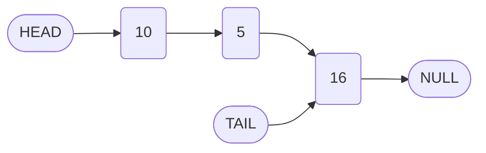
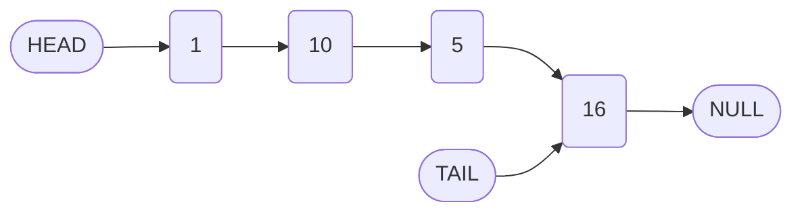

# Implementation of Singly Linked List Operations: The Prepend Method

## 1. Introduction

The `prepend` method adds a new node to the beginning (head) of a singly linked list. This operation is fundamental for building flexible list structures and is complementary to the `append` method discussed previously. This document provides a comprehensive explanation of the `prepend` implementation, including the algorithm, code, and operational complexity.

## 2. The Prepend Method: Algorithm and Implementation

### 2.1 Algorithm Steps

The `prepend` operation involves the following sequential steps:

1. **Create a New Node:** Instantiate a node with the provided value. Initially, its `next` pointer is set to `null`.
2. **Link the New Node to the Current Head:** Set the `next` pointer of the new node to reference the current `head` of the list.
3. **Update the Head Reference:** Reassign the `head` property of the linked list to point to the new node.
4. **Increment Length:** Increase the `length` counter by one.
5. **Return the List Instance:** Return the `LinkedList` object to support method chaining.

### 2.2 Code Implementation

The following JavaScript code defines the `prepend` method within the `LinkedList` class.

```javascript
class LinkedList {
    constructor(value) {
        this.head = new Node(value);
        this.tail = this.head;
        this.length = 1;
    }

    // Append method (previously defined)
    append(value) {
        const newNode = new Node(value);
        this.tail.next = newNode;
        this.tail = newNode;
        this.length++;
        return this;
    }

    /**
     * Prepends a new node with the specified value to the beginning of the list.
     * @param {*} value - The value to be added.
     * @returns {LinkedList} - The linked list instance.
     */
    prepend(value) {
        // Step 1: Create a new node
        const newNode = new Node(value);
        
        // Step 2: Link the new node to the current head
        newNode.next = this.head;
        
        // Step 3: Update the head reference to the new node
        this.head = newNode;
        
        // Step 4: Increment the length counter
        this.length++;
        
        // Step 5: Return the list instance
        return this;
    }
}
```

### 2.3 Explanation of Critical Steps

| Line of Code | Purpose |
| :--- | :--- |
| `const newNode = new Node(value);` | Creates a new node with the specified `value`. The `next` pointer defaults to `null`. |
| `newNode.next = this.head;` | Establishes a pointer from the new node to the node currently at the head of the list. |
| `this.head = newNode;` | Updates the list's `head` reference to point to the newly created node. |
| `this.length++;` | Increments the count of nodes in the list. |
| `return this;` | Returns the list instance, allowing for fluent method chaining. |

### 2.4 Execution Example

Consider an existing linked list constructed as follows:

```javascript
const myLinkedList = new LinkedList(10);
myLinkedList.append(5);
myLinkedList.append(16);
```

**Initial List Structure:**



After invoking `myLinkedList.prepend(1);`, the list transforms as follows:

**Updated List Structure:**



**Resulting State:**
- New head node holds value `1` and points to the previous head node (value `10`).
- The tail remains unchanged (value `16`).
- Length increases from `3` to `4`.

## 3. Analysis of the Prepend Operation

### 3.1 Time Complexity

| Operation | Time Complexity | Justification |
| :--- | :--- | :--- |
| Prepend | O(1) | The operation involves a constant number of steps: creating a node and reassigning a few pointers. No traversal is required. |

### 3.2 Space Complexity

| Aspect | Space Complexity | Justification |
| :--- | :--- | :--- |
| Prepend | O(1) auxiliary | Only a single new node is allocated, regardless of list size. |

### 3.3 Edge Cases

The `prepend` method as defined handles the following scenarios seamlessly:

- **Non-empty List:** The method correctly inserts the new node before the existing head.
- **Single-element List:** The new node becomes the head, and the previous head becomes the second node. The tail reference remains correctly pointing to the original node (now the second element).

**Note:** Since the constructor initializes the list with at least one node, an empty list scenario is not encountered in this implementation. For a more robust design, a check for an empty list could be added, but it is not required given the constructor's behavior.

## 4. Code Reusability: The Node Instantiation Pattern

Both the `append` and `prepend` methods share the common step of creating a new node:

```javascript
const newNode = new Node(value);
```

As the linked list implementation expands to include methods such as `insert(index, value)`, this node creation pattern will recur. To adhere to the **DRY (Don't Repeat Yourself)** principle and improve maintainability, the instantiation logic can be centralized or simply retained as is for clarity in an educational context. At this stage, the explicit node creation in each method enhances readability and comprehension.

## 5. Summary

- The `prepend` method adds a node to the front of a singly linked list in O(1) time.
- The algorithm involves creating a new node, linking it to the current head, and updating the head reference.
- The `tail` pointer remains unaffected unless the list was previously empty (which is not the case given the constructor).
- The implementation demonstrates core pointer manipulation principles essential for linked list operations.

This completes the foundational insertion methods (`append` and `prepend`) for a singly linked list. Subsequent sections will address additional operations such as insertion at a specific index, deletion, and traversal.