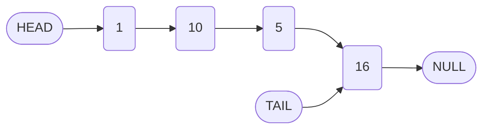
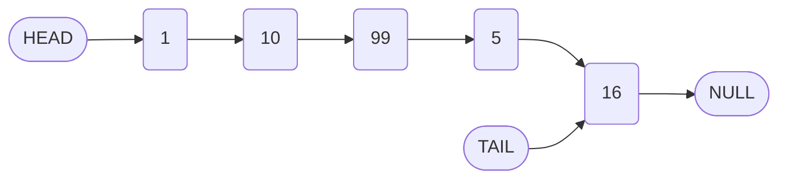

# Linked List Operations: Traversal, Print Utility, and Insert Method

## 1. Introduction

The previous sections established the foundational `append` and `prepend` operations for a singly linked list. Both methods execute in **O(1)** time complexity by directly manipulating the `head` and `tail` references without requiring list traversal. This document introduces more complex operations: the `printList` utility for visualizing the list as an array, and the `insert` method for adding a node at an arbitrary index.

The `insert` operation necessitates **traversal** to locate the desired position, thereby introducing **O(n)** time complexity in the worst case. A thorough understanding of pointer manipulation during traversal is essential for correct implementation.

## 2. The PrintList Utility Method

During development and debugging, visualizing the contents of a linked list is invaluable. The `printList` method traverses the entire list, collects node values into an array, and returns the array. This provides a clear, linear representation of the list's current state.

### 2.1 Algorithm for PrintList

1. Initialize an empty array to store values.
2. Set a variable `currentNode` to reference the `head` of the list.
3. While `currentNode` is not `null`:
   - Append `currentNode.value` to the array.
   - Advance `currentNode` to `currentNode.next`.
4. Return the populated array.

### 2.2 Code Implementation

```javascript
class LinkedList {
    // ... (constructor, append, prepend, etc.)

    /**
     * Traverses the linked list and returns an array of all node values.
     * @returns {Array} - An array containing the values in list order.
     */
    printList() {
        const array = [];
        let currentNode = this.head;
        
        // Traverse the list until the end (null) is reached
        while (currentNode !== null) {
            array.push(currentNode.value);
            currentNode = currentNode.next;
        }
        
        return array;
    }
}
```

### 2.3 Usage Example

```javascript
const myLinkedList = new LinkedList(10);
myLinkedList.append(5);
myLinkedList.append(16);
myLinkedList.prepend(1);

console.log(myLinkedList.printList()); // Output: [1, 10, 5, 16]
```

### 2.4 Time Complexity

| Operation | Time Complexity | Justification |
| :--- | :--- | :--- |
| printList | O(n) | The method traverses every node exactly once. |

## 3. The Insert Method: Problem Statement

The `insert(index, value)` method places a new node with the specified `value` at the given zero-based `index`. The existing node at that index (and all subsequent nodes) are shifted to the right.

### 3.1 Example Scenario

Given the list: `1 -> 10 -> 5 -> 16`

An insertion of value `99` at `index = 2` results in:

```
Index: 0    1    2    3    4
List:  1 -> 10 -> 99 -> 5 -> 16
```

### 3.2 Visual Representation of Insertion

**Before Insertion:**



**After Insertion of 99 at Index 2:**



### 3.3 Algorithmic Steps for Insert

To insert a node at a given `index`:

1. **Parameter Validation:** If `index` is less than `0` or greater than the current `length`, the operation is invalid. (Assumption: insertion at `length` is equivalent to `append`.)
2. **Edge Cases:**
   - If `index === 0`, delegate to `prepend(value)`.
   - If `index === this.length`, delegate to `append(value)`.
3. **General Case (0 < index < length):**
   - Create a new node with the given `value`.
   - Traverse to the node **immediately preceding** the target index (the `leader` node).
   - Set the new node's `next` pointer to the `leader`'s current `next` node.
   - Set the `leader`'s `next` pointer to the new node.
   - Increment the `length` property.
4. Return the list instance.

### 3.4 Key Pointer Manipulation

The core of the insertion lies in the pointer reassignment. Let `leader` be the node at `index - 1`.

```javascript
// 1. Link new node to the node currently after leader
newNode.next = leader.next;

// 2. Link leader to the new node
leader.next = newNode;
```

This sequence ensures the list remains connected without losing references.

### 3.5 Implementation Template (Partial)

The following code provides the structural framework for the `insert` method. The traversal logic using a loop is required to locate the `leader` node.

```javascript
class LinkedList {
    // ... existing methods

    /**
     * Inserts a new node with the given value at the specified index.
     * @param {number} index - The zero-based position for insertion.
     * @param {*} value - The value to insert.
     * @returns {LinkedList} - The updated list.
     */
    insert(index, value) {
        // Validate index range
        if (index < 0 || index > this.length) {
            throw new Error("Index out of bounds");
        }

        // Edge case: insert at beginning
        if (index === 0) {
            return this.prepend(value);
        }

        // Edge case: insert at end
        if (index === this.length) {
            return this.append(value);
        }

        // General case: insert in middle
        const newNode = new Node(value);
        
        // Traverse to the node just before the insertion point (leader)
        let leader = this.head;
        for (let i = 0; i < index - 1; i++) {
            leader = leader.next;
        }
        
        // Perform pointer reassignments
        newNode.next = leader.next;
        leader.next = newNode;
        
        this.length++;
        return this;
    }
}
```

### 3.6 Time Complexity Analysis

| Scenario | Time Complexity | Explanation |
| :--- | :--- | :--- |
| Insert at Head (index 0) | O(1) | Delegated to `prepend`. |
| Insert at Tail (index = length) | O(1) | Delegated to `append`. |
| Insert at Middle | O(n) | Requires traversal to find the `leader` node (index - 1). The pointer updates are O(1). |

## 4. Traversal in Linked Lists

The `printList` and `insert` methods both rely on **traversal**, the process of sequentially visiting each node starting from the head. Traversal is fundamental to most linked list operations beyond simple head/tail manipulations.

### 4.1 Traversal Pattern

A common traversal pattern uses a `while` loop:

```javascript
let currentNode = this.head;
while (currentNode !== null) {
    // Perform action on currentNode
    currentNode = currentNode.next;
}
```

Alternatively, a `for` loop can be used when the number of steps is known (e.g., traversing to a specific index):

```javascript
let currentNode = this.head;
for (let i = 0; i < targetIndex; i++) {
    currentNode = currentNode.next;
}
```

### 4.2 Importance of the Null Terminator

The condition `currentNode !== null` (or `currentNode.next !== null` for stopping at the last node) relies on the tail node's `next` pointer being `null`. This sentinel value reliably indicates the list's end.

## 5. Summary

- The `printList` method provides a straightforward O(n) traversal to visualize the list as an array.
- The `insert` method introduces arbitrary index insertion, requiring traversal to the insertion point.
- Pointer reassignment (`newNode.next = leader.next; leader.next = newNode;`) is the critical operation for middle insertion.
- Edge cases at the head and tail are efficiently handled by delegation to `prepend` and `append`, respectively.
- Mastery of traversal and pointer manipulation is essential for implementing advanced linked list operations such as deletion and reversal.