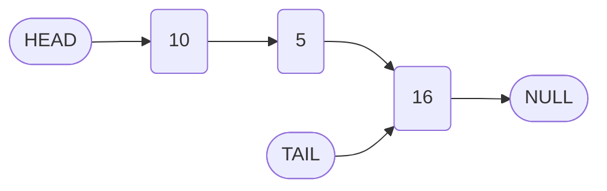
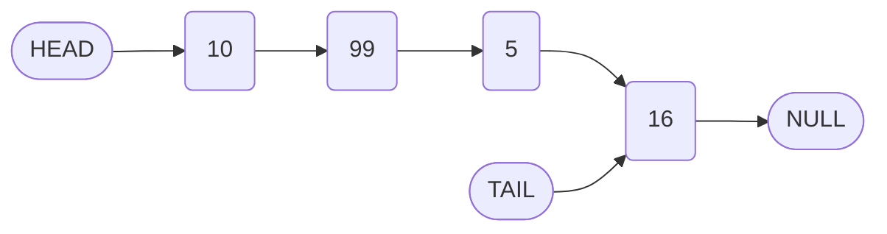
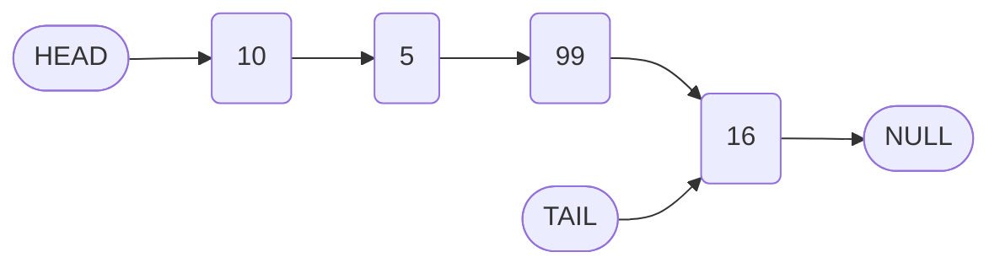

# Implementation of Linked List Insert Method and Introduction to Remove Operation

## 1. Introduction

The `insert` method is a fundamental operation for a singly linked list, enabling the addition of a new node at an arbitrary index within the sequence. This document provides a comprehensive explanation of the `insert` method's implementation, including parameter validation, traversal to locate the insertion point, and the critical pointer reassignments required to maintain list integrity. Additionally, the concept of the `remove` (or `delete`) method is introduced as a subsequent exercise, drawing parallels to the traversal and pointer manipulation techniques demonstrated in the `insert` operation.

## 2. The Insert Method: Algorithm and Implementation

The `insert(index, value)` method places a new node containing the specified `value` at the zero-based `index`. The operation modifies the `next` pointers of existing nodes to incorporate the new node without disrupting the overall structure.

### 2.1 Parameter Validation and Edge Cases

Robust methods include validation of input parameters. For the `insert` method, handling an `index` that exceeds the current list bounds is essential to prevent errors.

**Validation Strategy:**

- If the provided `index` is greater than or equal to the current `length` of the list, the method defaults to appending the value at the tail.
- Alternatively, an error could be thrown; however, for simplicity and continuity, automatic delegation to `append` is implemented.

**Code Implementation of Parameter Check:**

```javascript
class LinkedList {
    // ... (existing methods: constructor, append, prepend, printList)

    /**
     * Inserts a new node with the given value at the specified index.
     * @param {number} index - The zero-based insertion position.
     * @param {*} value - The value to be inserted.
     * @returns {LinkedList|Array} - The linked list instance or printed array.
     */
    insert(index, value) {
        // If index is out of bounds (>= length), append the value at the end
        if (index >= this.length) {
            return this.append(value);
        }
        
        // Remaining implementation follows...
    }
}
```

### 2.2 Traversal to Locate the Leader Node

To insert a node at index `i` (where `0 < i < length`), it is necessary to obtain a reference to the node at index `i - 1`, referred to as the **leader**. The leader's `next` pointer will be redirected to the new node.

A dedicated helper method, `traverseToIndex(index)`, performs the sequential traversal from the head to the specified index.

**Implementation of traverseToIndex:**

```javascript
class LinkedList {
    // ... 

    /**
     * Traverses the list and returns the node at the given index.
     * @param {number} index - The target index (0-based).
     * @returns {Node} - The node at the specified index.
     */
    traverseToIndex(index) {
        let counter = 0;
        let currentNode = this.head;
        
        // Continue advancing until the counter reaches the target index
        while (counter !== index) {
            currentNode = currentNode.next;
            counter++;
        }
        
        return currentNode;
    }
}
```

**Usage within Insert:**
To obtain the leader node (the node after which the new node will be inserted), call `traverseToIndex(index - 1)`.

```javascript
const leader = this.traverseToIndex(index - 1);
```

### 2.3 Pointer Reassignment for Insertion

With the leader node identified, the new node is inserted by adjusting pointers in the following sequence:

1. Store a reference to the node currently following the leader (the **holding pointer**).
2. Set the leader's `next` pointer to the new node.
3. Set the new node's `next` pointer to the stored holding pointer.

This process is illustrated below.

**Before Insertion (index = 2, value = 99):**



**After Insertion of 99 at Index 2:**



**Code for Pointer Reassignment:**

```javascript
// Create the new node
const newNode = new Node(value);

// Step 1: Hold reference to the node currently after leader
const holdingPointer = leader.next;

// Step 2: Redirect leader's next to the new node
leader.next = newNode;

// Step 3: Set new node's next to the held node
newNode.next = holdingPointer;

// Increment the list length
this.length++;
```

### 2.4 Complete Insert Method Implementation

Combining the validation, traversal, and pointer reassignment yields the full `insert` method.

```javascript
class LinkedList {
    // ... (constructor, append, prepend, printList, traverseToIndex)

    /**
     * Inserts a new node with the given value at the specified index.
     * @param {number} index - The zero-based insertion position.
     * @param {*} value - The value to insert.
     * @returns {LinkedList|Array} - The list instance or the printed array.
     */
    insert(index, value) {
        // Parameter validation: if index is beyond the end, append
        if (index >= this.length) {
            return this.append(value);
        }
        
        // Create the new node
        const newNode = new Node(value);
        
        // Obtain the leader node (node before insertion point)
        const leader = this.traverseToIndex(index - 1);
        
        // Hold reference to the subsequent node
        const holdingPointer = leader.next;
        
        // Perform pointer reassignments
        leader.next = newNode;
        newNode.next = holdingPointer;
        
        // Increment length
        this.length++;
        
        // Return printed list for immediate feedback (optional)
        return this.printList();
    }
}
```

### 2.5 Usage Example

```javascript
const myLinkedList = new LinkedList(10);
myLinkedList.append(5);
myLinkedList.append(16);

console.log('Before insert:', myLinkedList.printList()); // [10, 5, 16]

myLinkedList.insert(2, 99);
console.log('After insert at index 2:', myLinkedList.printList()); // [10, 5, 99, 16]

myLinkedList.insert(20, 88); // Index out of bounds, appends
console.log('After out-of-bounds insert:', myLinkedList.printList()); // [10, 5, 99, 16, 88]
```

### 2.6 Time Complexity Analysis

| Operation Phase | Time Complexity | Explanation |
| :--- | :--- | :--- |
| Parameter Validation | O(1) | Constant-time comparison. |
| Traversal to Leader | O(n) | In worst case, traverses up to index-1 nodes. |
| Pointer Reassignment | O(1) | Constant number of reference updates. |
| **Overall Insert** | **O(n)** | Dominated by traversal time. |

**Note:** Insertion at the head (index 0) or tail (index equal to length) can be optimized to O(1) by delegating to `prepend` or `append` respectively. The implementation above only handles index >= length by appending; a more robust version would include an explicit check for index === 0.

## 3. The Remove Method: Problem Statement

Following the pattern established for `insert`, the `remove(index)` method deletes the node at the specified `index`. This operation also requires traversal to locate the node **preceding** the target (the leader), followed by pointer reassignment to bypass the node to be removed.

### 3.1 Operational Requirements

- **Parameter:** `index` (zero-based position of the node to delete).
- **Behavior:** Remove the node at `index` and adjust surrounding pointers.
- **Edge Cases:**
  - Removing the head (index 0) requires updating the `head` reference.
  - Removing the tail requires updating the `tail` reference.
- **Return:** The list instance or a printed representation.

### 3.2 Algorithm Outline

1. **Validate Index:** Ensure `index` is within `0` to `this.length - 1`.
2. **Edge Case (Head Removal):** If `index === 0`, set `this.head` to `this.head.next`.
3. **General Case:**
   - Traverse to the `leader` node at `index - 1`.
   - Identify the `unwantedNode` as `leader.next`.
   - Update `leader.next` to `unwantedNode.next`.
   - If removing the tail (`index === this.length - 1`), update `this.tail` to `leader`.
4. **Decrement Length:** Reduce `this.length` by one.
5. **Return Result.**

### 3.3 Pointer Manipulation Visualization

**Before Removal of Node at Index 2 (value 99):**



**After Removal:**


The node with value `99` becomes unreferenced and is eligible for garbage collection.

### 3.4 Implementation Skeleton (Exercise)

```javascript
class LinkedList {
    // ... 

    /**
     * Removes the node at the specified index.
     * @param {number} index - The zero-based index of the node to remove.
     * @returns {LinkedList|Array} - The updated list or printed array.
     */
    remove(index) {
        // TODO: Validate index range (0 <= index < this.length)
        
        // TODO: Handle removal of head (index === 0)
        
        // TODO: Traverse to the leader node (index - 1)
        
        // TODO: Perform pointer reassignment to bypass the unwanted node
        
        // TODO: Update tail if the last node was removed
        
        // TODO: Decrement length
        
        // TODO: Return appropriate value
    }
}
```

## 4. Summary

- The `insert` method demonstrates the core pattern of linked list manipulation: **traverse** to a specific position, **hold references** to adjacent nodes, and **reassign pointers**.
- A helper method `traverseToIndex` encapsulates the sequential traversal logic, promoting code reuse.
- Parameter validation ensures robustness by handling out-of-bounds indices gracefully.
- The `remove` method is structurally analogous to `insert`, requiring similar traversal and pointer updates. The primary distinction lies in bypassing the target node rather than inserting a new one.
- Mastery of these operations solidifies understanding of linked list dynamics and prepares for more advanced topics such as list reversal and doubly linked lists.