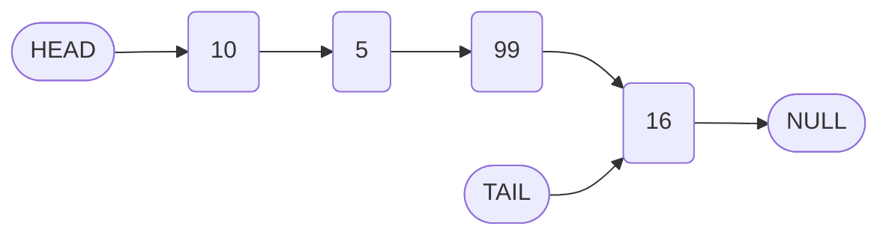
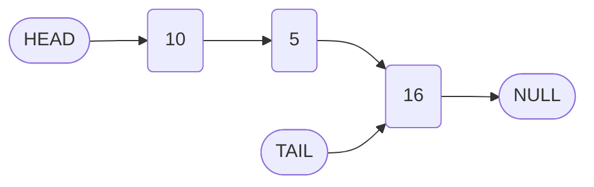

# Implementation of the Remove Method in Singly Linked Lists

## 1. Introduction

The `remove` method deletes a node at a specified index from a singly linked list. This operation is complementary to the `insert` method and relies on similar traversal and pointer manipulation techniques. Understanding the removal process reinforces the core concepts of linked list dynamics and memory management in garbage-collected environments.

## 2. Algorithm for Node Removal

The removal of a node at a given zero-based `index` involves the following steps:

1. **Parameter Validation:** Ensure the provided `index` is within the valid range (`0` to `this.length - 1`). Implement appropriate error handling or boundary checks.

2. **Locate the Leader Node:** Traverse the list to obtain the node immediately preceding the target node, referred to as the **leader** (`index - 1`).

3. **Identify the Unwanted Node:** The node to be removed is the `next` node of the leader (`leader.next`).

4. **Bypass the Unwanted Node:** Update the leader's `next` pointer to reference the node following the unwanted node (`unwantedNode.next`).

5. **Update Tail Reference (if necessary):** If the removed node was the tail, update the `tail` property to point to the leader.

6. **Decrement Length:** Reduce the `length` counter by one.

7. **Return Result:** Return the modified list or a printed representation.

### 2.1 Visual Representation of Removal

Consider a linked list with elements `10 -> 5 -> 99 -> 16`. Removing the node at index `2` (value `99`) results in the following transformation.

**Before Removal:**



**After Removal:**



The node containing `99` becomes unreachable and is eligible for garbage collection in languages like JavaScript.

## 3. Implementation in JavaScript

The following code implements the `remove` method within the `LinkedList` class, leveraging the previously defined `traverseToIndex` helper method.

```javascript
class LinkedList {
    // ... (constructor, append, prepend, printList, traverseToIndex, insert)

    /**
     * Removes the node at the specified index.
     * @param {number} index - The zero-based index of the node to remove.
     * @returns {Array} - The array representation of the updated list.
     */
    remove(index) {
        // Validate index range
        if (index < 0 || index >= this.length) {
            throw new Error("Index out of bounds");
        }

        // Edge case: Removing the head node
        if (index === 0) {
            this.head = this.head.next;
            this.length--;
            // If the list becomes empty, update tail as well
            if (this.length === 0) {
                this.tail = null;
            }
            return this.printList();
        }

        // General case: Locate the leader node (node before the target)
        const leader = this.traverseToIndex(index - 1);
        
        // Identify the node to be removed
        const unwantedNode = leader.next;
        
        // Bypass the unwanted node
        leader.next = unwantedNode.next;
        
        // If the removed node was the tail, update the tail reference
        if (index === this.length - 1) {
            this.tail = leader;
        }
        
        // Decrement the length
        this.length--;
        
        // Return the printed list for verification
        return this.printList();
    }
}
```

### 3.1 Explanation of Key Statements

| Code Statement | Purpose |
| :--- | :--- |
| `if (index < 0 \|\| index >= this.length)` | Ensures the index is within the existing node range. |
| `if (index === 0)` | Handles removal of the head node by advancing the `head` pointer. |
| `const leader = this.traverseToIndex(index - 1);` | Obtains the node preceding the target via traversal. |
| `const unwantedNode = leader.next;` | Captures a reference to the node slated for removal. |
| `leader.next = unwantedNode.next;` | Redirects the leader's pointer to bypass the unwanted node. |
| `if (index === this.length - 1)` | Updates the `tail` if the last node is removed. |
| `this.length--;` | Decrements the node count. |

### 3.2 Usage Example

```javascript
const myLinkedList = new LinkedList(10);
myLinkedList.append(5);
myLinkedList.append(99);
myLinkedList.append(16);

console.log('Initial List:', myLinkedList.printList()); // [10, 5, 99, 16]

myLinkedList.remove(2); // Remove 99
console.log('After removing index 2:', myLinkedList.printList()); // [10, 5, 16]

myLinkedList.remove(1); // Remove 5
console.log('After removing index 1:', myLinkedList.printList()); // [10, 16]
```

## 4. Time Complexity Analysis

| Operation Phase | Time Complexity | Explanation |
| :--- | :--- | :--- |
| Parameter Validation | O(1) | Constant-time bounds check. |
| Traversal to Leader | O(n) | In worst case (removing tail), traverses up to `index - 1` nodes. |
| Pointer Reassignment | O(1) | Constant number of reference updates. |
| **Overall Remove** | **O(n)** | Dominated by traversal time. |

**Note:** Removal of the head node (`index = 0`) is an **O(1)** operation, as it does not require traversal.

## 5. Memory Management and Garbage Collection

In JavaScript, memory is managed automatically via garbage collection. When the `remove` method bypasses a node by updating the leader's `next` pointer, the unwanted node loses all incoming references. Provided no other variables reference it, the node becomes eligible for garbage collection and its memory is reclaimed.

**Illustration of Reference Removal:**

```
Before: leader.next -> unwantedNode -> nextNode
After:  leader.next -> nextNode
        unwantedNode (unreferenced) -> eligible for GC
```

This behavior contrasts with low-level languages like C/C++, where explicit deallocation (`free()` or `delete`) is required to prevent memory leaks.

## 6. Transition to Doubly Linked Lists

The singly linked list implementation presented thus far provides unidirectional traversal from head to tail. However, certain operations (e.g., removing the tail node without a full traversal) remain inefficient.

A **doubly linked list** enhances the node structure by including an additional pointer to the **previous** node. This bidirectional linkage enables:

- O(1) removal of the tail node (by accessing `tail.previous`).
- Efficient traversal in both directions.
- Simplified implementation of certain algorithms (e.g., reverse traversal).

The subsequent section will explore the structure, implementation, and advantages of doubly linked lists.

## 7. Summary

- The `remove` method deletes a node at a specified index by traversing to the preceding node and reassigning its `next` pointer.
- The time complexity is O(n) in the general case due to traversal, but O(1) for head removal.
- Proper handling of edge cases (head removal, tail update) ensures list integrity.
- Garbage collection automatically reclaims memory of unreferenced nodes in JavaScript.
- Mastery of singly linked list operations provides a solid foundation for understanding more advanced structures like doubly linked lists.