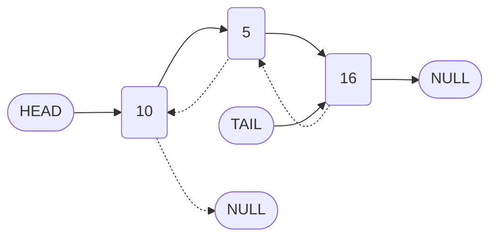

# Doubly Linked Lists: Introduction and Conceptual Overview

## 1. Introduction

A **doubly linked list** is an extension of the singly linked list data structure. While a singly linked list node contains a single reference to the next node in the sequence, a doubly linked list node maintains **two references**: one to the next node and one to the previous node. This bidirectional linkage enables more flexible traversal and simplifies certain operations at the cost of increased memory overhead.

## 2. Structure of a Doubly Linked List Node

A node in a doubly linked list comprises three distinct components:

| Component | Description |
| :--- | :--- |
| `value` | The data stored within the node. |
| `next` | A pointer (reference) to the subsequent node in the list. |
| `prev` | A pointer (reference) to the preceding node in the list. |

### 2.1 Node Representation in JavaScript

The following class defines a node suitable for a doubly linked list.

```javascript
/**
 * Represents a single node in a doubly linked list.
 */
class DoublyNode {
    /**
     * Creates a new doubly linked list node.
     * @param {*} value - The data to store.
     */
    constructor(value) {
        this.value = value;
        this.next = null;   // Pointer to the next node
        this.prev = null;   // Pointer to the previous node
    }
}
```

## 3. Visual Representation

Consider a doubly linked list containing three elements: `10`, `5`, and `16`. The structure is depicted below.



**Explanation:**

- The solid arrows represent `next` pointers, forming the forward chain from head to tail.
- The dashed arrows represent `prev` pointers, forming the backward chain from tail to head.
- The head node's `prev` pointer is `null`, indicating the start of the list.
- The tail node's `next` pointer is `null`, indicating the end of the list.

## 4. Comparison with Singly Linked Lists

| Feature | Singly Linked List | Doubly Linked List |
| :--- | :--- | :--- |
| **Node Pointers** | One (`next`) | Two (`next`, `prev`) |
| **Traversal Direction** | Forward only | Forward and backward |
| **Memory Overhead** | Lower (one pointer per node) | Higher (two pointers per node) |
| **Tail Removal Complexity** | O(n) — requires traversal to find predecessor | O(1) — direct access via `tail.prev` |
| **Insertion/Deletion at Known Node** | O(1) with reference to predecessor | O(1) with reference to the node itself |

## 5. Advantages of Doubly Linked Lists

### 5.1 Bidirectional Traversal

The `prev` pointer enables traversal from tail to head. This is particularly useful in applications requiring reverse iteration, such as navigating browser history or implementing undo/redo functionality.

### 5.2 Improved Deletion Efficiency

In a singly linked list, deleting a node requires a reference to its predecessor to update the `next` pointer. In a doubly linked list, given a reference to the node to be deleted, both the predecessor and successor can be accessed directly:

- Predecessor: `nodeToDelete.prev`
- Successor: `nodeToDelete.next`

This allows O(1) deletion without requiring traversal from the head, assuming the node reference is already available.

### 5.3 Potentially Optimized Search

Although the asymptotic time complexity for search remains **O(n)**, a doubly linked list can theoretically reduce the average number of nodes visited by a constant factor. If the approximate position of the target is known (e.g., in the first or second half of the list), traversal can commence from either the head or the tail, effectively halving the search space in the best case. However, this optimization does not alter the worst-case linear complexity.

## 6. Disadvantages of Doubly Linked Lists

### 6.1 Increased Memory Footprint

Each node stores an additional pointer (`prev`), increasing memory consumption. In environments with limited memory resources, this overhead may be significant, especially for lists containing a large number of nodes.

### 6.2 Additional Pointer Maintenance

Operations such as insertion and deletion must manage both `next` and `prev` pointers. This increases the complexity of implementation and the potential for pointer-related bugs.

## 7. Time Complexity Summary

| Operation | Singly Linked List | Doubly Linked List |
| :--- | :--- | :--- |
| Prepend (Insert at Head) | O(1) | O(1) |
| Append (Insert at Tail) | O(1) with tail pointer | O(1) |
| Insert at Arbitrary Index | O(n) | O(n) |
| Delete Head | O(1) | O(1) |
| Delete Tail | O(n) | O(1) |
| Delete Arbitrary Node (given reference) | O(n) without predecessor | O(1) |
| Search / Lookup | O(n) | O(n) |

## 8. Implementation Preview

Converting the previously implemented `LinkedList` class to support doubly linked functionality involves the following modifications:

1. **Node Class:** Replace the `Node` class with a `DoublyNode` class that includes a `prev` property.
2. **Constructor:** Initialize `head.prev` to `null`.
3. **Append Method:** When adding a new tail node, set `newNode.prev` to the previous tail.
4. **Prepend Method:** When adding a new head node, set the old head's `prev` to the new node.
5. **Insert Method:** Update both `next` and `prev` pointers of the new node and its neighbors.
6. **Remove Method:** Adjust the `prev` pointer of the node following the removed node (if any).

The subsequent sections will provide a detailed, step-by-step conversion of the singly linked list implementation into a fully functional doubly linked list.

## 9. Summary

- A doubly linked list enhances the singly linked list by adding a `prev` pointer to each node, enabling bidirectional traversal.
- The additional pointer simplifies tail removal and deletion of arbitrary nodes when a reference is available.
- The trade-off is increased memory usage and slightly more complex pointer management.
- Search complexity remains O(n), though constant-factor improvements may be realized.

Understanding doubly linked lists is essential for scenarios where backward traversal or efficient tail operations are required, and it serves as a foundation for more advanced data structures such as dequeues and certain tree implementations.