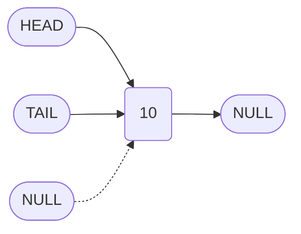
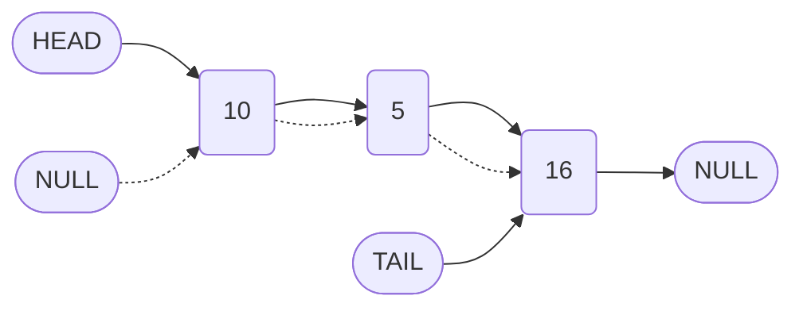
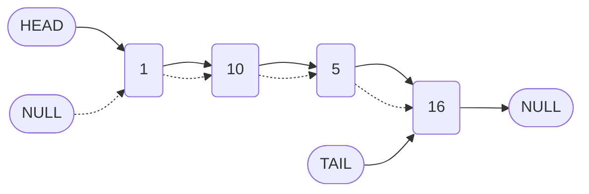
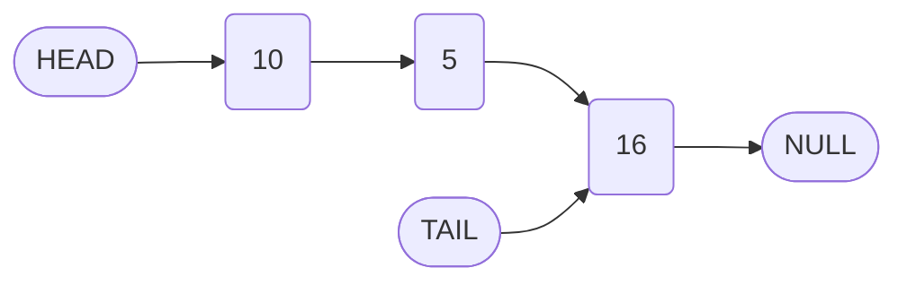
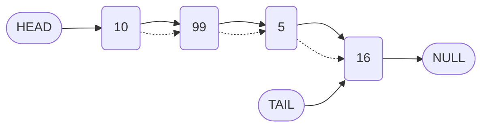

# Converting a Singly Linked List to a Doubly Linked List in JavaScript

## 1. Introduction

A doubly linked list extends the functionality of a singly linked list by maintaining an additional pointer in each node that references the previous node. This document details the step-by-step conversion of an existing singly linked list implementation into a fully functional doubly linked list. The modifications involve updating the node structure and adjusting the core methods—constructor, `append`, `prepend`, and `insert`—to correctly manage both `next` and `prev` references.

## 2. Node Structure Modification

The foundational change is the introduction of a `prev` property in the node class. In a singly linked list, a node contains only `value` and `next`. For a doubly linked list, the node must also store a reference to its predecessor.

### 2.1 DoublyNode Class Definition

```javascript
/**
 * Represents a single node in a doubly linked list.
 */
class DoublyNode {
    /**
     * Creates a new doubly linked list node.
     * @param {*} value - The data to store in the node.
     */
    constructor(value) {
        this.value = value;
        this.next = null;   // Pointer to the subsequent node
        this.prev = null;   // Pointer to the preceding node
    }
}
```

## 3. Constructor Modification

The constructor initializes the list with a single node. In a doubly linked list, the head node must have its `prev` pointer explicitly set to `null` (which is already the default). No additional changes are required beyond using the `DoublyNode` class.

```javascript
class DoublyLinkedList {
    /**
     * Initializes a doubly linked list with a single node.
     * @param {*} value - The value for the head node.
     */
    constructor(value) {
        this.head = new DoublyNode(value);
        this.tail = this.head;
        this.length = 1;
    }
}
```

**State after constructor:**



## 4. The Append Method

Appending a node to the end of a doubly linked list requires establishing a bidirectional link between the current tail and the new node.

### 4.1 Algorithm Steps

1. Create a new `DoublyNode` with the given value.
2. Set the `prev` pointer of the new node to reference the current `tail`.
3. Set the `next` pointer of the current `tail` to the new node.
4. Update the `tail` reference to the new node.
5. Increment the `length`.

### 4.2 Implementation

```javascript
class DoublyLinkedList {
    // ... constructor

    /**
     * Appends a new node to the end of the doubly linked list.
     * @param {*} value - The value to append.
     * @returns {DoublyLinkedList} - The updated list instance.
     */
    append(value) {
        const newNode = new DoublyNode(value);
        
        // Link the new node's prev to the current tail
        newNode.prev = this.tail;
        
        // Link the current tail's next to the new node
        this.tail.next = newNode;
        
        // Update tail reference
        this.tail = newNode;
        
        this.length++;
        return this;
    }
}
```

### 4.3 Visual Representation After Append



## 5. The Prepend Method

Prepending a node to the beginning of the list requires updating the `prev` pointer of the existing head and establishing a bidirectional link with the new node.

### 5.1 Algorithm Steps

1. Create a new `DoublyNode` with the given value.
2. Set the `next` pointer of the new node to the current `head`.
3. Set the `prev` pointer of the current `head` to the new node.
4. Update the `head` reference to the new node.
5. Increment the `length`.

### 5.2 Implementation

```javascript
class DoublyLinkedList {
    // ... other methods

    /**
     * Prepends a new node to the beginning of the doubly linked list.
     * @param {*} value - The value to prepend.
     * @returns {DoublyLinkedList} - The updated list instance.
     */
    prepend(value) {
        const newNode = new DoublyNode(value);
        
        // Link new node's next to current head
        newNode.next = this.head;
        
        // Link current head's prev to new node
        this.head.prev = newNode;
        
        // Update head reference
        this.head = newNode;
        
        this.length++;
        return this;
    }
}
```

### 5.3 Visual Representation After Prepend



## 6. The Insert Method

Inserting a node at an arbitrary index in a doubly linked list involves manipulating both `next` and `prev` pointers of the new node and its neighboring nodes (the **leader** and the **follower**).

### 6.1 Algorithm Steps

1. Validate the `index`. If out of bounds, delegate to `append`.
2. If `index === 0`, delegate to `prepend`.
3. Traverse to the **leader** node at `index - 1`.
4. Identify the **follower** node as `leader.next`.
5. Create a new `DoublyNode`.
6. Set the new node's `next` to the follower and `prev` to the leader.
7. Update the leader's `next` to the new node.
8. Update the follower's `prev` to the new node (if follower exists).
9. Increment `length`.

### 6.2 Implementation

```javascript
class DoublyLinkedList {
    // ... other methods including traverseToIndex

    /**
     * Inserts a new node at the specified index.
     * @param {number} index - Zero-based insertion position.
     * @param {*} value - Value to insert.
     * @returns {DoublyLinkedList} - The updated list.
     */
    insert(index, value) {
        // Handle index beyond current length
        if (index >= this.length) {
            return this.append(value);
        }
        // Handle insertion at head
        if (index === 0) {
            return this.prepend(value);
        }
        
        const newNode = new DoublyNode(value);
        const leader = this.traverseToIndex(index - 1);
        const follower = leader.next;
        
        // Link new node with leader and follower
        newNode.next = follower;
        newNode.prev = leader;
        
        // Update leader and follower pointers
        leader.next = newNode;
        follower.prev = newNode;
        
        this.length++;
        return this;
    }
}
```

### 6.3 Visual Representation of Insertion at Index 2 (Value 99)

**Before Insertion:**



**After Insertion:**



## 7. The Remove Method (Implementation Outline)

The `remove` method for a doubly linked list follows a similar pattern to the singly linked version but requires updating `prev` pointers as well. The key steps are:

1. Validate `index`.
2. If `index === 0`: update `head = head.next`; if new head exists, set `head.prev = null`.
3. Else:
   - Traverse to `leader` at `index - 1`.
   - Identify `unwantedNode = leader.next`.
   - Set `leader.next = unwantedNode.next`.
   - If `unwantedNode.next` exists, set `unwantedNode.next.prev = leader`.
   - If removing tail, update `tail = leader`.
4. Decrement `length`.

This exercise is left to the reader to implement fully, as it is a direct extension of the patterns established in the previous methods.

## 8. Summary of Changes

| Method | Additional Pointer Management Required |
| :--- | :--- |
| Constructor | None (beyond using `DoublyNode`). |
| Append | Set `newNode.prev = this.tail` before updating tail. |
| Prepend | Set `this.head.prev = newNode` before updating head. |
| Insert | Set `newNode.prev = leader` and `follower.prev = newNode`. |
| Remove | Update `prev` of the node following the removed node. |

## 9. Conclusion

Converting a singly linked list to a doubly linked list involves systematically adding `prev` pointer assignments to each method that modifies the list structure. While the additional pointer increases memory overhead, it enables bidirectional traversal and simplifies operations such as tail removal and reverse iteration. Mastery of these pointer manipulations is essential for understanding more complex data structures and is a common topic in technical interviews.