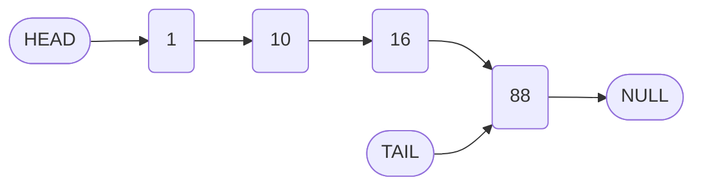
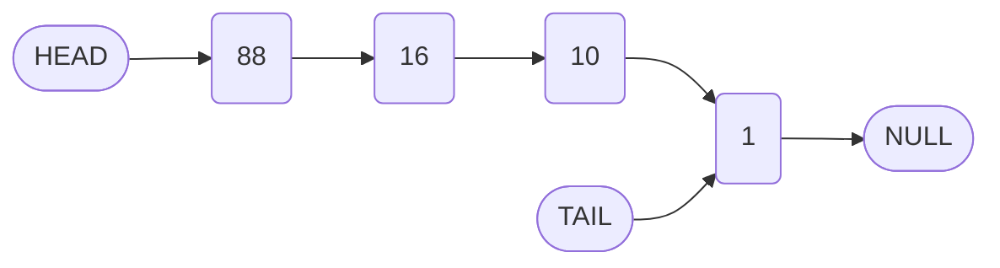

# Exercise: Reversing a Singly Linked List

## 1. Introduction

Reversing a linked list is a classic algorithmic problem frequently encountered in technical interviews. The task tests a candidate's understanding of pointer manipulation, traversal, and in-place data structure modification. This exercise involves implementing a `reverse` method for the singly linked list class developed in previous sections.

## 2. Problem Statement

Given a singly linked list, write a method that reverses the order of the nodes **in place**. The reversal must modify the existing node references rather than creating a new list or copying values into an auxiliary data structure.

### 2.1 Example

**Input List:**

```
Head --> [1] --> [10] --> [16] --> [88] --> null
```

**Output List (after reversal):**

```
Head --> [88] --> [16] --> [10] --> [1] --> null
```

### 2.2 Constraints

- The reversal must be performed **in-place**; no new nodes should be created (except temporary pointer variables).
- The original list structure should be mutated, not copied.
- The method should update the `head` and `tail` references appropriately.
- The `length` property remains unchanged.
- The method should handle edge cases: empty list (if applicable) and single-node list.

## 3. Method Signature

The `reverse` method is added to the `LinkedList` class.

```javascript
class LinkedList {
    // ... existing methods (constructor, append, prepend, insert, remove, printList)

    /**
     * Reverses the linked list in place.
     * @returns {LinkedList} - The reversed linked list instance.
     */
    reverse() {
        // TODO: Implement reversal logic
    }
}
```

## 4. Algorithmic Approach and Hints

Reversing a singly linked list requires reassigning the `next` pointer of each node to point to its previous node. Since nodes only have a forward reference, the reversal must be performed during a single traversal while maintaining references to surrounding nodes.

### 4.1 Key Steps

1. **Initialize Pointers:**
   - `previous = null` (will become the new `next` for the current head).
   - `current = this.head` (start at the beginning).

2. **Traverse and Reverse:**
   - While `current` is not `null`:
     - Store the next node temporarily: `let nextNode = current.next`.
     - Reverse the link: `current.next = previous`.
     - Move `previous` forward: `previous = current`.
     - Move `current` forward: `current = nextNode`.

3. **Update Head and Tail:**
   - After traversal, `previous` will point to the old tail (new head).
   - Set `this.tail = this.head` (the old head becomes the new tail).
   - Set `this.head = previous`.

### 4.2 Visual Representation of Reversal Process

Consider a list `1 -> 10 -> 16 -> 88 -> null`.

**Initial State:**



**After Reversal:**



### 4.3 Pointer Manipulation Details

The reversal loop maintains three pointers:

| Pointer | Purpose |
| :--- | :--- |
| `previous` | The node that has just been reversed; initially `null`. |
| `current` | The node currently being processed; initially `this.head`. |
| `nextNode` | Temporary storage for `current.next` before it is overwritten. |

The sequence of assignments within the loop is critical:

```javascript
let nextNode = current.next;   // Step 1: Save reference to next node
current.next = previous;       // Step 2: Reverse the link
previous = current;            // Step 3: Advance previous to current
current = nextNode;            // Step 4: Advance current to saved next
```

## 5. Expected Outcome

After implementing and invoking the `reverse` method, the following test should pass:

```javascript
const list = new LinkedList(1);
list.append(10);
list.append(16);
list.append(88);

console.log('Original:', list.printList()); // [1, 10, 16, 88]

list.reverse();
console.log('Reversed:', list.printList()); // [88, 16, 10, 1]
```

Additionally, the `head` and `tail` references should correctly point to the new extremities.

## 6. Implementation Considerations

| Consideration | Guidance |
| :--- | :--- |
| **Empty List** | If the list can be empty (e.g., after removals), handle `this.head === null` by returning immediately. |
| **Single Node** | Reversing a list of length 1 is a no-op; the loop condition naturally handles it. |
| **Tail Update** | Remember to set `this.tail = this.head` **before** updating `this.head`, as the original head reference is needed. |

## 7. Exercise Instructions

1. Open the `LinkedList` class implementation from previous sections.
2. Add the `reverse` method as described.
3. Test your implementation using the provided example and additional edge cases.
4. Do **not** use any auxiliary data structures (e.g., arrays, stacks) to store node values.
5. Ensure the list remains a valid singly linked list after reversal.

The solution will be presented in the subsequent video. Attempt the implementation independently to maximize learning and problem-solving proficiency.