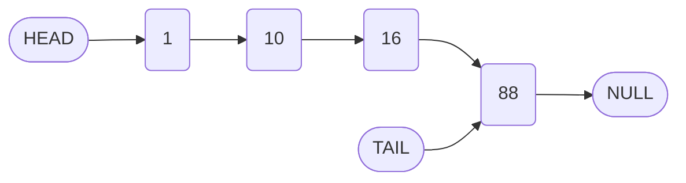
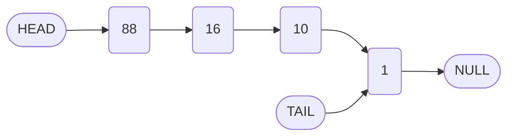

# Reversing a Singly Linked List: Algorithm and Implementation

## 1. Introduction

Reversing a singly linked list is a fundamental operation that transforms the list such that the order of nodes is inverted. The original head becomes the tail, and the original tail becomes the head. This operation is commonly used as an interview question to assess a candidate's understanding of pointer manipulation and iterative traversal in linked data structures.

This document presents a comprehensive solution for reversing a singly linked list **in place**, without allocating additional nodes or auxiliary data structures.

## 2. Problem Definition

Given a singly linked list with nodes connected via `next` pointers, modify the list such that the direction of all links is reversed.

**Example:**

- **Input List:** `1 → 10 → 16 → 88 → null`
- **Output List:** `88 → 16 → 10 → 1 → null`

**Constraints:**
- The reversal must be performed in-place (O(1) auxiliary space).
- The `head` and `tail` references of the list must be updated correctly.
- The method should handle edge cases, including an empty list or a list with a single node.

## 3. Algorithm Overview

The reversal is accomplished through a single traversal of the list, during which the `next` pointer of each node is redirected to its predecessor. Three pointer variables are maintained:

| Pointer | Purpose |
| :--- | :--- |
| `first` (or `prev`) | The node that has already been reversed; initially `null`. |
| `second` (or `current`) | The node currently being processed; initially the `head`. |
| `temp` (or `next`) | Temporary storage for the next node before the link is broken. |

The algorithm proceeds as follows:

1. Handle the trivial case where the list has zero or one node.
2. Initialize `first = this.head` and `second = first.next`.
3. Update the `tail` reference to point to the current `head` (since the head will become the tail).
4. Iterate while `second` is not `null`:
   - Store `second.next` in a temporary variable `temp`.
   - Reverse the link: `second.next = first`.
   - Shift `first` and `second` forward: `first = second`, `second = temp`.
5. After the loop, set the original head's `next` to `null`.
6. Update `this.head` to `first` (the new head).

## 4. Detailed Step-by-Step Walkthrough

Consider the initial list: `1 → 10 → 16 → 88 → null`.

### 4.1 Initialization

```javascript
let first = this.head;   // first points to node with value 1
let second = first.next; // second points to node with value 10
this.tail = this.head;   // The current head (1) will become the tail
```

**State:**

```
first  → [1] → [10] → [16] → [88] → null
second → [10] → ...
tail   → [1]
```

### 4.2 Iteration 1

- `temp = second.next` → points to node with value `16`.
- `second.next = first` → node `10` now points to `1`.
- `first = second` → `first` now points to `10`.
- `second = temp` → `second` now points to `16`.

**State after first iteration:**

```
[1] ← [10]    [16] → [88] → null
        ↑      ↑
      first  second
```

### 4.3 Iteration 2

- `temp = second.next` → points to `88`.
- `second.next = first` → node `16` now points to `10`.
- `first = second` → `first` points to `16`.
- `second = temp` → `second` points to `88`.

**State:**

```
[1] ← [10] ← [16]    [88] → null
                ↑      ↑
              first  second
```

### 4.4 Iteration 3

- `temp = second.next` → `null`.
- `second.next = first` → node `88` points to `16`.
- `first = second` → `first` points to `88`.
- `second = temp` → `second` becomes `null`.

**State:**

```
[1] ← [10] ← [16] ← [88]
                      ↑
                    first
second = null → loop terminates.
```

### 4.5 Final Adjustments

- `this.head.next = null` → ensures the original head (now tail) points to `null`.
- `this.head = first` → updates head reference to `88`.

**Final Reversed List:**

```
[88] → [16] → [10] → [1] → null
```

## 5. Code Implementation

The following JavaScript code implements the `reverse` method within the `LinkedList` class.

```javascript
class LinkedList {
    // ... (existing properties and methods)

    /**
     * Reverses the singly linked list in place.
     * @returns {LinkedList} - The reversed linked list instance.
     */
    reverse() {
        // Edge case: empty list or single node
        if (!this.head || !this.head.next) {
            return this;
        }

        let first = this.head;
        let second = first.next;
        
        // The current head will become the tail
        this.tail = this.head;

        // Traverse and reverse pointers
        while (second) {
            const temp = second.next;   // Store reference to next node
            second.next = first;        // Reverse the link
            first = second;             // Move first forward
            second = temp;              // Move second forward
        }

        // Terminate the new tail
        this.head.next = null;
        
        // Update head to the new first node
        this.head = first;

        return this;
    }
}
```

### 5.1 Code Explanation

| Line | Explanation |
| :--- | :--- |
| `if (!this.head \|\| !this.head.next)` | Handles lists with 0 or 1 nodes; reversal is unnecessary. |
| `this.tail = this.head;` | Captures the original head as the new tail before any modifications. |
| `while (second)` | Iterates as long as there is a node to process. |
| `const temp = second.next;` | Saves the subsequent node to avoid losing the reference after reassignment. |
| `second.next = first;` | The core reversal step: the current node now points backward. |
| `first = second; second = temp;` | Advances the pointers for the next iteration. |
| `this.head.next = null;` | Sets the `next` of the original head (now tail) to `null`. |
| `this.head = first;` | Updates the list's head to the new first node. |

## 6. Visual Representation

The following diagram illustrates the transformation from the original list to the reversed list.

**Before Reversal:**



**After Reversal:**



## 7. Complexity Analysis

| Metric | Complexity | Justification |
| :--- | :--- | :--- |
| **Time Complexity** | O(n) | The algorithm traverses the list exactly once, where `n` is the number of nodes. |
| **Space Complexity** | O(1) | Only a constant number of pointer variables (`first`, `second`, `temp`) are used; no additional data structures are allocated. |

## 8. Edge Cases and Validation

| Scenario | Behavior |
| :--- | :--- |
| Empty list (`head === null`) | Method returns immediately without error. |
| Single-node list | Method returns immediately; `head` and `tail` remain unchanged. |
| List with multiple nodes | Reversal performed correctly; `head` and `tail` updated. |

**Test Example:**

```javascript
const list = new LinkedList(1);
list.append(10);
list.append(16);
list.append(88);

console.log(list.printList()); // [1, 10, 16, 88]

list.reverse();
console.log(list.printList()); // [88, 16, 10, 1]
console.log(list.head.value);  // 88
console.log(list.tail.value);  // 1
```

## 9. Conclusion

Reversing a singly linked list in place is a classic exercise that reinforces the concepts of pointer manipulation and iterative traversal. The presented algorithm achieves O(n) time complexity and O(1) auxiliary space, making it both efficient and memory-conservative. Mastery of this operation is essential for understanding more advanced linked list problems and is a valuable skill for technical interviews.