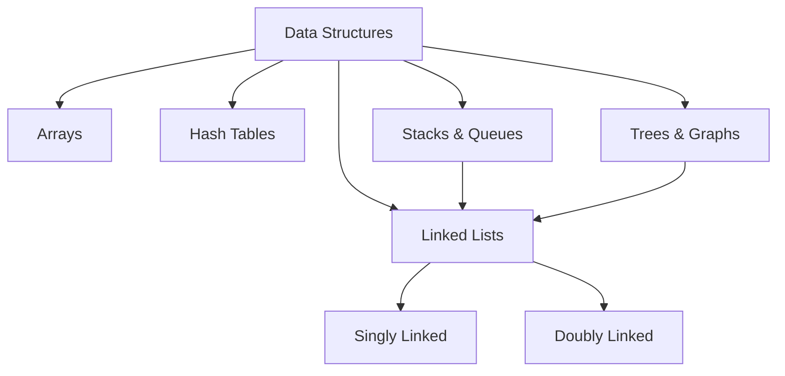

# Linked Lists: Summary and Applications

## 1. Overview

Linked lists are fundamental, low-level data structures in computer science. They serve as building blocks for more complex structures and are frequently encountered in both academic curricula and technical interviews. This document consolidates the key concepts, trade-offs, and practical applications of singly and doubly linked lists.

## 2. Language Availability and Implementation

- **Native Support:** Some programming languages, such as Java and C++, provide built-in linked list implementations within their standard libraries.
- **JavaScript:** Linked lists are not natively included. However, they can be constructed manually using object-oriented principles and reference semantics, as demonstrated in prior sections.

## 3. Core Characteristics of Linked Lists

### 3.1 Comparison with Arrays and Hash Tables

| Property | Array | Hash Table | Linked List |
| :--- | :--- | :--- | :--- |
| **Random Access** | O(1) via indexing | O(1) average via hashing | O(n) sequential traversal required |
| **Lookup Speed** | Fast (direct) | Fast (key-based) | Slow (traversal) |
| **Ordering** | Maintains index order | Unordered | Maintains insertion order |
| **Insertion/Deletion** | Costly (O(n) shifting) | Fast (O(1) average) | Fast (O(1) at ends with reference) |

### 3.2 Advantages of Linked Lists

- **Dynamic Resizing:** Linked lists grow and shrink incrementally without requiring pre-allocation or costly resizing operations (unlike dynamic arrays).
- **Efficient Insertions/Deletions:** Once a reference to a node is obtained, inserting or deleting adjacent nodes is O(1). This is particularly beneficial at the head and tail.
- **Ordered Structure:** Nodes are linked in a defined sequence, enabling predictable traversal order.

### 3.3 Disadvantages of Linked Lists

- **No Random Access:** Accessing an arbitrary element requires linear traversal from the head (or tail, in doubly linked lists).
- **Increased Memory Overhead:** Each node stores one or two pointer references in addition to the data payload.
- **Poor Cache Locality:** Non-contiguous memory allocation may lead to more cache misses compared to arrays.

## 4. Practical Applications

Linked lists are employed in various real-world scenarios:

- **File Systems:** Directory structures and file allocation tables may utilize linked list concepts.
- **Browser History:** The back and forward navigation can be modeled as a doubly linked list, where each page points to the previous and next visited URLs.
- **Hash Table Collision Resolution:** Separate chaining uses linked lists to store multiple entries that hash to the same bucket index.
- **Stacks and Queues:** Both data structures can be efficiently implemented using linked lists, leveraging O(1) insertions and deletions at the ends.

## 5. Improvement of Hash Table Implementation

In the previously constructed hash table, collision handling was implemented by pushing entries into an array at the bucket index. While functional, deletion from an array within a bucket would require shifting elements, incurring O(n) time.

**Proposed Enhancement:**
Replace the array at each bucket with a singly linked list. This modification would enable O(1) deletion of entries from the chain, provided a reference to the node to be removed is available. The `set` method would append a new node to the linked list at the corresponding bucket, and the `get` method would traverse the chain to locate the desired key.

```javascript
// Example modification in HashTable set method (conceptual)
set(key, value) {
    const address = this._hash(key);
    if (!this.data[address]) {
        // Initialize bucket as a new LinkedList
        this.data[address] = new LinkedList();
    }
    // Append new entry as a node { key, value }
    this.data[address].append({ key, value });
}
```

This change optimizes deletion operations within the collision chain, aligning with the strengths of linked lists.

## 6. Relationship to Upcoming Data Structures

Linked lists serve as a foundational concept for several advanced data structures:

- **Stacks and Queues:** Both are linear collections that can be implemented using linked lists to achieve O(1) push/pop or enqueue/dequeue operations.
- **Trees and Graphs:** Node-based structures where each element may have multiple pointers (e.g., left and right children in a binary tree) extend the linked list concept.

The following diagram illustrates the position of linked lists within the broader data structure hierarchy.



## 7. Conclusion

Linked lists are a versatile and essential data structure, valued for their dynamic memory usage and efficient insertions/deletions. While they lack the random access speed of arrays and hash tables, their ordered nature and adaptability make them indispensable in numerous applications, from low-level system components to high-level algorithm design. A thorough understanding of linked lists provides a strong foundation for mastering subsequent data structures and excelling in technical evaluations.