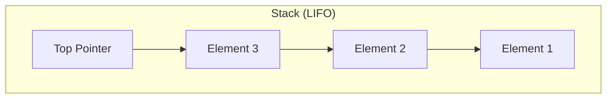
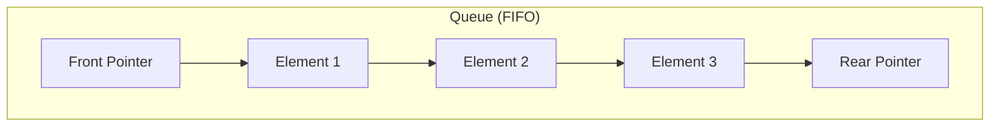

# Linear Data Structures: Stacks and Queues

## 1. Introduction to Linear Data Structures

Linear data structures represent a fundamental category of data organization in computer science where elements are arranged in a sequential manner. The defining characteristic of a linear data structure is that traversal—the process of visiting each data element—occurs sequentially, one element after another. In such structures, only one data element can be directly accessed at any given moment.

Stacks and Queues are two primary examples of linear data structures. They share significant similarities in their implementation approaches but differ fundamentally in how elements are removed from the structure. Both are typically implemented using lower-level data structures such as arrays or linked lists, providing a restricted set of operations that make them suitable for specific computational tasks.

## 2. Core Principles of Restricted Access

Unlike arrays, which support random access operations, Stacks and Queues intentionally limit the operations available to the user. Common operations are confined to:

- **Push**: Adding an element to the structure
- **Pop**: Removing an element from the structure
- **Peek**: Viewing an element without removing it

These operations deal exclusively with elements at the extremities (beginning or end) of the data structure. This restricted access model is not a limitation but rather a deliberate design choice in computer science.

### 2.1 The Benefit of Constrained Operations

Higher-level data structures built upon lower-level ones (arrays, linked lists) provide constrained interfaces that offer significant advantages:

- **Controlled Usage**: Users are guided toward correct and efficient operations
- **Error Prevention**: Restricted operations reduce the likelihood of misuse
- **Conceptual Clarity**: A limited set of methods simplifies the mental model for developers
- **Algorithmic Efficiency**: Specialized structures optimize specific access patterns

This principle reflects a broader engineering philosophy: providing only essential tools reduces complexity and improves reliability.

## 3. The Stack Data Structure

A Stack follows the **Last-In-First-Out (LIFO)** principle. The most recently added element is the first one to be removed, analogous to a stack of plates where plates are added to and removed from the top.

### 3.1 Stack Operations

| Operation | Description |
|-----------|-------------|
| push(element) | Adds an element to the top of the stack |
| pop() | Removes and returns the top element |
| peek() | Returns the top element without removal |
| isEmpty() | Checks whether the stack contains elements |

### 3.2 Visual Representation



### 3.3 Java Implementation Example

```java
/**
 * A simple Stack implementation using an array.
 * Demonstrates the LIFO (Last-In-First-Out) behavior.
 */
public class ArrayStack {
    private int[] stackArray;
    private int top;
    private int capacity;

    /**
     * Constructor to initialize the stack with a given capacity.
     */
    public ArrayStack(int size) {
        capacity = size;
        stackArray = new int[capacity];
        top = -1; // Indicates an empty stack
    }

    /**
     * Adds an element to the top of the stack.
     * @param value The element to be added
     */
    public void push(int value) {
        if (top == capacity - 1) {
            System.out.println("Stack Overflow: Cannot push, stack is full.");
            return;
        }
        stackArray[++top] = value;
        System.out.println("Pushed: " + value);
    }

    /**
     * Removes and returns the top element from the stack.
     * @return The top element, or -1 if stack is empty
     */
    public int pop() {
        if (isEmpty()) {
            System.out.println("Stack Underflow: Cannot pop, stack is empty.");
            return -1;
        }
        return stackArray[top--];
    }

    /**
     * Returns the top element without removing it.
     * @return The top element, or -1 if stack is empty
     */
    public int peek() {
        if (isEmpty()) {
            System.out.println("Stack is empty.");
            return -1;
        }
        return stackArray[top];
    }

    /**
     * Checks whether the stack is empty.
     * @return true if stack is empty, false otherwise
     */
    public boolean isEmpty() {
        return top == -1;
    }

    /**
     * Returns the current number of elements in the stack.
     */
    public int size() {
        return top + 1;
    }
}
```

## 4. The Queue Data Structure

A Queue follows the **First-In-First-Out (FIFO)** principle. The first element added to the queue is the first one to be removed, analogous to a line of people waiting for service.

### 4.1 Queue Operations

| Operation | Description |
|-----------|-------------|
| enqueue(element) | Adds an element to the rear of the queue |
| dequeue() | Removes and returns the front element |
| peek() | Returns the front element without removal |
| isEmpty() | Checks whether the queue contains elements |

### 4.2 Visual Representation



### 4.3 Java Implementation Example

```java
/**
 * A simple Queue implementation using an array.
 * Demonstrates the FIFO (First-In-First-Out) behavior.
 */
public class ArrayQueue {
    private int[] queueArray;
    private int front;
    private int rear;
    private int capacity;
    private int currentSize;

    /**
     * Constructor to initialize the queue with a given capacity.
     */
    public ArrayQueue(int size) {
        capacity = size;
        queueArray = new int[capacity];
        front = 0;
        rear = -1;
        currentSize = 0;
    }

    /**
     * Adds an element to the rear of the queue.
     * @param value The element to be added
     */
    public void enqueue(int value) {
        if (currentSize == capacity) {
            System.out.println("Queue Overflow: Cannot enqueue, queue is full.");
            return;
        }
        // Circular increment of rear index
        rear = (rear + 1) % capacity;
        queueArray[rear] = value;
        currentSize++;
        System.out.println("Enqueued: " + value);
    }

    /**
     * Removes and returns the front element from the queue.
     * @return The front element, or -1 if queue is empty
     */
    public int dequeue() {
        if (isEmpty()) {
            System.out.println("Queue Underflow: Cannot dequeue, queue is empty.");
            return -1;
        }
        int value = queueArray[front];
        // Circular increment of front index
        front = (front + 1) % capacity;
        currentSize--;
        return value;
    }

    /**
     * Returns the front element without removing it.
     * @return The front element, or -1 if queue is empty
     */
    public int peek() {
        if (isEmpty()) {
            System.out.println("Queue is empty.");
            return -1;
        }
        return queueArray[front];
    }

    /**
     * Checks whether the queue is empty.
     * @return true if queue is empty, false otherwise
     */
    public boolean isEmpty() {
        return currentSize == 0;
    }

    /**
     * Returns the current number of elements in the queue.
     */
    public int size() {
        return currentSize;
    }
}
```

## 5. Comparison: Stack vs Queue

| Feature | Stack | Queue |
|---------|-------|-------|
| Ordering Principle | LIFO (Last-In-First-Out) | FIFO (First-In-First-Out) |
| Insertion Point | Top | Rear |
| Removal Point | Top | Front |
| Primary Operations | push(), pop(), peek() | enqueue(), dequeue(), peek() |
| Real-world Analogy | Stack of plates | Waiting line at a counter |

## 6. Summary

Stacks and Queues represent specialized linear data structures that intentionally restrict access to elements, providing only the operations necessary for specific algorithmic patterns. While both can be implemented using arrays or linked lists, their distinct removal policies—LIFO for Stacks and FIFO for Queues—make them suitable for different computational scenarios. Understanding these structures forms a critical foundation for algorithm design and system architecture in computer science.