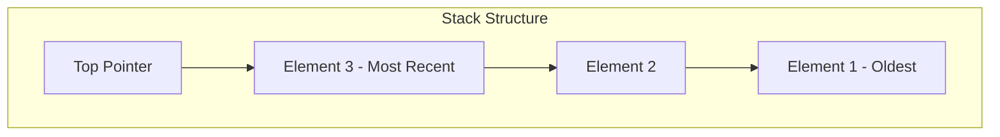

# The Stack Data Structure

## 1. Introduction to Stacks

A stack is a linear data structure that follows a specific order of operations known as **LIFO (Last-In-First-Out)**. The conceptual model of a stack can be visualized as a vertical collection of plates, where new plates are placed on top of the existing ones and only the topmost plate is accessible at any given time. This restriction on access is a defining characteristic of the stack data structure.

### 1.1 Core Principle

In a stack, elements are added and removed from the same end, referred to as the **top** of the stack. The element most recently added is always the first one to be removed. This behavior ensures that the last item to enter the structure is the first item to exit.

## 2. Stack Operations

A stack typically provides a limited set of operations that interact exclusively with the top element. The three fundamental methods are:

| Method | Description |
|--------|-------------|
| **push(element)** | Adds a new element to the top of the stack |
| **pop()** | Removes and returns the topmost element from the stack |
| **peek()** | Returns the topmost element without removing it |

### 2.1 Additional Utility Methods

- **isEmpty()**: Checks whether the stack contains any elements
- **size()**: Returns the number of elements currently in the stack

### 2.2 Time Complexity Considerations

| Operation | Time Complexity |
|-----------|-----------------|
| push()    | O(1)            |
| pop()     | O(1)            |
| peek()    | O(1)            |
| lookup/search | O(n)        |

The lookup or search operation is generally **O(n)** because it may require traversing the entire stack to find a specific element. This is not a typical stack operation, as stacks are intentionally designed to restrict access to the top element only.

## 3. Visual Representation

The following diagram illustrates the LIFO behavior of a stack:



In this representation, new elements are added at the top, and removal always occurs from the top position.

## 4. Implementation in Java

The following code demonstrates a basic stack implementation using an array:

```java
/**
 * Implementation of a Stack using a fixed-size array.
 * Demonstrates the LIFO (Last-In-First-Out) behavior.
 */
public class Stack {
    private int[] stackArray;
    private int top;
    private int capacity;

    /**
     * Constructor to initialize the stack with a specified capacity.
     * @param size Maximum number of elements the stack can hold
     */
    public Stack(int size) {
        capacity = size;
        stackArray = new int[capacity];
        top = -1; // -1 indicates an empty stack
    }

    /**
     * Pushes an element onto the top of the stack.
     * @param value The element to be added
     */
    public void push(int value) {
        if (top == capacity - 1) {
            System.out.println("Stack Overflow: Cannot push " + value);
            return;
        }
        stackArray[++top] = value;
        System.out.println("Pushed: " + value);
    }

    /**
     * Removes and returns the top element from the stack.
     * @return The top element, or -1 if the stack is empty
     */
    public int pop() {
        if (isEmpty()) {
            System.out.println("Stack Underflow: Stack is empty");
            return -1;
        }
        return stackArray[top--];
    }

    /**
     * Returns the top element without removing it.
     * @return The top element, or -1 if the stack is empty
     */
    public int peek() {
        if (isEmpty()) {
            System.out.println("Stack is empty");
            return -1;
        }
        return stackArray[top];
    }

    /**
     * Checks if the stack is empty.
     * @return true if the stack contains no elements, false otherwise
     */
    public boolean isEmpty() {
        return top == -1;
    }

    /**
     * Returns the current number of elements in the stack.
     * @return The size of the stack
     */
    public int size() {
        return top + 1;
    }
}
```

## 5. Applications of Stacks

Stacks are employed in numerous computational scenarios where the order of processing is critical. The following sections outline common use cases.

### 5.1 Function Call Management

Most programming languages use a **call stack** to manage function invocations. When a function is called, its execution context is pushed onto the stack. If that function calls another function, a new context is pushed. Upon completion, contexts are popped in reverse order, ensuring proper return to the calling function. This LIFO behavior is fundamental to program execution flow.

### 5.2 Browser History Navigation

Web browsers maintain a stack-based history mechanism. Each visited page is pushed onto a history stack. Clicking the **Back** button pops the current page to reveal the previously visited page. The **Forward** button utilizes a secondary stack to re-visit pages that were popped during backward navigation.

### 5.3 Undo/Redo Functionality

Text editors, graphic design software, and many other applications implement undo and redo operations using stacks. Each action performed by the user is pushed onto an undo stack. The undo command pops the most recent action and reverses its effect. Redo operations are managed through a separate stack that stores undone actions.

### 5.4 Expression Evaluation and Syntax Parsing

Stacks are instrumental in evaluating arithmetic expressions (infix, postfix, prefix notation) and in parsing programming language syntax. Compilers and interpreters use stacks to validate matching brackets, braces, and parentheses, as well as to construct Abstract Syntax Trees (ASTs).

## 6. Stack Overflow Condition

A **stack overflow** occurs when an attempt is made to push an element onto a stack that has reached its maximum capacity. In programming contexts, this term is often associated with excessive recursive function calls that exhaust the call stack memory, leading to runtime errors. Understanding stack limitations is essential for writing robust and efficient code.

## 7. Summary

The stack data structure provides a disciplined, LIFO-based access model that is both simple and powerful. By restricting operations to the top element, stacks offer predictable behavior and are widely applicable in system-level programming, user interface design, and algorithmic problem-solving. Mastery of stack operations and their applications forms a foundational component of computer science education.