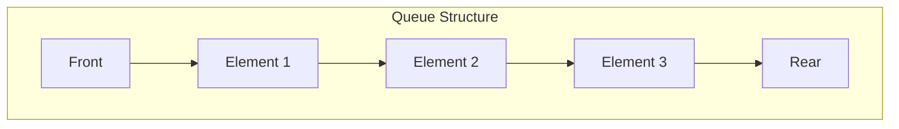

# The Queue Data Structure

## 1. Introduction to Queues

A queue is a linear data structure that follows the **FIFO (First-In-First-Out)** principle. The conceptual model of a queue can be understood as a line of people waiting for a service, such as an entrance to a roller coaster. The first person to join the line is the first person to receive service and leave the line. This sequential processing order distinguishes queues from stacks and makes them suitable for scenarios where fairness and order of arrival are paramount.

### 1.1 Core Principle

In a queue, elements are added at one end, called the **rear** (or tail), and removed from the opposite end, called the **front** (or head). The element that has been waiting the longest is always the next one to be removed. This ensures that items are processed in the exact order they were received.

## 2. Queue Operations

A queue provides a restricted set of operations that manipulate only the front and rear ends of the structure.

| Operation | Alternative Name | Description |
|-----------|------------------|-------------|
| **enqueue(element)** | push(), add() | Adds a new element to the rear of the queue |
| **dequeue()** | pop(), remove() | Removes and returns the element at the front of the queue |
| **peek()** | front() | Returns the element at the front without removing it |
| **isEmpty()** | - | Checks whether the queue contains any elements |

### 2.1 Time Complexity

| Operation | Time Complexity (Efficient Implementation) |
|-----------|---------------------------------------------|
| enqueue() | O(1) |
| dequeue() | O(1) |
| peek()    | O(1) |
| lookup/search | O(n) |

The lookup operation is generally O(n) as it may require scanning the entire queue, but it is not a typical queue operation. Queues are designed for sequential processing of elements based on arrival time.

## 3. Visual Representation

The following diagram illustrates the FIFO behavior of a queue:



New elements enter at the rear, and elements are removed from the front. The arrow indicates the direction of data flow.

## 4. Practical Applications of Queues

Queues are ubiquitous in computing systems where tasks must be processed in the order they arrive.

### 4.1 Printer Spooling

When multiple users send print jobs to a shared printer, the operating system places these jobs in a print queue. The first job submitted is printed first, followed by the second, and so on. This prevents conflicts and ensures fair access to the printing resource.

### 4.2 Waitlist and Booking Systems

Applications for concert ticket sales, restaurant reservations, or ride-hailing services (e.g., Uber, Lyft) employ queues to manage user requests. The user who requests a ride first receives the first available driver, maintaining a fair and predictable system.

### 4.3 Task Scheduling

Operating systems use queues extensively for process scheduling. Ready queues hold processes that are prepared to execute, waiting for CPU time. Various scheduling algorithms (e.g., First-Come-First-Served) rely on the FIFO nature of queues.

### 4.4 Message Buffering

In inter-process communication and networking, queues act as buffers that hold messages until the receiving component is ready to process them. This decouples the sender and receiver, improving system robustness.

## 5. Implementation Considerations

### 5.1 Inefficiency of Array-Based Implementation

Implementing a queue using a simple array leads to significant performance degradation during dequeue operations. When an element is removed from the front of an array, all remaining elements must be shifted one position to the left to fill the vacant slot. This operation has a time complexity of **O(n)**, where n is the number of elements in the queue.

```
Initial Array: [A][B][C][D][ ]
Indices:        0  1  2  3  4
Front = 0, Rear = 3

After dequeue():
Array becomes:  [B][C][D][ ][ ]
Indices:         0  1  2  3  4
Front = 0, Rear = 2

All elements shifted left: O(n) cost
```

For applications with frequent enqueue and dequeue operations, this linear time cost is unacceptable. Therefore, more efficient implementations are preferred.

### 5.2 Efficient Implementations

To achieve O(1) time complexity for both enqueue and dequeue operations, two common approaches are used:

- **Circular Array (Ring Buffer)**: Uses an array with two pointers (front and rear) that wrap around the end of the array. No shifting is required.
- **Linked List**: Uses a singly linked list with pointers to both the head and tail nodes. Removal from the head and insertion at the tail are O(1) operations.

## 6. Implementation in Java

The following implementation uses a **linked list** to achieve O(1) enqueue and dequeue operations.

```java
/**
 * Implementation of a Queue using a Singly Linked List.
 * Provides O(1) time complexity for enqueue and dequeue operations.
 */
public class LinkedListQueue {
    
    // Node class representing each element in the queue
    private class Node {
        int data;
        Node next;
        
        Node(int data) {
            this.data = data;
            this.next = null;
        }
    }
    
    private Node front;  // Points to the front (head) of the queue
    private Node rear;   // Points to the rear (tail) of the queue
    private int size;    // Tracks the number of elements
    
    /**
     * Constructor initializes an empty queue.
     */
    public LinkedListQueue() {
        front = null;
        rear = null;
        size = 0;
    }
    
    /**
     * Adds an element to the rear of the queue.
     * @param value The element to be added
     */
    public void enqueue(int value) {
        Node newNode = new Node(value);
        
        // If queue is empty, both front and rear point to the new node
        if (isEmpty()) {
            front = newNode;
            rear = newNode;
        } else {
            // Link the current rear to the new node and update rear
            rear.next = newNode;
            rear = newNode;
        }
        size++;
        System.out.println("Enqueued: " + value);
    }
    
    /**
     * Removes and returns the element at the front of the queue.
     * @return The front element, or -1 if queue is empty
     */
    public int dequeue() {
        if (isEmpty()) {
            System.out.println("Queue Underflow: Cannot dequeue, queue is empty.");
            return -1;
        }
        
        int value = front.data;
        front = front.next;  // Move front to the next node
        
        // If queue becomes empty, set rear to null as well
        if (front == null) {
            rear = null;
        }
        
        size--;
        return value;
    }
    
    /**
     * Returns the front element without removing it.
     * @return The front element, or -1 if queue is empty
     */
    public int peek() {
        if (isEmpty()) {
            System.out.println("Queue is empty.");
            return -1;
        }
        return front.data;
    }
    
    /**
     * Checks if the queue is empty.
     * @return true if queue has no elements, false otherwise
     */
    public boolean isEmpty() {
        return front == null;
    }
    
    /**
     * Returns the current number of elements in the queue.
     * @return The size of the queue
     */
    public int size() {
        return size;
    }
}
```

### 6.1 Alternative: Circular Array Implementation

For environments where linked list overhead is a concern, a circular array provides O(1) operations with better memory locality. The key technique is using modulo arithmetic to wrap pointers.

```java
/**
 * Implementation of a Queue using a Circular Array.
 * Avoids shifting elements by using modulo arithmetic.
 */
public class CircularArrayQueue {
    private int[] queueArray;
    private int front;
    private int rear;
    private int capacity;
    private int currentSize;
    
    public CircularArrayQueue(int size) {
        capacity = size;
        queueArray = new int[capacity];
        front = 0;
        rear = -1;
        currentSize = 0;
    }
    
    public void enqueue(int value) {
        if (currentSize == capacity) {
            System.out.println("Queue Overflow");
            return;
        }
        rear = (rear + 1) % capacity;
        queueArray[rear] = value;
        currentSize++;
    }
    
    public int dequeue() {
        if (isEmpty()) {
            System.out.println("Queue Underflow");
            return -1;
        }
        int value = queueArray[front];
        front = (front + 1) % capacity;
        currentSize--;
        return value;
    }
    
    public int peek() {
        if (isEmpty()) return -1;
        return queueArray[front];
    }
    
    public boolean isEmpty() {
        return currentSize == 0;
    }
}
```

## 7. Comparison: Stack vs Queue

| Feature | Stack | Queue |
|---------|-------|-------|
| Ordering Principle | LIFO (Last-In-First-Out) | FIFO (First-In-First-Out) |
| Insertion Point | Top | Rear (Tail) |
| Removal Point | Top | Front (Head) |
| Primary Operations | push(), pop(), peek() | enqueue(), dequeue(), peek() |
| Real-world Analogy | Stack of plates | Waiting line |

## 8. Summary

The queue data structure enforces a disciplined FIFO access model, ensuring that elements are processed in the exact order of their arrival. This behavior is essential for a wide range of applications, from system-level task scheduling to user-facing waitlist management. While array-based implementations suffer from O(n) dequeue costs due to element shifting, efficient implementations using linked lists or circular arrays achieve O(1) time complexity for both primary operations. A thorough understanding of queues is indispensable for designing fair and efficient software systems.