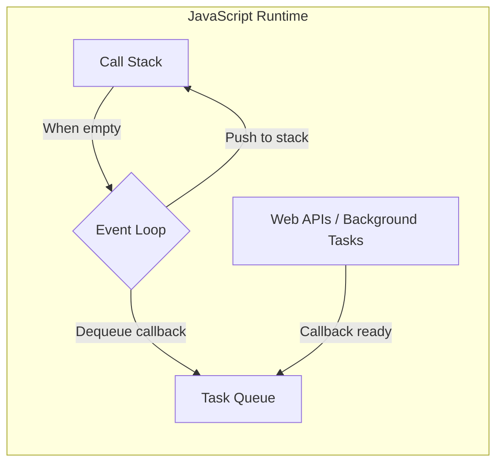

# Stacks and Queues in JavaScript: Call Stack and Event Loop

## 1. Introduction

JavaScript, as a single-threaded, non-blocking language, provides an excellent practical demonstration of both stack and queue data structures within its runtime environment. The language's execution model relies fundamentally on a **Call Stack** (a LIFO stack) to manage function invocations and a **Task Queue** (a FIFO queue) to handle asynchronous operations. Understanding these internal mechanisms not only clarifies the behavior of JavaScript programs but also illustrates real-world applications of the abstract data types discussed previously.

## 2. The JavaScript Call Stack

The JavaScript engine interprets and executes code within a single execution thread. To keep track of function calls and their respective execution contexts, it employs a **Call Stack**. This stack adheres strictly to the **Last-In-First-Out (LIFO)** principle.

### 2.1 Execution Context and Stack Frames

- When a script starts, the global execution context is created and pushed onto the stack.
- Each time a function is invoked, a new **execution context** (or **stack frame**) is created for that function. This frame contains the function's arguments, local variables, and the return address.
- The new frame is **pushed** onto the top of the call stack.
- When a function completes its execution and returns, its frame is **popped** from the stack.
- Execution then resumes from the point where the function was called, using the return address stored in the popped frame.

### 2.2 Visual Representation of the Call Stack

The following diagram illustrates the LIFO behavior during nested function calls:

```mermaid
graph TD
    subgraph "Call Stack (Top to Bottom)"
        C[third() Frame] --> B[second() Frame]
        B --> A[first() Frame]
        A --> G[Global Context]
    end
```

When `third()` finishes, it is popped, leaving `second()` at the top.

### 2.3 Stack Overflow

A **stack overflow** occurs when the call stack exceeds its maximum size limit. This typically happens due to:

- **Deep or Infinite Recursion**: A recursive function that lacks a proper base case will continuously push new frames onto the stack without popping any, eventually exhausting the allocated memory.
- **Excessively Nested Function Calls**: Though less common, extremely deep non-recursive call chains can also cause overflow.

When a stack overflow is detected, the JavaScript engine throws a `RangeError` with the message `"Maximum call stack size exceeded"`. This prevents the program from continuing in an unstable state.

**Example: Recursive Function Causing Stack Overflow**

```javascript
/**
 * A recursive function without a base case.
 * Each call pushes a new frame onto the call stack.
 */
function causeStackOverflow() {
    // No base case: the function calls itself indefinitely
    return causeStackOverflow();
}

// Uncommenting the following line will result in a RangeError
// causeStackOverflow();
```

**Example: Safe Recursive Function with Base Case**

```javascript
/**
 * A recursive function with a proper base case.
 * Frames are popped when the base case is reached.
 */
function countdown(n) {
    if (n <= 0) {           // Base case: stop recursion
        console.log("Done!");
        return;
    }
    console.log(n);
    countdown(n - 1);       // Recursive call with reduced argument
}

countdown(5);
// Output: 5, 4, 3, 2, 1, Done!
```

## 3. The Task Queue (Callback Queue)

JavaScript handles asynchronous operations—such as timer callbacks, network requests, and DOM events—using a **Task Queue** (also called the **Callback Queue** or **Macrotask Queue**). This queue operates on the **First-In-First-Out (FIFO)** principle.

### 3.1 Asynchronous Callback Management

- When an asynchronous operation is initiated (e.g., `setTimeout()`), the browser or Node.js environment manages the timing or I/O operation outside the main JavaScript thread.
- Upon completion of the asynchronous task, its associated callback function is **enqueued** into the Task Queue.
- The callback remains in the queue, waiting for the call stack to become empty.

### 3.2 The Event Loop

The **Event Loop** is the mechanism that continuously checks two conditions:

1. Is the call stack empty?
2. Are there any pending callbacks in the Task Queue?

Only when the call stack is completely empty does the Event Loop **dequeue** the first callback from the Task Queue and push it onto the call stack for execution. This ensures that asynchronous code never interrupts synchronous code execution.



### 3.3 Example: Asynchronous Execution Order

The following code demonstrates the interaction between the call stack and the task queue:

```javascript
console.log("1: Start");

setTimeout(function callback() {
    console.log("2: Timeout callback");
}, 0);

console.log("3: End");

// Output:
// 1: Start
// 3: End
// 2: Timeout callback
```

**Explanation:**

1. `console.log("1: Start")` is pushed onto the stack, executed, and popped.
2. `setTimeout()` is called, which registers the callback with the Web API and then immediately pops off the stack. The timer (even with 0 ms delay) completes in the background.
3. `console.log("3: End")` is pushed, executed, and popped.
4. The call stack is now empty.
5. The callback function is moved from the Task Queue to the call stack by the Event Loop.
6. `console.log("2: Timeout callback")` is executed.

This illustrates FIFO behavior: the callback was added to the queue first and executed after the synchronous code completed.

## 4. Comprehensive Example: Stack and Queue Interaction

The following example demonstrates both stack overflow prevention and the asynchronous queue mechanism in a single program:

```javascript
/**
 * A function that processes an array of tasks using a queue-like pattern.
 */
function processTaskQueue(taskArray) {
    if (taskArray.length === 0) {
        console.log("All tasks completed.");
        return;
    }

    const currentTask = taskArray.shift(); // Dequeue first task (FIFO)
    console.log(`Processing: ${currentTask}`);

    // Simulate asynchronous processing with setTimeout
    setTimeout(function() {
        console.log(`Completed: ${currentTask}`);
        processTaskQueue(taskArray); // Recursively process remaining tasks
    }, 1000);
}

const tasks = ["Task A", "Task B", "Task C"];
processTaskQueue(tasks);

// Expected Output (with 1-second intervals):
// Processing: Task A
// Completed: Task A
// Processing: Task B
// Completed: Task B
// Processing: Task C
// Completed: Task C
// All tasks completed.
```

**Key Points:**
- The array `tasks` is treated as a queue: the first element added is the first to be processed (`shift()` implements FIFO dequeue).
- The recursive call to `processTaskQueue` is delayed by `setTimeout`. This ensures that each recursive call is enqueued as a separate task, preventing a synchronous recursive buildup on the call stack that could lead to stack overflow.
- The call stack depth never exceeds a few frames, demonstrating safe recursion using the task queue.

## 5. Summary

The JavaScript runtime elegantly embodies both stack and queue data structures:

| Data Structure | JavaScript Manifestation | Principle | Primary Role |
|----------------|-------------------------|-----------|--------------|
| **Stack** | Call Stack | LIFO | Managing synchronous function execution contexts |
| **Queue** | Task Queue (Callback Queue) | FIFO | Scheduling asynchronous callback execution |

Understanding these internal mechanisms is crucial for writing efficient, non-blocking JavaScript code and for diagnosing issues such as stack overflows or unexpected asynchronous execution order. The Event Loop serves as the bridge between the synchronous stack and the asynchronous queue, ensuring a predictable and manageable execution flow.