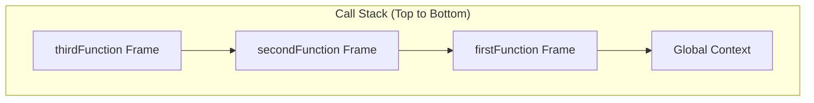
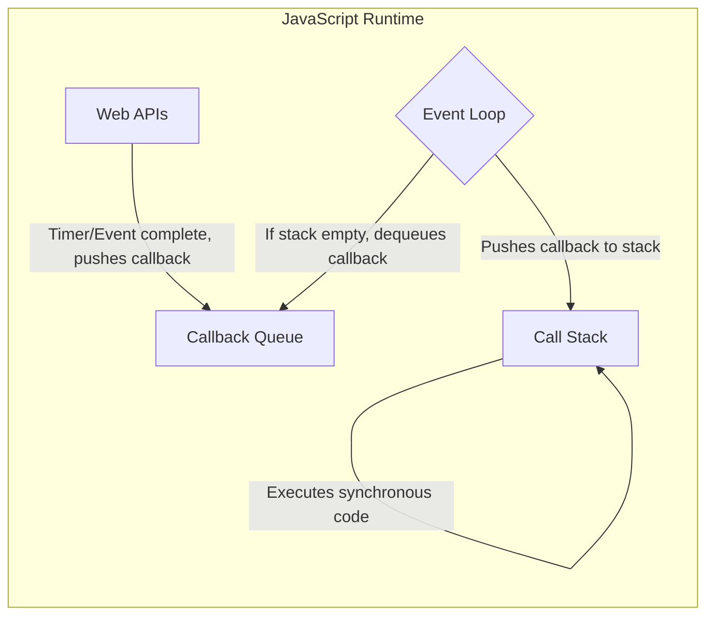

# JavaScript Runtime Architecture: Memory Heap, Call Stack, and Event Loop

## 1. Introduction

JavaScript is widely recognized as a **single-threaded**, **non-blocking** programming language. While developers can write effective JavaScript programs without intimate knowledge of the underlying engine, a comprehensive understanding of its runtime architecture is essential for diagnosing performance issues, preventing memory leaks, and mastering asynchronous programming. This document examines the internal mechanisms of JavaScript execution, including the memory heap, the call stack, and the event-driven concurrency model facilitated by Web APIs, the callback queue, and the event loop.

## 2. Fundamental Requirements of a Program

Every computer program, regardless of language or environment, must perform two essential tasks:

1. **Memory Allocation**: Reserve space in memory for variables, data structures, and executable code.
2. **Parsing and Execution**: Read, interpret, and execute instructions sequentially.

In JavaScript, these responsibilities are delegated to the **JavaScript Engine** (e.g., V8 in Chrome, SpiderMonkey in Firefox), which translates human-readable JavaScript code into machine-executable instructions.

## 3. Components of the JavaScript Engine

The JavaScript engine comprises two principal components that manage memory and execution flow.

### 3.1 Memory Heap

The **memory heap** is a region of unstructured memory where dynamic memory allocation occurs. Every time a variable is declared or an object is instantiated, a portion of the heap is reserved to store that data.

**Example of Memory Allocation:**

```javascript
// Allocating memory for primitive values and objects
const numberVariable = 1;           // Allocates memory for a number
const stringVariable = "Hello";     // Allocates memory for a string
const objectVariable = {            // Allocates memory for an object
    name: "John",
    age: 30
};
const arrayVariable = [1, 2, 3, 4]; // Allocates memory for an array
```

### 3.2 Call Stack

The **call stack** is a LIFO (Last-In-First-Out) data structure that tracks the execution context of the program. It records where in the script the interpreter currently is and manages function invocations.

- When a script begins, the global execution context is pushed onto the stack.
- Each function call creates a new **stack frame** containing the function's arguments, local variables, and return address. This frame is pushed onto the stack.
- When a function returns, its frame is popped from the stack.
- Execution resumes at the point from which the function was called.

**Example: Call Stack Behavior**

```javascript
function firstFunction() {
    console.log("Inside firstFunction");
    secondFunction();
    console.log("Back inside firstFunction");
}

function secondFunction() {
    console.log("Inside secondFunction");
    thirdFunction();
    console.log("Back inside secondFunction");
}

function thirdFunction() {
    console.log("Inside thirdFunction");
}

firstFunction();

// Output:
// Inside firstFunction
// Inside secondFunction
// Inside thirdFunction
// Back inside secondFunction
// Back inside firstFunction
```

**Call Stack Progression (LIFO):**



The stack grows downward as functions are called and shrinks upward as they return.

## 4. Memory Leaks and Global Variables

A **memory leak** occurs when allocated memory is no longer needed by the program but is not released back to the system. Over time, unused memory accumulates, reducing available resources and potentially degrading performance or crashing the application.

### 4.1 Common Causes of Memory Leaks

- **Excessive Global Variables**: Variables declared in the global scope persist for the lifetime of the application, even if they are no longer needed.
- **Forgotten Timers or Callbacks**: `setInterval` or `setTimeout` callbacks that are not cleared continue to hold references to variables.
- **Detached DOM Nodes**: JavaScript references to DOM elements that have been removed from the document tree prevent garbage collection.

### 4.2 Best Practices for Prevention

- Declare variables in the narrowest scope possible.
- Use `let` and `const` instead of implicitly declaring global variables.
- Explicitly set unused references to `null` when they are no longer required.
- Clear intervals and timeouts when components unmount or are destroyed.

## 5. Single-Threaded Nature and Synchronous Execution

JavaScript is **single-threaded**, meaning it possesses exactly one call stack and can execute only one operation at a time. This characteristic simplifies the language design by eliminating the complexities associated with multi-threaded environments, such as race conditions and deadlocks.

**Synchronous execution** refers to the sequential processing of statements: each line of code must complete before the next line begins. This predictable behavior is a direct consequence of the single call stack.

**Example of Synchronous Code:**

```javascript
console.log("Step 1");
console.log("Step 2");
console.log("Step 3");

// Output (in exact order):
// Step 1
// Step 2
// Step 3
```

While synchronous execution is straightforward and predictable, it introduces a significant limitation: a long-running task blocks the entire thread, preventing any other operations—including user interactions—from being processed.

## 6. Stack Overflow

A **stack overflow** occurs when the call stack exceeds its maximum size capacity. This typically results from unbounded recursion, where a function calls itself without a terminating base case, continuously pushing new frames onto the stack.

**Example: Function Causing Stack Overflow**

```javascript
function recursiveOverflow() {
    // No base case: infinite recursion
    return recursiveOverflow();
}

// Uncommenting the following line will throw a RangeError
// recursiveOverflow();
// Error: Maximum call stack size exceeded
```

**Example: Safe Recursive Function with Base Case**

```javascript
function countdown(n) {
    if (n <= 0) {          // Base case: stops recursion
        console.log("Done!");
        return;
    }
    console.log(n);
    countdown(n - 1);      // Recursive call with decremented argument
}

countdown(3);
// Output: 3, 2, 1, Done!
```

## 7. The JavaScript Runtime Environment

The JavaScript engine alone is insufficient for executing modern web applications. Browsers and Node.js provide a **JavaScript Runtime Environment** that extends the engine with additional capabilities:

- **Web APIs** (or C++ APIs in Node.js): Provide functionality such as timers, DOM manipulation, AJAX requests, and event listeners.
- **Callback Queue** (Task Queue): Holds callback functions ready to be executed once the call stack is empty.
- **Event Loop**: Continuously monitors the call stack and the callback queue, moving callbacks from the queue to the stack when the stack is empty.

### 7.1 Runtime Architecture Diagram



## 8. Asynchronous Programming with Callbacks

**Asynchronous programming** allows JavaScript to initiate long-running operations (e.g., network requests, file I/O, timers) without blocking the main thread. When an asynchronous operation is invoked, it is handed off to the Web API, and the call stack continues executing subsequent synchronous code.

### 8.1 The `setTimeout` Example

```javascript
console.log("1: Start");

setTimeout(function callback() {
    console.log("2: Timeout completed");
}, 2000);

console.log("3: End");

// Output:
// 1: Start
// 3: End
// 2: Timeout completed (after approximately 2 seconds)
```

**Execution Flow Explanation:**

1. `console.log("1: Start")` is pushed onto the call stack, executed, and popped.
2. `setTimeout()` is invoked. The browser's Web API registers a timer for 2000 milliseconds. The `setTimeout` call is then popped from the stack.
3. `console.log("3: End")` is pushed, executed, and popped.
4. After 2000 milliseconds, the Web API places the callback function into the **Callback Queue**.
5. The **Event Loop** checks if the call stack is empty. Since it is, the event loop dequeues the callback and pushes it onto the call stack.
6. The callback executes `console.log("2: Timeout completed")`.

### 8.2 Zero-Second Delay Behavior

Even with a delay of `0` milliseconds, the asynchronous callback is deferred until the call stack clears.

```javascript
console.log("First");

setTimeout(function() {
    console.log("Second (asynchronous)");
}, 0);

console.log("Third");

// Output:
// First
// Third
// Second (asynchronous)
```

This behavior demonstrates that `setTimeout` callbacks are always processed asynchronously, regardless of the specified delay, because they must pass through the Web API, callback queue, and event loop.

## 9. Event Listeners and Asynchronous Callbacks

DOM event listeners operate on the same asynchronous principle. When an event (e.g., click, keypress) occurs, the corresponding callback is placed in the callback queue and executed only when the call stack is empty.

```javascript
// Registering an event listener asynchronously
document.getElementById("myButton").addEventListener("click", function() {
    console.log("Button clicked!");
});

console.log("Event listener registered.");

// The click callback will only execute when the button is clicked,
// and after the current synchronous code completes.
```

## 10. Synchronous vs. Asynchronous: A Comparative Analogy

| Aspect | Synchronous | Asynchronous |
|--------|-------------|--------------|
| **Behavior** | Executes tasks sequentially; each task blocks subsequent tasks. | Initiates tasks and continues execution; tasks complete later via callbacks. |
| **Analogy** | Calling a teacher and waiting on hold until they answer. | Sending a text message to a teacher and continuing other activities until they reply. |
| **User Experience** | May cause unresponsiveness during long operations. | Allows interaction while operations are in progress. |
| **Use Cases** | Simple calculations, DOM manipulations that do not involve I/O. | Network requests, file reading, timers, event handling. |

## 11. Practical Implications for Web Development

- **Blocking Operations**: Performing computationally intensive tasks synchronously on the main thread will freeze the user interface, leading to a poor user experience.
- **Non-Blocking Patterns**: Utilize asynchronous APIs (`fetch`, `setTimeout`, `Promise`, `async/await`) to keep the application responsive.
- **Call Stack Awareness**: Recursive functions must include proper base cases to avoid stack overflow errors.
- **Memory Management**: Avoid unnecessary global variables and clean up event listeners and timers to prevent memory leaks.

## 12. Summary

| Component | Description | Principle |
|-----------|-------------|-----------|
| **Memory Heap** | Unstructured memory region for dynamic allocation of variables and objects. | N/A |
| **Call Stack** | LIFO structure tracking function execution contexts. | Last-In-First-Out |
| **Web APIs** | Browser-provided interfaces for asynchronous operations (timers, DOM, AJAX). | N/A |
| **Callback Queue** | FIFO queue holding callbacks ready for execution. | First-In-First-Out |
| **Event Loop** | Mechanism that moves callbacks from the queue to the call stack when the stack is empty. | N/A |

JavaScript's single-threaded, non-blocking architecture, enabled by the event loop and asynchronous callbacks, allows developers to write responsive applications capable of handling concurrent operations without the complexity of multi-threading. A thorough grasp of these internal mechanisms is invaluable for debugging, performance optimization, and technical interviews.