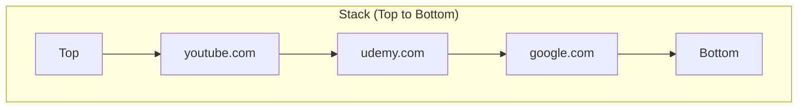

# Implementing a Stack Data Structure in JavaScript

## 1. Introduction

This document provides a comprehensive guide to implementing a **Stack** data structure using a **singly linked list** in JavaScript. The stack adheres to the **Last-In-First-Out (LIFO)** principle, where elements are added and removed exclusively from the top of the structure. The implementation utilizes a custom `Node` class to represent individual elements and a `Stack` class that encapsulates the stack operations.

## 2. Prerequisite: The Node Class

Each element within the stack is represented as a **node** containing a value and a reference to the next node. The `Node` class serves as the fundamental building block for the linked structure.

```javascript
/**
 * Represents a single node in the stack.
 * Each node holds a value and a pointer to the next node.
 */
class Node {
    constructor(value) {
        this.value = value;
        this.next = null;
    }
}
```

## 3. The Stack Class Structure

The `Stack` class maintains references to the **top** and **bottom** nodes and tracks the current **length** of the stack.

```javascript
class Stack {
    constructor() {
        this.top = null;    // Reference to the top node
        this.bottom = null; // Reference to the bottom node
        this.length = 0;    // Number of nodes in the stack
    }
    
    // Methods will be defined here
}
```

## 4. Core Stack Operations

### 4.1 Push Operation

The `push()` method adds a new element to the **top** of the stack. In a linked list implementation, this involves creating a new node and setting its `next` pointer to the current top node. If the stack is initially empty, both `top` and `bottom` reference the new node.

```javascript
/**
 * Adds a new element to the top of the stack.
 * @param {*} value - The value to be stored in the stack.
 * @returns {Stack} The updated stack instance.
 */
push(value) {
    const newNode = new Node(value);
    
    if (this.length === 0) {
        // Stack is empty; new node becomes both top and bottom
        this.top = newNode;
        this.bottom = newNode;
    } else {
        // Link new node to the current top
        newNode.next = this.top;
        this.top = newNode;
    }
    
    this.length++;
    return this;
}
```

**Time Complexity:** O(1)

### 4.2 Pop Operation

The `pop()` method removes and returns the element at the **top** of the stack. The top pointer is advanced to the next node. If the stack becomes empty after removal, the bottom pointer is also set to `null`.

```javascript
/**
 * Removes and returns the top element from the stack.
 * @returns {*} The value of the removed node, or null if stack is empty.
 */
pop() {
    if (this.length === 0) {
        return null; // Stack underflow
    }
    
    const poppedNode = this.top;
    this.top = this.top.next;
    this.length--;
    
    if (this.length === 0) {
        // Stack became empty; reset bottom pointer
        this.bottom = null;
    }
    
    return poppedNode.value;
}
```

**Time Complexity:** O(1)

### 4.3 Peek Operation

The `peek()` method returns the value of the **top** element without removing it from the stack.

```javascript
/**
 * Returns the value at the top of the stack without removing it.
 * @returns {*} The value of the top node, or null if stack is empty.
 */
peek() {
    if (this.length === 0) {
        return null;
    }
    return this.top.value;
}
```

**Time Complexity:** O(1)

### 4.4 isEmpty Operation

The `isEmpty()` method provides a convenient way to check whether the stack contains any elements.

```javascript
/**
 * Checks whether the stack is empty.
 * @returns {boolean} true if the stack is empty, false otherwise.
 */
isEmpty() {
    return this.length === 0;
}
```

**Time Complexity:** O(1)

## 5. Complete Implementation

The following code presents the complete `Stack` class with all methods integrated.

```javascript
/**
 * Node class for individual stack elements.
 */
class Node {
    constructor(value) {
        this.value = value;
        this.next = null;
    }
}

/**
 * Stack implementation using a singly linked list.
 */
class Stack {
    constructor() {
        this.top = null;
        this.bottom = null;
        this.length = 0;
    }

    /**
     * Returns the top element without removal.
     */
    peek() {
        return this.isEmpty() ? null : this.top.value;
    }

    /**
     * Adds an element to the top of the stack.
     */
    push(value) {
        const newNode = new Node(value);
        
        if (this.isEmpty()) {
            this.top = newNode;
            this.bottom = newNode;
        } else {
            newNode.next = this.top;
            this.top = newNode;
        }
        
        this.length++;
        return this;
    }

    /**
     * Removes and returns the top element.
     */
    pop() {
        if (this.isEmpty()) {
            return null;
        }
        
        const poppedValue = this.top.value;
        this.top = this.top.next;
        this.length--;
        
        if (this.isEmpty()) {
            this.bottom = null;
        }
        
        return poppedValue;
    }

    /**
     * Checks if the stack is empty.
     */
    isEmpty() {
        return this.length === 0;
    }
}
```

## 6. Example Usage: Browser History Simulation

The following example demonstrates the stack in action by simulating a web browser's back button history.

```javascript
// Instantiate a new stack
const browserHistory = new Stack();

// Visit websites (push onto stack)
browserHistory.push("google.com");
browserHistory.push("udemy.com");
browserHistory.push("youtube.com");
browserHistory.push("discord.com");

console.log("Current page:", browserHistory.peek()); // discord.com

// Navigate back (pop from stack)
console.log("Going back from:", browserHistory.pop()); // discord.com
console.log("Going back from:", browserHistory.pop()); // youtube.com
console.log("Current page:", browserHistory.peek());   // udemy.com

// Continue navigation
console.log("Going back from:", browserHistory.pop()); // udemy.com
console.log("Going back from:", browserHistory.pop()); // google.com

console.log("Is history empty?", browserHistory.isEmpty()); // true
console.log("Current page:", browserHistory.peek());        // null
```

**Expected Output:**
```
Current page: discord.com
Going back from: discord.com
Going back from: youtube.com
Current page: udemy.com
Going back from: udemy.com
Going back from: google.com
Is history empty? true
Current page: null
```

## 7. Visual Representation of the Stack

The following diagram illustrates the state of the stack after pushing three elements (`google.com`, `udemy.com`, `youtube.com`).



When `pop()` is called, the `youtube.com` node is removed, and the `top` pointer moves to `udemy.com`.

## 8. Alternative: Array-Based Implementation

While the linked list implementation provides O(1) push and pop operations without resizing overhead, an array-based implementation is also possible and simpler for fixed-size scenarios. Below is an alternative using a JavaScript array.

```javascript
class ArrayStack {
    constructor() {
        this.items = [];
    }

    push(value) {
        this.items.push(value);
        return this;
    }

    pop() {
        return this.items.pop() || null;
    }

    peek() {
        return this.items.length > 0 ? this.items[this.items.length - 1] : null;
    }

    isEmpty() {
        return this.items.length === 0;
    }
}
```

**Note:** The array-based implementation relies on JavaScript's built-in `push()` and `pop()` methods, which are amortized O(1) but may incur occasional resizing costs.

## 9. Summary

This document has presented a complete, production-ready implementation of a stack data structure in JavaScript using a singly linked list. Key features include:

- **LIFO behavior** enforced through `push()` and `pop()` operations.
- **O(1) time complexity** for all primary operations.
- **Dynamic sizing** without capacity limitations.
- **Intuitive API** mirroring standard stack terminology.

The provided code and examples serve as a solid foundation for understanding and utilizing stacks in practical JavaScript applications.