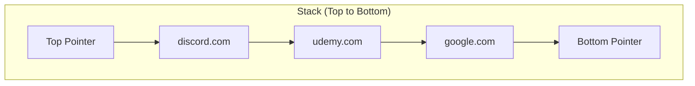

# Implementation of a Stack Data Structure in JavaScript

## 1. Introduction

A **Stack** is a linear data structure that follows the **Last-In-First-Out (LIFO)** principle. Elements are added and removed from a single end, referred to as the **top** of the stack. This document provides a detailed walkthrough of implementing a stack in JavaScript using a **singly linked list** approach, leveraging a custom `Node` class to represent individual elements.

## 2. Node Class Definition

Each element in the stack is encapsulated within a `Node` object. The `Node` class contains two properties: `value` to store the data and `next` to reference the subsequent node in the stack.

```javascript
/**
 * Represents a single node in the stack.
 */
class Node {
    constructor(value) {
        this.value = value;
        this.next = null;
    }
}
```

## 3. Stack Class Structure

The `Stack` class maintains three essential properties:

- `top`: Reference to the topmost node in the stack.
- `bottom`: Reference to the bottommost node in the stack.
- `length`: Integer count of the number of nodes currently in the stack.

```javascript
class Stack {
    constructor() {
        this.top = null;
        this.bottom = null;
        this.length = 0;
    }
    
    // Methods: peek(), push(), pop(), isEmpty()
}
```

## 4. Core Operations

### 4.1 Peek Operation

The `peek()` method returns the value of the element at the top of the stack without removing it. This operation provides visibility into the most recently added item.

```javascript
/**
 * Returns the top element without removal.
 * @returns {*} The value of the top node, or null if stack is empty.
 */
peek() {
    return this.top ? this.top.value : null;
}
```

**Time Complexity:** O(1)

### 4.2 Push Operation

The `push()` method adds a new element to the top of the stack. The implementation involves creating a new node and adjusting the `top` pointer.

**Algorithm Steps:**
1. Create a new `Node` with the provided value.
2. If the stack is empty (`length === 0`), set both `top` and `bottom` to the new node.
3. Otherwise, set the `next` pointer of the new node to the current `top`, then update `top` to the new node.
4. Increment the `length` property.
5. Return the stack instance to allow method chaining.

```javascript
/**
 * Adds an element to the top of the stack.
 * @param {*} value - The value to be pushed onto the stack.
 * @returns {Stack} The updated stack instance.
 */
push(value) {
    const newNode = new Node(value);
    
    if (this.length === 0) {
        this.top = newNode;
        this.bottom = newNode;
    } else {
        // Hold reference to the current top node
        const previousTop = this.top;
        this.top = newNode;
        this.top.next = previousTop;
    }
    
    this.length++;
    return this;
}
```

**Time Complexity:** O(1)

### 4.3 Pop Operation

The `pop()` method removes and returns the element at the top of the stack. The `top` pointer is advanced to the next node. Special handling is required when the stack contains only one element.

**Algorithm Steps:**
1. If the stack is empty (`top` is `null`), return `null`.
2. Store a reference to the current top node.
3. Update `top` to `top.next`.
4. Decrement the `length` property.
5. If the stack becomes empty (`length === 0`), set `bottom` to `null` as well.
6. Return the value of the removed node.

```javascript
/**
 * Removes and returns the top element from the stack.
 * @returns {*} The value of the removed node, or null if stack is empty.
 */
pop() {
    if (!this.top) {
        return null; // Stack underflow
    }
    
    const poppedNode = this.top;
    this.top = this.top.next;
    this.length--;
    
    // If the stack becomes empty, reset the bottom pointer
    if (this.length === 0) {
        this.bottom = null;
    }
    
    return poppedNode.value;
}
```

**Note on Memory Management:** In JavaScript, objects that are no longer referenced become eligible for garbage collection. Once `top` is updated and no variable holds a reference to the removed node, its memory will be automatically reclaimed.

**Time Complexity:** O(1)

### 4.4 isEmpty Operation (Optional)

The `isEmpty()` method provides a convenient check for an empty stack.

```javascript
/**
 * Checks whether the stack is empty.
 * @returns {boolean} true if empty, false otherwise.
 */
isEmpty() {
    return this.length === 0;
}
```

## 5. Complete Implementation

The following is the consolidated implementation of the `Stack` class using a linked list.

```javascript
class Node {
    constructor(value) {
        this.value = value;
        this.next = null;
    }
}

class Stack {
    constructor() {
        this.top = null;
        this.bottom = null;
        this.length = 0;
    }

    peek() {
        return this.top ? this.top.value : null;
    }

    push(value) {
        const newNode = new Node(value);
        
        if (this.length === 0) {
            this.top = newNode;
            this.bottom = newNode;
        } else {
            const previousTop = this.top;
            this.top = newNode;
            this.top.next = previousTop;
        }
        
        this.length++;
        return this;
    }

    pop() {
        if (!this.top) {
            return null;
        }
        
        const poppedNode = this.top;
        this.top = this.top.next;
        this.length--;
        
        if (this.length === 0) {
            this.bottom = null;
        }
        
        return poppedNode.value;
    }

    isEmpty() {
        return this.length === 0;
    }
}
```

## 6. Example Usage: Browser History Simulation

The following code demonstrates the stack by simulating a web browser's back button history.

```javascript
const browserHistory = new Stack();

// Visiting websites
browserHistory.push("google.com");
browserHistory.push("udemy.com");
browserHistory.push("discord.com");

console.log("Current top:", browserHistory.peek()); // "discord.com"

// Navigating back
console.log("Popped:", browserHistory.pop()); // "discord.com"
console.log("Popped:", browserHistory.pop()); // "udemy.com"
console.log("Current top:", browserHistory.peek()); // "google.com"

console.log("Popped:", browserHistory.pop()); // "google.com"
console.log("Is empty?", browserHistory.isEmpty()); // true
console.log("Peek:", browserHistory.peek()); // null
```

## 7. Visual Representation

The state of the stack after pushing `google.com`, `udemy.com`, and `discord.com` can be visualized as follows:



After performing a `pop()` operation, the `discord.com` node is removed, and the `top` pointer shifts to `udemy.com`.

## 8. Alternative: Array-Based Implementation

While the linked list approach provides guaranteed O(1) push and pop without resizing, a simpler array-based stack can also be implemented using JavaScript's built-in array methods.

```javascript
class ArrayStack {
    constructor() {
        this.items = [];
    }

    peek() {
        return this.items.length > 0 ? this.items[this.items.length - 1] : null;
    }

    push(value) {
        this.items.push(value);
        return this;
    }

    pop() {
        return this.items.pop() || null;
    }

    isEmpty() {
        return this.items.length === 0;
    }
}
```

**Note:** JavaScript arrays are dynamic and their `push()` and `pop()` methods are amortized O(1). However, occasional resizing may cause a temporary performance cost.

## 9. Summary

This document has provided a complete implementation of a stack data structure in JavaScript using a singly linked list. The key operations—`push()`, `pop()`, and `peek()`—are all O(1) time complexity. Proper handling of edge cases, such as an empty stack and single-element removal, ensures robustness. The stack data structure is foundational for numerous applications, including browser history management, undo/redo functionality, and expression evaluation.