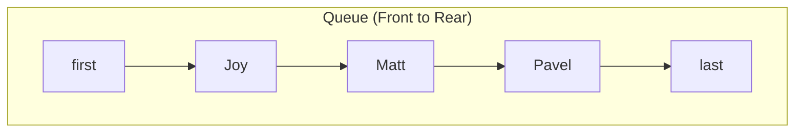

# Implementation of a Queue Data Structure in JavaScript

## 1. Introduction

A **Queue** is a linear data structure that follows the **First-In-First-Out (FIFO)** principle. Elements are added at one end, termed the **rear** or **last**, and removed from the opposite end, termed the **front** or **first**. This behavior is analogous to a waiting line where the first person to arrive is the first to be served.

This document presents a complete implementation of a Queue in JavaScript using a **singly linked list** as the underlying storage mechanism. The implementation provides O(1) time complexity for both enqueue and dequeue operations, making it suitable for performance-sensitive applications such as waitlist management, task scheduling, and message buffering.

## 2. Queue Operations

A standard queue supports the following core operations:

| Operation | Description |
|-----------|-------------|
| `enqueue(value)` | Adds a new element to the rear of the queue. |
| `dequeue()` | Removes and returns the element at the front of the queue. |
| `peek()` | Returns the front element without removing it. |
| `isEmpty()` | Checks whether the queue contains any elements. |

## 3. Node Class Definition

Each element in the queue is encapsulated within a `Node` object. The `Node` class contains a `value` property to store data and a `next` property to reference the subsequent node.

```javascript
/**
 * Represents a single node in the queue.
 */
class Node {
    constructor(value) {
        this.value = value;
        this.next = null;
    }
}
```

## 4. Queue Class Structure

The `Queue` class maintains references to the first and last nodes and tracks the current number of elements.

```javascript
class Queue {
    constructor() {
        this.first = null;  // Front of the queue (dequeue position)
        this.last = null;   // Rear of the queue (enqueue position)
        this.length = 0;    // Number of nodes in the queue
    }

    // Methods: peek(), enqueue(), dequeue(), isEmpty()
}
```

## 5. Implementation of Core Methods

### 5.1 Peek Operation

The `peek()` method returns the value of the element at the front of the queue without removing it.

```javascript
/**
 * Returns the element at the front of the queue without removal.
 * @returns {*} The value of the first node, or null if queue is empty.
 */
peek() {
    if (this.isEmpty()) {
        return null;
    }
    return this.first.value;
}
```

**Time Complexity:** O(1)

### 5.2 Enqueue Operation

The `enqueue()` method adds a new element to the rear of the queue. The implementation handles two scenarios: an empty queue and a non-empty queue.

```javascript
/**
 * Adds an element to the rear of the queue.
 * @param {*} value - The element to be enqueued.
 * @returns {Queue} The updated queue instance (for method chaining).
 */
enqueue(value) {
    const newNode = new Node(value);

    if (this.isEmpty()) {
        // Queue is empty: new node becomes both first and last
        this.first = newNode;
        this.last = newNode;
    } else {
        // Append new node to the end and update last pointer
        this.last.next = newNode;
        this.last = newNode;
    }

    this.length++;
    return this;
}
```

**Algorithm Explanation:**
1. Create a new `Node` with the provided value.
2. If the queue is empty (`length === 0`), set both `first` and `last` to the new node.
3. Otherwise, link the current `last` node's `next` pointer to the new node, then update `last` to reference the new node.
4. Increment the `length` counter.
5. Return the queue instance to allow chaining.

**Time Complexity:** O(1)

### 5.3 Dequeue Operation

The `dequeue()` method removes and returns the element at the front of the queue. The `first` pointer is advanced to the next node. Special handling is required when the queue becomes empty after removal.

```javascript
/**
 * Removes and returns the element at the front of the queue.
 * @returns {*} The value of the dequeued node, or null if queue is empty.
 */
dequeue() {
    if (this.isEmpty()) {
        return null; // Queue underflow
    }

    const dequeuedNode = this.first;
    this.first = this.first.next;
    this.length--;

    // If the queue becomes empty, reset last pointer as well
    if (this.isEmpty()) {
        this.last = null;
    }

    return dequeuedNode.value;
}
```

**Algorithm Explanation:**
1. If the queue is empty, return `null` (underflow condition).
2. Store a reference to the current `first` node.
3. Update `first` to point to the next node in the sequence.
4. Decrement the `length` counter.
5. If the queue becomes empty (`length === 0`), set `last` to `null` to maintain consistency.
6. Return the value of the removed node.

**Time Complexity:** O(1)

### 5.4 isEmpty Operation

The `isEmpty()` method provides a convenient way to check for an empty queue.

```javascript
/**
 * Checks whether the queue is empty.
 * @returns {boolean} true if empty, false otherwise.
 */
isEmpty() {
    return this.length === 0;
}
```

**Time Complexity:** O(1)

## 6. Complete Implementation

The following code consolidates the `Node` and `Queue` classes into a complete, reusable module.

```javascript
/**
 * Node class for individual queue elements.
 */
class Node {
    constructor(value) {
        this.value = value;
        this.next = null;
    }
}

/**
 * Queue implementation using a singly linked list with head and tail pointers.
 */
class Queue {
    constructor() {
        this.first = null;
        this.last = null;
        this.length = 0;
    }

    peek() {
        return this.isEmpty() ? null : this.first.value;
    }

    enqueue(value) {
        const newNode = new Node(value);

        if (this.isEmpty()) {
            this.first = newNode;
            this.last = newNode;
        } else {
            this.last.next = newNode;
            this.last = newNode;
        }

        this.length++;
        return this;
    }

    dequeue() {
        if (this.isEmpty()) {
            return null;
        }

        const dequeuedValue = this.first.value;
        this.first = this.first.next;
        this.length--;

        if (this.isEmpty()) {
            this.last = null;
        }

        return dequeuedValue;
    }

    isEmpty() {
        return this.length === 0;
    }

    size() {
        return this.length;
    }
}
```

## 7. Example Usage: Waitlist Application

The following example demonstrates the queue by simulating a waitlist where individuals are added and then served in order of arrival.

```javascript
const waitlist = new Queue();

// People joining the waitlist
waitlist.enqueue("Joy");
waitlist.enqueue("Matt");
waitlist.enqueue("Pavel");
waitlist.enqueue("Samir");

console.log("First in line:", waitlist.peek()); // "Joy"
console.log("Queue size:", waitlist.size());     // 4

// Serving people (dequeue in FIFO order)
console.log("Serving:", waitlist.dequeue()); // "Joy"
console.log("Serving:", waitlist.dequeue()); // "Matt"
console.log("First in line now:", waitlist.peek()); // "Pavel"

console.log("Serving:", waitlist.dequeue()); // "Pavel"
console.log("Serving:", waitlist.dequeue()); // "Samir"

console.log("Is queue empty?", waitlist.isEmpty()); // true
console.log("Attempt dequeue on empty:", waitlist.dequeue()); // null
```

**Expected Output:**
```
First in line: Joy
Queue size: 4
Serving: Joy
Serving: Matt
First in line now: Pavel
Serving: Pavel
Serving: Samir
Is queue empty? true
Attempt dequeue on empty: null
```

## 8. Visual Representation

The following diagram illustrates the state of the queue after enqueuing three elements: `Joy`, `Matt`, and `Pavel`.



After a `dequeue()` operation, the `first` pointer advances to `Matt`, and the `Joy` node is removed.

## 9. Time Complexity Analysis

| Operation | Time Complexity | Explanation |
|-----------|-----------------|-------------|
| `enqueue()` | O(1) | Appending to the tail with a direct reference. |
| `dequeue()` | O(1) | Removing from the head by advancing the pointer. |
| `peek()` | O(1) | Direct access to the first node's value. |
| `isEmpty()` | O(1) | Simple length check. |

## 10. Comparison with Array-Based Queue

While a linked list implementation guarantees O(1) enqueue and dequeue without element shifting, an array-based approach using a naive array would incur O(n) dequeue cost due to shifting. A **circular array** implementation can achieve O(1) operations but introduces fixed capacity constraints. The linked list queue presented here provides both O(1) performance and dynamic sizing, making it the preferred choice for unbounded queue scenarios.

## 11. Summary

This document has provided a complete, production-ready implementation of a Queue data structure in JavaScript using a singly linked list. The class exposes the standard queue interface (`enqueue`, `dequeue`, `peek`, `isEmpty`) and maintains O(1) time complexity for all primary operations. The queue is suitable for a wide range of applications, including waitlist systems, task scheduling, and event handling. The implementation follows best practices for readability, efficiency, and correctness.