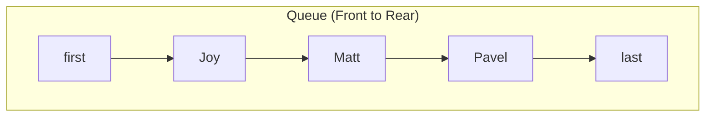

# Implementation of a Queue Data Structure in JavaScript

## 1. Introduction

A **Queue** is a linear data structure that adheres to the **First-In-First-Out (FIFO)** principle. Elements are inserted at one end, designated as the **rear** (or **last**), and removed from the opposite end, designated as the **front** (or **first**). This behavior mirrors real-world scenarios such as a waiting line, where individuals are served in the exact order of their arrival.

This document provides a comprehensive implementation of a Queue in JavaScript utilizing a **singly linked list** as the foundational storage mechanism. The design ensures O(1) time complexity for both insertion (enqueue) and removal (dequeue) operations, making it well-suited for applications including waitlist management, task scheduling, and event handling.

## 2. Queue Operations

A standard queue exposes the following core operations:

| Operation | Description |
|-----------|-------------|
| `enqueue(value)` | Adds a new element to the rear of the queue. |
| `dequeue()` | Removes and returns the element at the front of the queue. |
| `peek()` | Returns the front element without removal. |
| `isEmpty()` | Checks whether the queue contains any elements. |

## 3. Node Class Definition

Each element within the queue is encapsulated as a `Node` object. The `Node` class contains a `value` property to hold the data and a `next` property to reference the subsequent node in the sequence.

```javascript
/**
 * Represents a single node in the queue.
 */
class Node {
    constructor(value) {
        this.value = value;
        this.next = null;
    }
}
```

## 4. Queue Class Structure

The `Queue` class maintains references to the first and last nodes, along with a count of the total number of elements.

```javascript
class Queue {
    constructor() {
        this.first = null;  // Front of the queue (dequeue position)
        this.last = null;   // Rear of the queue (enqueue position)
        this.length = 0;    // Number of nodes in the queue
    }

    // Methods: peek(), enqueue(), dequeue(), isEmpty()
}
```

## 5. Implementation of Core Methods

### 5.1 Peek Operation

The `peek()` method returns the value of the element at the front of the queue without modifying the structure.

```javascript
/**
 * Returns the element at the front of the queue without removal.
 * @returns {*} The value of the first node, or null if queue is empty.
 */
peek() {
    if (this.isEmpty()) {
        return null;
    }
    return this.first.value;
}
```

**Time Complexity:** O(1)

### 5.2 Enqueue Operation

The `enqueue()` method appends a new element to the rear of the queue. The implementation differentiates between an empty queue and a non-empty queue.

```javascript
/**
 * Adds an element to the rear of the queue.
 * @param {*} value - The element to be enqueued.
 * @returns {Queue} The updated queue instance for method chaining.
 */
enqueue(value) {
    const newNode = new Node(value);

    if (this.length === 0) {
        // Queue is empty: new node becomes both first and last
        this.first = newNode;
        this.last = newNode;
    } else {
        // Link current last node to new node and update last pointer
        this.last.next = newNode;
        this.last = newNode;
    }

    this.length++;
    return this;
}
```

**Algorithm Explanation:**
1. Instantiate a new `Node` with the provided value.
2. If the queue is empty (`length === 0`), assign both `first` and `last` to the new node.
3. Otherwise, set the `next` property of the current `last` node to the new node, then update `last` to reference the new node.
4. Increment the `length` counter.
5. Return the queue instance to support fluent method chaining.

**Time Complexity:** O(1)

### 5.3 Dequeue Operation

The `dequeue()` method removes and returns the element at the front of the queue. The `first` pointer is advanced to the subsequent node. Special handling is applied when the queue becomes empty after the removal.

```javascript
/**
 * Removes and returns the element at the front of the queue.
 * @returns {*} The value of the dequeued node, or null if queue is empty.
 */
dequeue() {
    if (this.isEmpty()) {
        return null; // Queue underflow
    }

    // Optional: Retain reference to dequeued node for potential further use
    const dequeuedNode = this.first;

    // If only one node exists, ensure last becomes null
    if (this.first === this.last) {
        this.last = null;
    }

    // Advance first pointer to the next node
    this.first = this.first.next;
    this.length--;

    return dequeuedNode.value;
}
```

**Algorithm Explanation:**
1. If the queue is empty, return `null` (underflow condition).
2. Store a reference to the current `first` node.
3. If `first` and `last` reference the same node (single element), set `last` to `null`.
4. Update `first` to point to `first.next`.
5. Decrement the `length` counter.
6. Return the value of the removed node.

**Note on Memory Management:** In JavaScript, objects that are no longer referenced become eligible for garbage collection. Storing the dequeued node in a variable before pointer reassignment allows the caller to retain access if needed; otherwise, it will be automatically reclaimed.

**Time Complexity:** O(1)

### 5.4 isEmpty Operation

The `isEmpty()` method offers a convenient means to determine whether the queue contains any elements.

```javascript
/**
 * Checks whether the queue is empty.
 * @returns {boolean} true if empty, false otherwise.
 */
isEmpty() {
    return this.length === 0;
}
```

**Time Complexity:** O(1)

## 6. Complete Implementation

The following code integrates the `Node` and `Queue` classes into a cohesive module.

```javascript
/**
 * Node class for individual queue elements.
 */
class Node {
    constructor(value) {
        this.value = value;
        this.next = null;
    }
}

/**
 * Queue implementation using a singly linked list with head and tail pointers.
 */
class Queue {
    constructor() {
        this.first = null;
        this.last = null;
        this.length = 0;
    }

    peek() {
        return this.isEmpty() ? null : this.first.value;
    }

    enqueue(value) {
        const newNode = new Node(value);

        if (this.length === 0) {
            this.first = newNode;
            this.last = newNode;
        } else {
            this.last.next = newNode;
            this.last = newNode;
        }

        this.length++;
        return this;
    }

    dequeue() {
        if (this.isEmpty()) {
            return null;
        }

        const dequeuedNode = this.first;

        if (this.first === this.last) {
            this.last = null;
        }

        this.first = this.first.next;
        this.length--;

        return dequeuedNode.value;
    }

    isEmpty() {
        return this.length === 0;
    }

    size() {
        return this.length;
    }
}
```

## 7. Example Usage: Waitlist Application

The following example illustrates the queue in operation by simulating a waitlist where individuals are added and subsequently served in arrival order.

```javascript
const waitlist = new Queue();

// People joining the waitlist
waitlist.enqueue("Joy");
waitlist.enqueue("Matt");
waitlist.enqueue("Pavel");
waitlist.enqueue("Samir");

console.log("First in line:", waitlist.peek()); // "Joy"
console.log("Queue size:", waitlist.size());     // 4

// Serving people in FIFO order
console.log("Serving:", waitlist.dequeue()); // "Joy"
console.log("Serving:", waitlist.dequeue()); // "Matt"
console.log("First in line now:", waitlist.peek()); // "Pavel"

console.log("Serving:", waitlist.dequeue()); // "Pavel"
console.log("Serving:", waitlist.dequeue()); // "Samir"

console.log("Is queue empty?", waitlist.isEmpty()); // true
console.log("Attempt dequeue on empty:", waitlist.dequeue()); // null
```

**Expected Output:**
```
First in line: Joy
Queue size: 4
Serving: Joy
Serving: Matt
First in line now: Pavel
Serving: Pavel
Serving: Samir
Is queue empty? true
Attempt dequeue on empty: null
```

## 8. Visual Representation

The state of the queue after enqueuing `Joy`, `Matt`, and `Pavel` is depicted below.



Upon executing `dequeue()`, the `first` pointer advances to `Matt`, and the `Joy` node is removed from the structure.

## 9. Time Complexity Analysis

| Operation | Time Complexity | Explanation |
|-----------|-----------------|-------------|
| `enqueue()` | O(1) | Appending to the tail with direct reference. |
| `dequeue()` | O(1) | Removing from the head by advancing the pointer. |
| `peek()` | O(1) | Direct access to the first node's value. |
| `isEmpty()` | O(1) | Simple length check. |

## 10. Summary

This document has detailed the implementation of a Queue data structure in JavaScript using a singly linked list. The class exposes the standard queue interface—`enqueue`, `dequeue`, `peek`, and `isEmpty`—and guarantees constant-time performance for all fundamental operations. The queue's dynamic sizing and efficient pointer management make it an excellent choice for scenarios requiring fair, order-preserving processing of elements. The provided code is both practical for production use and instructive for understanding the inner workings of the FIFO data structure.