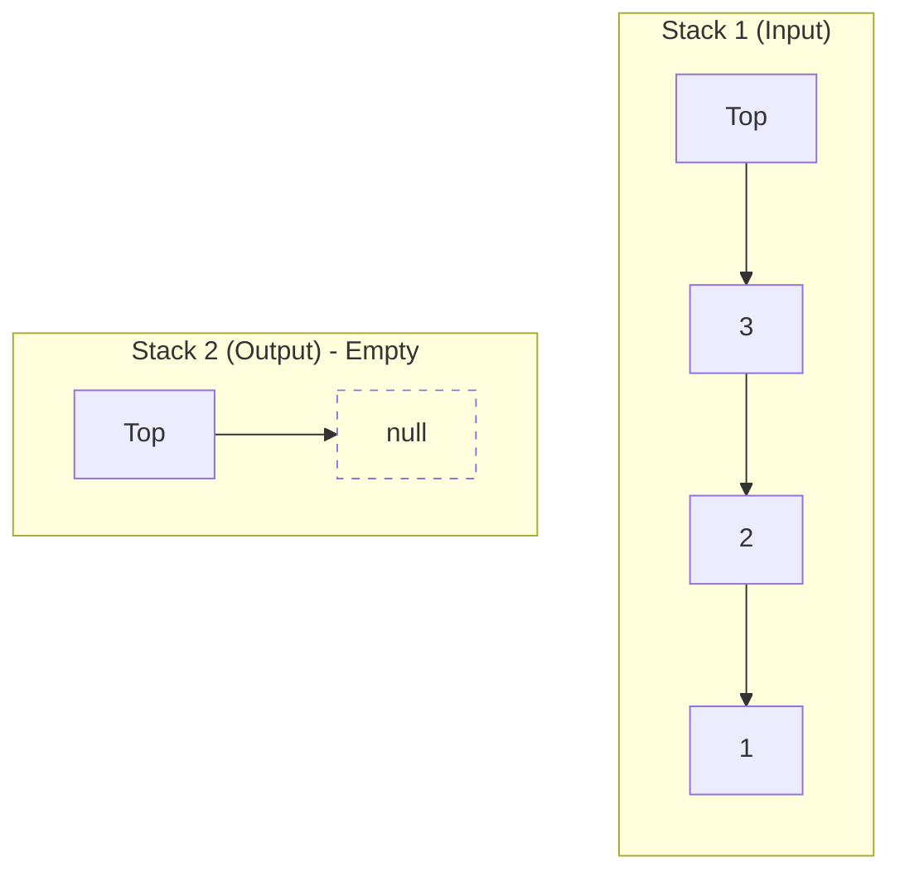
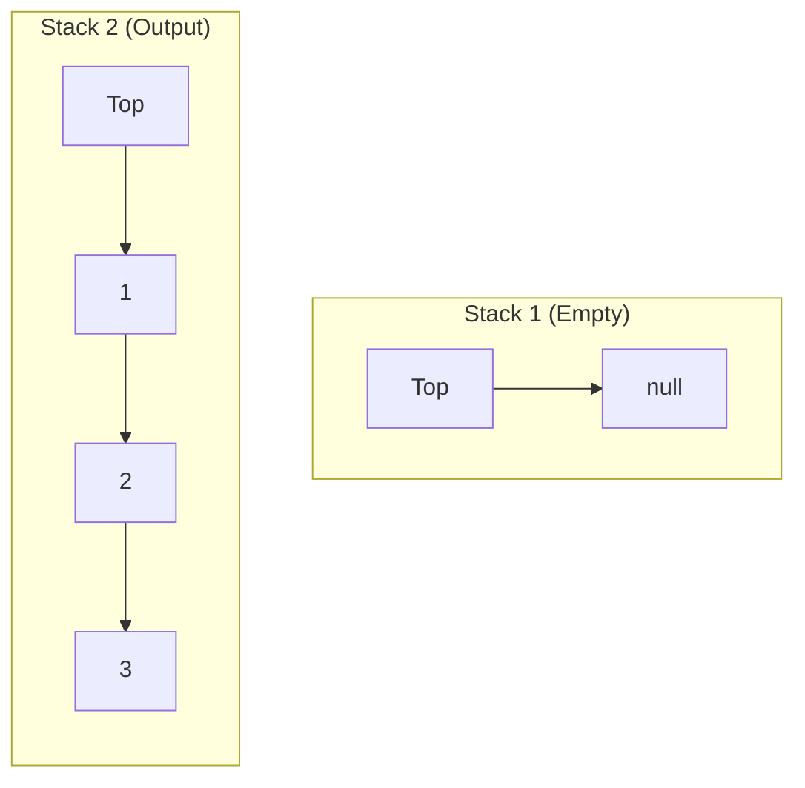

# Implementing a Queue Using Stacks

## 1. Introduction

The problem of implementing a **Queue** using **Stacks** is a classic interview question that tests a candidate's understanding of fundamental data structures and their operational characteristics. A queue follows the **First-In-First-Out (FIFO)** principle, whereas a stack adheres to the **Last-In-First-Out (LIFO)** principle. The challenge lies in simulating the FIFO behavior of a queue using only the LIFO operations provided by stacks.

This document presents a detailed analysis of the problem, explores the standard two-stack solution, provides time complexity evaluations, and offers a complete implementation in JavaScript.

## 2. Problem Statement

Implement a queue data structure with the following operations using **only** stack operations (`push`, `pop`, `peek`, and `isEmpty`). The queue should support:

- `enqueue(value)`: Inserts an element at the rear of the queue.
- `dequeue()`: Removes and returns the element from the front of the queue.
- `peek()`: Returns the front element without removing it.
- `empty()`: Returns `true` if the queue is empty, `false` otherwise.

**Constraints:**
- Only standard stack operations are permitted for internal data management.
- The underlying stacks may be implemented using arrays or linked lists.

## 3. Approach: Two Stacks

The most efficient and widely accepted solution employs **two stacks**:

- **Stack 1 (Input Stack / Push Stack)**: Used to enqueue new elements.
- **Stack 2 (Output Stack / Pop Stack)**: Used to dequeue elements.

### 3.1 Algorithm Explanation

The queue operations are mapped to stack operations as follows:

**Enqueue Operation (`enqueue`):**
- Simply push the new element onto **Stack 1**.
- Time Complexity: **O(1)**.

**Dequeue Operation (`dequeue`):**
- If **Stack 2** is not empty, pop from **Stack 2** and return the value.
- If **Stack 2** is empty:
  - Transfer all elements from **Stack 1** to **Stack 2** by popping from **Stack 1** and pushing onto **Stack 2**. This reverses the order, making the oldest element appear at the top of **Stack 2**.
  - Then pop from **Stack 2**.
- Time Complexity: **Amortized O(1)** per operation. In the worst case, a single dequeue may be O(n), but this cost is distributed across n enqueues.

**Peek Operation (`peek`):**
- Similar to `dequeue`, but return the top of **Stack 2** without popping. If **Stack 2** is empty, transfer elements from **Stack 1** first.
- Time Complexity: **Amortized O(1)**.

**Empty Check (`empty`):**
- Return `true` only if both stacks are empty.

### 3.2 Visual Representation

The following diagram illustrates the state of the two stacks during a dequeue operation after multiple enqueues.



After transferring elements from Stack 1 to Stack 2 (when Stack 2 is empty):



Now, popping from Stack 2 yields the oldest element (`1`), achieving FIFO order.

## 4. Implementation in JavaScript

The following code implements a `MyQueue` class using two internal stacks. Each stack is an array that respects the LIFO principle.

```javascript
/**
 * Queue implementation using two stacks.
 * Provides standard queue operations: enqueue, dequeue, peek, empty.
 */
class MyQueue {
    constructor() {
        this.stack1 = []; // Input stack (for enqueue)
        this.stack2 = []; // Output stack (for dequeue)
    }

    /**
     * Adds an element to the rear of the queue.
     * @param {*} value - The element to enqueue.
     */
    enqueue(value) {
        this.stack1.push(value);
    }

    /**
     * Removes and returns the element at the front of the queue.
     * @returns {*} The dequeued element, or undefined if queue is empty.
     */
    dequeue() {
        // If output stack is empty, transfer all elements from input stack
        if (this.stack2.length === 0) {
            while (this.stack1.length > 0) {
                this.stack2.push(this.stack1.pop());
            }
        }
        return this.stack2.pop();
    }

    /**
     * Returns the front element without removing it.
     * @returns {*} The front element, or undefined if queue is empty.
     */
    peek() {
        if (this.stack2.length === 0) {
            while (this.stack1.length > 0) {
                this.stack2.push(this.stack1.pop());
            }
        }
        return this.stack2[this.stack2.length - 1];
    }

    /**
     * Checks whether the queue is empty.
     * @returns {boolean} true if empty, false otherwise.
     */
    empty() {
        return this.stack1.length === 0 && this.stack2.length === 0;
    }
}
```

### 4.1 Example Usage

```javascript
const queue = new MyQueue();

queue.enqueue(10);
queue.enqueue(20);
queue.enqueue(30);

console.log(queue.peek());    // 10
console.log(queue.dequeue()); // 10
console.log(queue.dequeue()); // 20

queue.enqueue(40);

console.log(queue.dequeue()); // 30
console.log(queue.dequeue()); // 40
console.log(queue.empty());   // true
```

## 5. Time Complexity Analysis

| Operation | Time Complexity (Amortized) | Explanation |
|-----------|-----------------------------|-------------|
| `enqueue` | O(1) | Single push onto Stack 1. |
| `dequeue` | Amortized O(1) | Each element is moved from Stack 1 to Stack 2 at most once. The total cost of `m` dequeues after `n` enqueues is O(n + m), averaging to O(1) per operation. |
| `peek` | Amortized O(1) | Same transfer logic as `dequeue`. |
| `empty` | O(1) | Simple length check on both stacks. |

**Worst-Case Scenario:** A single `dequeue` may take O(n) time if Stack 2 is empty and all `n` elements reside in Stack 1. However, this cost is infrequent and amortized over subsequent operations.

## 6. Alternative Implementations

### 6.1 Using a Single Stack (Recursive)

A queue can be implemented with a single stack using recursion, but this approach is inefficient for large datasets due to O(n) time for both enqueue and dequeue, and it may cause stack overflow for deep recursion.

### 6.2 Using Two Stacks with Lazy Transfer

The implementation above employs **lazy transfer**: elements are moved from Stack 1 to Stack 2 only when Stack 2 becomes empty. This minimizes unnecessary transfers and is the optimal two-stack approach.

## 7. Summary

Implementing a queue using stacks demonstrates the power of data structure composition. By strategically employing two stacks, the FIFO behavior of a queue can be emulated with amortized constant-time operations. This problem reinforces key concepts such as:

- LIFO vs. FIFO order.
- Amortized analysis of algorithms.
- Practical use of fundamental data structures.

The solution presented is widely applicable and forms the basis for understanding more complex data structure designs. The accompanying JavaScript implementation is ready for use in both educational and production environments.