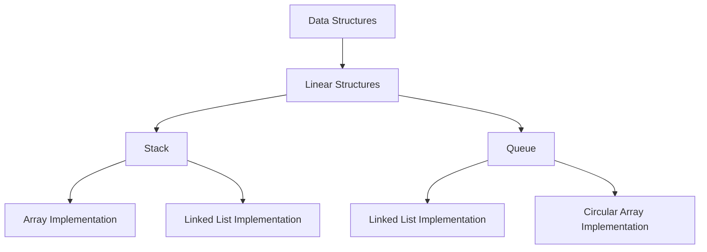

# Summary: Stacks and Queues

## 1. Introduction

Stacks and Queues are fundamental linear data structures that impose specific access restrictions to optimize particular operations. A stack follows the **Last-In-First-Out (LIFO)** principle, analogous to a stack of plates where only the topmost plate is accessible. A queue adheres to the **First-In-First-Out (FIFO)** principle, comparable to a waiting line where the first person to arrive is the first to be served.

These structures are typically built upon lower-level data structures such as arrays and linked lists, with the restricted interface intentionally limiting operations to ensure high efficiency for insertion, removal, and inspection of elements at the extremities.

## 2. Conceptual Analogies

| Data Structure | Analogy | Access Principle |
|----------------|---------|------------------|
| **Stack** | Stack of plates | Last-In-First-Out (LIFO) |
| **Queue** | Waiting line | First-In-First-Out (FIFO) |

## 3. Implementation Strategies

### 3.1 Stack Implementation

A stack can be efficiently implemented using either **arrays** or **linked lists**.

**Array-Based Stack:**
- Built-in `push()` and `pop()` methods provide natural LIFO behavior.
- Excellent cache locality due to contiguous memory allocation.
- Fixed capacity or dynamic resizing may introduce occasional O(n) cost.
- Simplicity and minimal code overhead.

**Linked List-Based Stack:**
- Truly dynamic size without resizing penalties.
- Each node requires extra memory for pointers.
- Slightly less cache-friendly due to scattered memory allocation.
- O(1) push and pop operations guaranteed.

**Selection Criteria:** Both implementations are viable. Arrays are preferred for predictable capacity and cache performance; linked lists are chosen for unbounded growth and consistent O(1) operations without resizing.

### 3.2 Queue Implementation

**Array-Based Queue (Naive):**
- Enqueue is O(1), but dequeue requires shifting all remaining elements, resulting in **O(n)** time complexity.
- **Not recommended** for performance-sensitive applications.

**Circular Array Queue:**
- Overcomes shifting cost using modulo arithmetic to wrap pointers.
- Both enqueue and dequeue are O(1).
- Fixed capacity; may become full.

**Linked List-Based Queue:**
- Maintains `head` (front) and `tail` (rear) pointers.
- Enqueue (append to tail) and dequeue (remove from head) are O(1) operations.
- Dynamic sizing without capacity limits.
- **Preferred implementation** for general-purpose queues.

## 4. Operational Characteristics and Time Complexity

Stacks and queues are optimized for operations at the ends of the structure. They do not support efficient random access or search operations.

### 4.1 Stack Operations

| Operation | Description | Time Complexity |
|-----------|-------------|-----------------|
| `push()` | Add element to top | O(1) |
| `pop()` | Remove element from top | O(1) |
| `peek()` | View top element without removal | O(1) |
| `isEmpty()` | Check if stack is empty | O(1) |
| `search()` / `lookup` | Find an element | O(n) |

### 4.2 Queue Operations

| Operation | Description | Time Complexity |
|-----------|-------------|-----------------|
| `enqueue()` | Add element to rear | O(1) |
| `dequeue()` | Remove element from front | O(1) |
| `peek()` | View front element without removal | O(1) |
| `isEmpty()` | Check if queue is empty | O(1) |
| `search()` / `lookup` | Find an element | O(n) |

## 5. Visual Overview: Stack and Queue in Context

## 6. Key Takeaways

- **Stacks** provide LIFO access and are ideal for browser history, undo/redo functionality, and function call management.
- **Queues** provide FIFO access and are essential for task scheduling, print spooling, waitlist applications, and message buffering.
- The restricted interface of stacks and queues ensures that allowed operations (`push`, `pop`, `enqueue`, `dequeue`, `peek`) execute in constant time, making them highly efficient for specific use cases.
- Implementation choices (array vs. linked list) involve trade-offs between memory locality, dynamic sizing, and complexity.
- A common interview question—**"Implement a Queue using Stacks"**—reinforces understanding of data structure composition and amortized analysis.

## 7. Conclusion

Stacks and queues are indispensable tools in a programmer's toolkit. Their simplicity, efficiency, and wide applicability make them foundational concepts in computer science. Mastery of these structures, including their implementation nuances and operational constraints, is critical for algorithm design, system architecture, and technical interviews. The journey through data structures continues with non-linear structures such as trees and graphs, which build upon the principles established here.