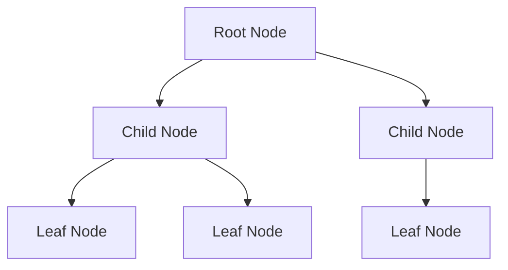

# Introduction to Tree Data Structures

## 1. Overview

Trees represent a fundamental shift from linear data structures to hierarchical organization. Unlike arrays or linked lists that maintain elements in a sequential, one-dimensional arrangement, trees structure data in multiple levels with parent-child relationships.

This hierarchical nature makes trees essential for modeling numerous real-world systems and computational processes.

## 2. Definition and Core Terminology

### 2.1 What is a Tree?

A tree is a non-linear, hierarchical data structure consisting of nodes connected by edges. The structure is characterized by a single entry point and unidirectional relationships between connected nodes.

### 2.2 Essential Terminology

| Term | Definition |
|------|------------|
| **Root Node** | The topmost node in the hierarchy; the single entry point from which all other nodes descend |
| **Parent Node** | A node that has one or more child nodes connected below it |
| **Child Node** | A node that descends from exactly one parent node |
| **Leaf Node** | A node that has no children; located at the terminal ends of the tree structure |
| **Edge** | The connection or link between a parent and its child node |
| **Subtree** | Any node and all of its descendants considered as an independent tree structure |
| **Siblings** | Nodes that share the same parent |

### 2.3 Visual Representation



The diagram above illustrates the basic structure. All arrows point downward, representing the unidirectional parent-to-child relationship.

## 3. Fundamental Characteristics

### 3.1 Hierarchical Structure

Trees organize data in levels. The root occupies Level 0, its children reside at Level 1, and subsequent generations occupy increasing depth levels. This layered organization contrasts sharply with the flat, sequential arrangement of linear data structures.

### 3.2 Unidirectional Relationships

In a standard tree implementation, connections flow exclusively from parent to child. A node maintains references to its children but does not inherently reference its parent. This design simplifies traversal algorithms and reduces memory overhead.

### 3.3 Single Entry Point

Every tree possesses exactly one root node. All operations—searching, insertion, traversal—begin from this singular entry point. There are no alternative access routes.

### 3.4 No Cycles

By definition, a tree cannot contain cycles. A path traced from any node following child references will never loop back to a previously visited node. This property distinguishes trees from graphs.

## 4. Real-World Applications

### 4.1 Document Object Model (DOM)

Web browsers represent HTML documents as a tree structure. The `<html>` element serves as the root, with `<head>` and `<body>` as its immediate children. Nested elements form deeper levels in the hierarchy.

```
html (root)
├── head
│   ├── meta
│   ├── title
│   └── link
└── body
    ├── header
    │   └── nav
    ├── main
    │   └── section
    └── footer
```

### 4.2 Game Decision Trees

Classical chess engines employ tree structures to evaluate potential moves. Each node represents a board state, and each branch represents a possible move. The engine traverses this tree to identify optimal strategies.

### 4.3 Abstract Syntax Tree (AST)

Compilers and interpreters parse source code into tree representations. Each syntactic construct becomes a node, and the hierarchical relationships capture the grammatical structure of the program.

### 4.4 Comment Threads and Hierarchical Data

Nested comment systems—such as those on social media platforms—naturally model tree structures. A top-level comment acts as a root for its reply subtree, with each reply becoming a child node.

### 4.5 File Systems

Directory structures on operating systems organize files and folders in tree hierarchies. The root directory (e.g., `C:\` or `/`) contains subdirectories, which may contain further nested directories and files.

## 5. Relationship with Linked Lists

### 5.1 Shared Foundation

Both trees and linked lists rely on node-based architecture. Each node contains:

- Data payload (any required information)
- Reference(s) to other node(s)

### 5.2 Key Distinction

A singly linked list qualifies as a degenerate tree—specifically, a tree where each node has at most one child. This linear restriction produces a single, unbranched path from head to tail.

**Linked List Structure:**
```
[Node A] → [Node B] → [Node C] → null
```

**Tree Structure (General Case):**
```
        [Root]
       /   |   \
  [Child] [Child] [Child]
    /  \      |
[Leaf][Leaf][Leaf]
```

### 5.3 Reference Management

In linked lists, each node holds exactly one reference (to the next node). In trees, nodes may hold multiple references—typically stored in an array or list—to accommodate an arbitrary number of children.

## 6. Implementation Foundation in JavaScript

### 6.1 Basic Node Structure

```javascript
class TreeNode {
    constructor(value) {
        this.value = value;       // Data stored in the node
        this.children = [];       // Array to hold child node references
    }
    
    // Adds a child node to the current node
    addChild(childNode) {
        this.children.push(childNode);
    }
    
    // Removes a child node by reference
    removeChild(childNode) {
        const index = this.children.indexOf(childNode);
        if (index !== -1) {
            this.children.splice(index, 1);
            return true;
        }
        return false;
    }
}

// Example usage
const root = new TreeNode("Root");
const child1 = new TreeNode("Child 1");
const child2 = new TreeNode("Child 2");
const leafNode = new TreeNode("Leaf");

root.addChild(child1);
root.addChild(child2);
child1.addChild(leafNode);

console.log(root);
```

### 6.2 Tree Class Wrapper

```javascript
class Tree {
    constructor(rootValue) {
        this.root = new TreeNode(rootValue);
    }
    
    // Additional tree-level methods would be implemented here
    // such as traversal algorithms, search operations, etc.
}

// Example instantiation
const myTree = new Tree("Root Node Value");
```

## 7. Diversity of Tree Types

### 7.1 Context

The field of tree data structures encompasses numerous specialized variants, each optimized for particular use cases. While the quantity may appear overwhelming, most production scenarios rely on a core subset of tree types.

### 7.2 Common Categories (Preview)

| Tree Type | Distinguishing Feature |
|-----------|------------------------|
| Binary Tree | Each node has at most two children |
| Binary Search Tree | Ordered binary tree with efficient search properties |
| AVL Tree | Self-balancing binary search tree |
| Trie (Prefix Tree) | Optimized for string and prefix operations |
| Heap | Specialized tree satisfying heap property (min/max) |

### 7.3 Learning Approach

Mastering the fundamental concepts presented in this document establishes the necessary foundation for understanding all specialized tree variants. Subsequent study focuses on variations that alter node count constraints, ordering rules, or balancing mechanisms while preserving the core hierarchical architecture.

## 8. Summary

Trees provide the essential framework for representing hierarchical relationships in computational systems. Their node-based architecture, unidirectional parent-to-child references, and single-root entry point define a flexible structure applicable to diverse domains—from web document representation to game artificial intelligence.

Understanding trees serves as a prerequisite for exploring advanced data structures and algorithms, particularly those involving efficient searching, sorting, and state-space exploration.