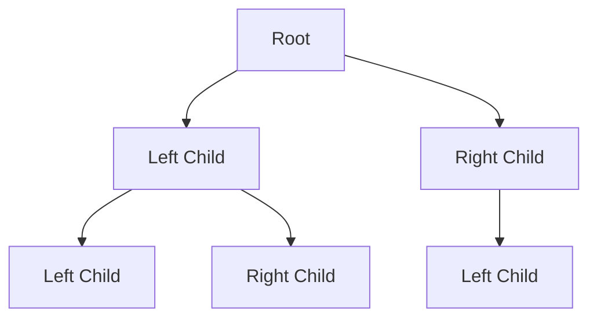
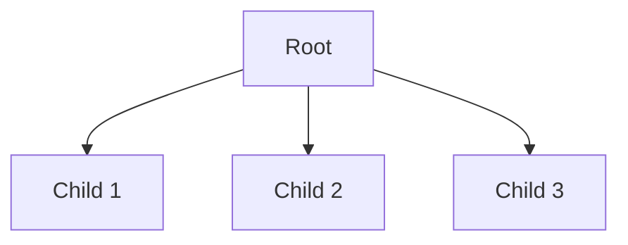

# Binary Trees

## 1. Introduction to Binary Trees

A binary tree is a specialized form of the general tree data structure that imposes a strict constraint on the maximum number of children per node. This restriction yields predictable structural properties and enables efficient algorithms for searching, insertion, and traversal.

Binary trees form the foundation for numerous advanced data structures, including binary search trees, heaps, and expression trees.

## 2. Definition and Structural Rules

### 2.1 Core Definition

A binary tree is a tree data structure in which each node has **at most two children**, conventionally referred to as the **left child** and the **right child**.

### 2.2 Governing Rules

| Rule | Description |
|------|-------------|
| **Child Limit** | Each node may have zero, one, or two children. No node may have three or more children. |
| **Single Parent** | Every child node has exactly one parent node. |
| **Directional References** | Links from parent to children are unidirectional; nodes do not inherently reference their parent. |

### 2.3 Valid and Invalid Examples

**Valid Binary Tree:**


**Invalid Binary Tree (Node with Three Children):**


## 3. Node Structure Implementation

### 3.1 Binary Tree Node in JavaScript

A binary tree node requires storage for the data payload and two reference pointers to its left and right children.

```javascript
class BinaryTreeNode {
    constructor(value) {
        // The data stored in this node
        this.value = value;
        
        // Reference to the left child (initially null)
        this.left = null;
        
        // Reference to the right child (initially null)
        this.right = null;
    }
}

// Example instantiation
const rootNode = new BinaryTreeNode(10);
const leftChild = new BinaryTreeNode(5);
const rightChild = new BinaryTreeNode(15);

rootNode.left = leftChild;
rootNode.right = rightChild;
```

### 3.2 Comparison with Linked List Nodes

The binary tree node extends the concept of a singly linked list node. Where a linked list node maintains a single `next` reference, the binary tree node maintains two distinct references—`left` and `right`.

```
Linked List Node:      [ value | next ] → [ value | next ] → null

Binary Tree Node:           [ value ]
                           /         \
                      [left]       [right]
```

## 4. Classification of Binary Trees

### 4.1 Full Binary Tree

A **full binary tree** (sometimes called a **proper binary tree**) satisfies the condition that every node has either **zero children or two children**. No node possesses exactly one child.

```
        A
       / \
      B   C
     / \
    D   E
```

In the above ASCII representation, node A has two children (B and C). Node B has two children (D and E). Nodes C, D, and E have zero children. No node has exactly one child.

### 4.2 Perfect Binary Tree

A **perfect binary tree** is a stricter classification that requires **both** of the following conditions:

- Every node has either zero or two children (full binary tree condition).
- All leaf nodes reside at the **same depth level**.

```
         1
       /   \
      2     3
     / \   / \
    4   5 6   7
```

### 4.3 Complete Binary Tree (Contextual Note)

While not detailed in the source material, a **complete binary tree** is a related classification where all levels are completely filled except possibly the last level, and the last level is filled from left to right. This structure is essential for heap implementations.

## 5. Mathematical Properties of Perfect Binary Trees

Perfect binary trees exhibit two significant properties that underpin their efficiency in algorithmic applications.

### 5.1 Doubling Node Count per Level

As one descends from the root to subsequent levels, the number of nodes **doubles** at each level.

| Level | Number of Nodes |
|-------|-----------------|
| 0 (Root) | 1 = 2⁰ |
| 1 | 2 = 2¹ |
| 2 | 4 = 2² |
| 3 | 8 = 2³ |
| ... | ... |
| h | 2ʰ |

**General Formula:** At level `h` (where root is level 0), the number of nodes equals `2ʰ`.

### 5.2 Relationship Between Leaf Nodes and Internal Nodes

In a perfect binary tree, the number of nodes on the **last level** equals the **sum of nodes on all preceding levels plus one**.

**Mathematical Expression:**
```
Number of leaves = (Number of internal nodes) + 1
```

**Verification with a Perfect Binary Tree of Height 2:**
```
        O          Level 0: 1 node
       / \
      O   O        Level 1: 2 nodes
     / \ / \
    O  O O  O      Level 2: 4 nodes (leaves)

Leaves: 4
Internal nodes (Level 0 + Level 1): 1 + 2 = 3
4 = 3 + 1  (Property holds)
```

### 5.3 Implication for Data Distribution

The second property reveals that approximately **half of all nodes in a perfect binary tree reside at the bottommost level**. This distribution has profound implications for search efficiency. If an algorithm can bypass visiting entire subtrees during a search operation, substantial performance gains become achievable.

## 6. Introduction to Logarithmic Complexity

### 6.1 Connection to Binary Trees

The structural properties of balanced binary trees—particularly perfect and complete binary trees—enable search, insertion, and deletion operations to execute in **O(log n)** time complexity, where `n` represents the total number of nodes.

### 6.2 Intuition Behind O(log n)

Consider a perfect binary tree with `n` nodes and height `h`. The relationship between `n` and `h` is:

```
n = 2^(h+1) - 1
```

Solving for height `h`:

```
h = log₂(n + 1) - 1
```

Thus, the height grows logarithmically with respect to the number of nodes. Operations that traverse from the root to a leaf—making a decision at each level—require at most `h` steps. Consequently, the time complexity scales as O(log n).

### 6.3 Significance

Logarithmic time complexity represents a dramatic improvement over linear O(n) operations, especially for large datasets. This efficiency motivates the study and application of balanced binary tree structures in database indexing, file system organization, and network routing algorithms.

## 7. Summary

- A **binary tree** restricts each node to at most two children: a left child and a right child.
- **Full binary trees** contain only nodes with zero or two children.
- **Perfect binary trees** are full binary trees where all leaves occupy the same deepest level.
- Perfect binary trees exhibit node doubling per level and a fixed relationship between leaf count and internal node count.
- Balanced binary tree structures enable **O(log n)** time complexity for core operations, a substantial advantage over linear data structures.

The binary tree serves as the foundational abstraction for advanced tree variants that incorporate ordering rules and self-balancing mechanisms to maintain logarithmic performance guarantees.