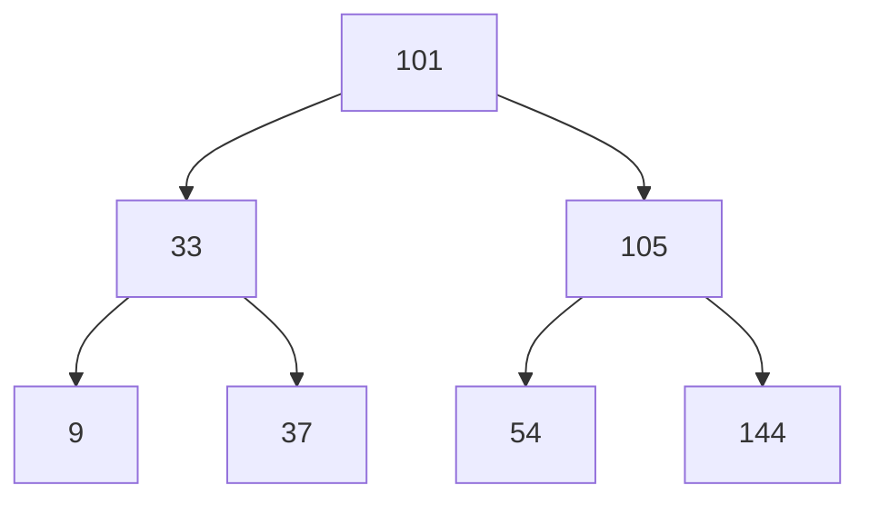

# Binary Search Tree (BST)

## 1. Introduction

A Binary Search Tree (BST) is a specialized form of a binary tree that enforces an ordering property among its nodes. This ordering constraint transforms the tree into an efficient data structure for search, insertion, and deletion operations, particularly when the tree remains balanced.

Binary search trees are widely employed in applications that require dynamic data storage with fast lookup capabilities while preserving hierarchical relationships among elements. Common use cases include implementing symbol tables in compilers, maintaining sorted data streams, and serving as the underlying mechanism for database indexing structures.

## 2. Definition and Governing Rules

A Binary Search Tree is a binary tree that satisfies the following invariants at every node:

| Rule | Description |
|------|-------------|
| **Left Subtree Property** | All nodes in the left subtree of a node must contain values strictly less than the node's value. |
| **Right Subtree Property** | All nodes in the right subtree of a node must contain values strictly greater than the node's value. |
| **Binary Tree Constraint** | Each node may have at most two children (left and right). |
| **No Duplicate Values** | Typically, BST implementations assume unique values to maintain strict ordering. Variants exist that accommodate duplicates by storing counts or using a "less than or equal" rule on one side. |

### 2.1 Visual Representation



In the diagram above, every node's left descendants contain smaller values, and right descendants contain larger values. For example, starting from the root `101`:
- Left subtree nodes (`33`, `9`, `37`) are all less than `101`.
- Right subtree nodes (`105`, `54`, `144`) are all greater than `101`.

## 3. Motivation and Comparison with Hash Tables

While hash tables provide O(1) average-case insertion, deletion, and lookup, they do not preserve any ordering or relationship among keys. A Binary Search Tree, in contrast, maintains a sorted order of its elements, which enables operations such as:

- Finding the minimum or maximum element efficiently.
- Iterating over elements in sorted sequence (in-order traversal).
- Answering range queries (e.g., find all values between 50 and 100).
- Supporting predecessor and successor queries.

BSTs are therefore preferred in scenarios where the relational order of data is significant, such as file system directory hierarchies, priority queues with dynamic ordering, and certain database indexing mechanisms.

## 4. Core Operations

### 4.1 Lookup (Search)

Searching for a value in a BST exploits the ordering property to eliminate half of the remaining tree at each step.

**Algorithm:**
1. Begin at the root node.
2. If the current node is `null`, the value is not present.
3. If the target value equals the current node's value, return the node (or `true`).
4. If the target value is less than the current node's value, recursively search the left subtree.
5. If the target value is greater, recursively search the right subtree.

**Example:** Searching for `37` in the tree above:
- Start at `101`: `37 < 101` → go left to `33`.
- At `33`: `37 > 33` → go right to `37` (found).

### 4.2 Insertion

Insertion follows a similar path as lookup to determine the appropriate leaf position for the new value.

**Algorithm:**
1. Start at the root.
2. If the tree is empty, create a new node as root.
3. Compare the new value with the current node's value.
4. If smaller, move to the left child; if greater, move to the right child.
5. If the appropriate child is `null`, insert the new node there.
6. Otherwise, continue traversing.

### 4.3 Deletion

Deletion is the most complex operation because it must maintain the BST ordering property after node removal. Three cases arise:

| Case | Description | Action |
|------|-------------|--------|
| **Case 1:** Leaf Node | The node to delete has no children. | Simply remove the node (set parent's reference to `null`). |
| **Case 2:** One Child | The node has exactly one child. | Replace the node with its single child. |
| **Case 3:** Two Children | The node has both left and right children. | Find the **in-order successor** (smallest node in the right subtree) or **in-order predecessor** (largest node in the left subtree). Replace the node's value with the successor/predecessor value, then recursively delete the successor/predecessor (which will fall into Case 1 or 2). |

The in-order successor is the minimum value in the right subtree. It is guaranteed to have no left child, making its removal straightforward.

## 5. Implementation in JavaScript

### 5.1 Node Class

```javascript
class BSTNode {
    constructor(value) {
        this.value = value;   // Data stored in the node
        this.left = null;     // Reference to left child
        this.right = null;    // Reference to right child
    }
}
```

### 5.2 Binary Search Tree Class with Basic Operations

```javascript
class BinarySearchTree {
    constructor() {
        this.root = null;     // Root node of the BST
    }

    /**
     * Inserts a value into the BST.
     * @param {number} value - The value to insert.
     */
    insert(value) {
        const newNode = new BSTNode(value);

        if (this.root === null) {
            this.root = newNode;
            return;
        }

        let current = this.root;
        while (true) {
            if (value < current.value) {
                // Go left
                if (current.left === null) {
                    current.left = newNode;
                    return;
                }
                current = current.left;
            } else if (value > current.value) {
                // Go right
                if (current.right === null) {
                    current.right = newNode;
                    return;
                }
                current = current.right;
            } else {
                // Value already exists (assuming no duplicates allowed)
                return;
            }
        }
    }

    /**
     * Searches for a value in the BST.
     * @param {number} value - The value to find.
     * @returns {BSTNode|null} - The node containing the value, or null if not found.
     */
    lookup(value) {
        let current = this.root;

        while (current !== null) {
            if (value === current.value) {
                return current;       // Found
            } else if (value < current.value) {
                current = current.left;
            } else {
                current = current.right;
            }
        }
        return null;                  // Not found
    }

    /**
     * Deletes a value from the BST.
     * This is a simplified version that returns a new root for the subtree.
     * @param {number} value - The value to delete.
     * @param {BSTNode} node - Current node in recursion (start with root).
     * @returns {BSTNode|null} - The new root of the subtree after deletion.
     */
    delete(value, node = this.root) {
        if (node === null) {
            return null;  // Value not found
        }

        // Traverse to find the node
        if (value < node.value) {
            node.left = this.delete(value, node.left);
        } else if (value > node.value) {
            node.right = this.delete(value, node.right);
        } else {
            // Node to delete found

            // Case 1: No children (leaf)
            if (node.left === null && node.right === null) {
                return null;
            }
            // Case 2: One child
            if (node.left === null) {
                return node.right;
            }
            if (node.right === null) {
                return node.left;
            }
            // Case 3: Two children
            // Find in-order successor (smallest in right subtree)
            let successor = this.findMin(node.right);
            node.value = successor.value;
            // Delete the successor
            node.right = this.delete(successor.value, node.right);
        }
        return node;
    }

    /**
     * Helper: Finds the node with the minimum value in a subtree.
     * @param {BSTNode} node - Root of the subtree.
     * @returns {BSTNode} - Node with minimum value.
     */
    findMin(node) {
        while (node.left !== null) {
            node = node.left;
        }
        return node;
    }
}

// Example Usage
const bst = new BinarySearchTree();
bst.insert(101);
bst.insert(33);
bst.insert(105);
bst.insert(9);
bst.insert(37);
bst.insert(54);
bst.insert(144);

console.log(bst.lookup(37));   // BSTNode { value: 37, left: null, right: null }
bst.delete(105);
```

## 6. Time Complexity Analysis

The efficiency of BST operations depends on the height of the tree. In a **balanced** BST, the height is approximately `log₂(n)`, yielding logarithmic time complexity.

| Operation | Average Case | Worst Case (Unbalanced) |
|-----------|--------------|-------------------------|
| Lookup    | O(log n)     | O(n)                    |
| Insert    | O(log n)     | O(n)                    |
| Delete    | O(log n)     | O(n)                    |

The worst-case scenario occurs when the BST degenerates into a linked list—for instance, when elements are inserted in strictly increasing or decreasing order. In such cases, the height becomes `n`, and operations degrade to linear time.

## 7. Limitations and Unbalanced Trees

A significant drawback of the basic Binary Search Tree is its susceptibility to becoming unbalanced. Without a self-balancing mechanism, sequential insertions can produce a skewed tree that negates the logarithmic advantage.

**Example of Unbalanced BST (Insertion order: 9, 33, 37, 54, 101, 105, 144):**
```
9
 \
  33
   \
    37
     \
      54
       \
        101
         \
          105
           \
            144
```
This structure behaves identically to a linked list, with O(n) search performance.

To address this issue, self-balancing variants such as **AVL Trees** and **Red-Black Trees** enforce additional structural constraints that guarantee O(log n) height after every insertion and deletion. These advanced tree structures are the subject of subsequent study.

## 8. Summary

- A **Binary Search Tree (BST)** extends the binary tree with an ordering property: left subtree values < node value < right subtree values.
- BSTs enable efficient O(log n) search, insertion, and deletion in balanced conditions.
- They preserve sorted order and support range-based queries, offering advantages over hash tables when relationships matter.
- The basic BST implementation is straightforward but may degrade to O(n) performance if not balanced.
- Understanding BSTs lays the groundwork for studying self-balancing trees that maintain logarithmic guarantees.