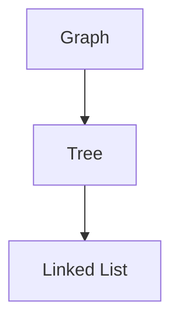

# Graphs: Fundamentals and Introduction

## Introduction to Graphs

A graph is a non-linear data structure consisting of a finite set of vertices (also called nodes) and a set of edges that connect these vertices in a pairwise fashion. Graphs are among the most versatile and widely used data structures in computer science, primarily due to their ability to model complex real-world relationships and networks effectively.

Unlike arrays or linked lists which organize data sequentially, graphs represent relationships between discrete entities. This makes them indispensable for applications ranging from social network analysis to route planning and recommendation systems.

## Basic Terminology

### Vertex (Node)
A vertex, commonly referred to as a node, represents an individual entity within the graph. Each vertex stores a value or data item and can be connected to other vertices through edges.

### Edge
An edge represents a connection or relationship between two vertices. Edges define how vertices are related to one another and form the fundamental structure of the graph.

### Visual Representation

Consider the following abstract representation of a graph:

```
    A --- B
    |     |
    |     |
    C --- D
```

In this representation:
- A, B, C, and D are vertices (nodes)
- The lines connecting them are edges

## Real-World Applications

Graphs excel at modeling scenarios where entities maintain relationships with other entities. The following applications demonstrate the practical significance of graph data structures:

### Social Networks
Platforms such as Facebook and LinkedIn represent users as vertices and friendships or professional connections as edges. This graph representation enables features like friend suggestions, mutual connection discovery, and community detection.

### Recommendation Engines
E-commerce platforms including Amazon and Netflix construct graphs where vertices represent users and products, while edges represent interactions such as purchases, views, or ratings. Graph algorithms analyze these relationships to generate personalized recommendations.

### Navigation and Mapping
Google Maps and other navigation systems model locations (cities, intersections) as vertices and roads or pathways as edges. Weights assigned to edges represent distances, travel times, or traffic conditions, enabling shortest-path calculations for route optimization.

### World Wide Web
The internet itself can be represented as a directed graph where web pages serve as vertices and hyperlinks function as directed edges connecting one page to another. Search engines utilize graph traversal algorithms to index and rank web content.

### Network Infrastructure
Computer networks, telecommunications systems, and electrical grids employ graph models where routers, towers, or substations are vertices and physical or logical connections constitute edges.

## Relationship with Other Data Structures

Graphs represent a generalization of several fundamental data structures encountered previously. Understanding this hierarchy provides valuable context for appreciating the graph abstraction.

### The Data Structure Hierarchy

The relationship between linked lists, trees, and graphs can be visualized as follows:



### Linked Lists as Graphs
A singly linked list can be interpreted as a specialized graph with the following constraints:
- Each vertex (except the last) has exactly one outgoing edge pointing to its successor
- Each vertex (except the first) has exactly one incoming edge from its predecessor
- The structure is linear and acyclic

### Trees as Graphs
A tree constitutes a restricted form of a graph characterized by:
- Connectedness: All vertices are reachable from the root
- Acyclicity: No cycles exist within the structure
- Hierarchical organization: A root vertex exists, and each child vertex has exactly one parent

### Graph as the General Case
A graph removes all constraints imposed by trees and linked lists, permitting:
- Multiple connections per vertex (arbitrary degree)
- Cyclic relationships
- Disconnected components
- Bidirectional or directed connections

Consequently, every linked list is a tree, and every tree is a graph, but the converse does not hold true.

## Graph Representation in Code

The following JavaScript example illustrates a basic graph implementation using an adjacency list, which is one of the most common and efficient representation techniques.

```javascript
class Graph {
    constructor() {
        // Initialize an empty object to store adjacency lists
        // Each key represents a vertex, and its value is an array of connected vertices
        this.adjacencyList = {};
    }

    // Add a new vertex to the graph
    addVertex(vertex) {
        // Only add if the vertex does not already exist
        if (!this.adjacencyList[vertex]) {
            this.adjacencyList[vertex] = [];
        }
    }

    // Add an undirected edge between two vertices
    addEdge(vertex1, vertex2) {
        // Ensure both vertices exist before adding edges
        if (this.adjacencyList[vertex1] && this.adjacencyList[vertex2]) {
            // For an undirected graph, add the connection in both directions
            this.adjacencyList[vertex1].push(vertex2);
            this.adjacencyList[vertex2].push(vertex1);
        }
    }

    // Display the graph structure
    display() {
        for (let vertex in this.adjacencyList) {
            console.log(`${vertex} -> ${this.adjacencyList[vertex].join(', ')}`);
        }
    }
}

// Example usage demonstrating graph creation
const socialNetwork = new Graph();

// Adding vertices (users)
socialNetwork.addVertex('Alice');
socialNetwork.addVertex('Bob');
socialNetwork.addVertex('Charlie');
socialNetwork.addVertex('Diana');

// Adding edges (friendships)
socialNetwork.addEdge('Alice', 'Bob');
socialNetwork.addEdge('Alice', 'Charlie');
socialNetwork.addEdge('Bob', 'Diana');
socialNetwork.addEdge('Charlie', 'Diana');

// Display the resulting graph structure
socialNetwork.display();

// Expected Output:
// Alice -> Bob, Charlie
// Bob -> Alice, Diana
// Charlie -> Alice, Diana
// Diana -> Bob, Charlie
```

### Explanation of the Implementation

The adjacency list approach stores, for each vertex, a collection of its neighboring vertices. This method offers several advantages:
- **Memory Efficiency**: Space complexity of O(V + E), where V represents vertices and E represents edges
- **Traversal Performance**: Enables efficient iteration over a vertex's neighbors
- **Flexibility**: Accommodates both sparse and dense graphs effectively

The example models a simple social network where users (vertices) establish mutual friendships (undirected edges). Each friendship is represented bidirectionally to reflect the symmetric nature of the relationship.

## Conclusion

Graphs constitute a foundational data structure with extensive applicability across diverse domains of computer science and software engineering. Their capacity to model pairwise relationships makes them uniquely suited for representing interconnected systems in both the physical and digital worlds.

Subsequent topics will explore graph traversal algorithms, including breadth-first search and depth-first search, shortest-path algorithms such as Dijkstra's algorithm, and minimum spanning tree construction. Understanding the fundamental concepts presented here provides the necessary groundwork for engaging with these more advanced graph operations.