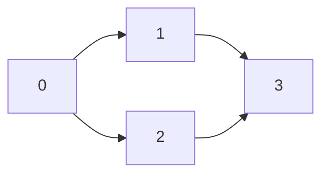

# Graph Classification: Identification Exercises and Analysis

## Introduction

The ability to classify graphs based on observable characteristics is fundamental to selecting appropriate algorithms and data representations. This document presents a systematic approach to identifying graph types through visual inspection of structural properties. The classification framework builds upon three primary dichotomies: directed versus undirected edges, weighted versus unweighted connections, and cyclic versus acyclic topology.

## Classification Criteria Review

Before examining specific examples, the following criteria establish the basis for categorization:

| Property | Question to Consider | Visual Indicator |
|----------|---------------------|------------------|
| Directionality | Can edges be traversed in both directions? | Presence or absence of arrowheads |
| Weightedness | Do edges carry numerical values? | Numbers displayed along edges |
| Cyclicity | Does any closed loop exist? | Path returning to starting vertex |

## Exercise 1: Undirected Weighted Cyclic Graph

### Graph Description

The first graph exhibits the following visual characteristics:
- No arrowheads on any edge connections
- Numerical values displayed adjacent to edges
- A closed traversal path exists connecting multiple vertices

### Classification Analysis

**Undirected Nature:**
All edges lack directional indicators. Traversal from any vertex to a connected neighbor permits immediate return traversal. The relationship between adjacent vertices is symmetric.

**Weighted Nature:**
Each edge displays a numerical weight value. These weights provide quantitative information about the strength, cost, or distance associated with the connection.

**Cyclic Nature:**
A cycle exists through vertices 0 → 1 → 2 → 0. The ability to return to the starting vertex without retracing edges confirms cyclicity.

### Visual Representation

```
    0
   / \
  2   3
 /     \
1 ----- 2
   4
```

In this representation, the numbers along edges denote weights. The cycle 0-1-2-0 is evident.

### Classification Summary

| Property | Determination |
|----------|---------------|
| Directed/Undirected | Undirected |
| Weighted/Unweighted | Weighted |
| Cyclic/Acyclic | Cyclic |

## Exercise 2: Undirected Weighted Cyclic Graph (Variant)

### Graph Description

The second graph presents similar structural features:
- Bidirectional edges without directional markings
- Weight values assigned to each connection
- Multiple cyclical pathways throughout the structure

### Classification Analysis

This graph represents a more densely connected variant of the first example. The absence of arrowheads confirms undirected edges. Weight labels on all edges establish the weighted classification. The presence of numerous interconnected loops, such as any triangular formation among three vertices, satisfies the cyclic condition.

### Classification Summary

| Property | Determination |
|----------|---------------|
| Directed/Undirected | Undirected |
| Weighted/Unweighted | Weighted |
| Cyclic/Acyclic | Cyclic |

## Exercise 3: Directed Unweighted Acyclic Graph

### Graph Description

The third graph displays:
- Arrowheads indicating permissible traversal directions
- No numerical values on edges
- No path exists that returns to any starting vertex

### Classification Analysis

**Directed Nature:**
Arrowheads on edges specify the sole direction of permitted movement. An edge from vertex A to vertex B does not imply the existence of a reverse edge.

**Unweighted Nature:**
All edges lack associated weight values. The connectivity topology is the exclusive information conveyed.

**Acyclic Nature:**
Consider the edge from vertex 0 to vertex 1. No subsequent sequence of directed edges leads back to vertex 0. The graph forms a directed acyclic structure where vertices 6 and 7, despite being disconnected from the main component, remain part of the overall graph definition.

### Important Observation

Disconnected vertices do not invalidate graph status. A graph may consist of multiple components without edges between them. Vertices 6 and 7 constitute a separate component yet remain part of the complete graph structure.

### Classification Summary

| Property | Determination |
|----------|---------------|
| Directed/Undirected | Directed |
| Weighted/Unweighted | Unweighted |
| Cyclic/Acyclic | Acyclic |

## Exercise 4: Directed Weighted Acyclic Graph

### Graph Description

The fourth graph incorporates:
- Directional arrowheads on all edges
- Numerical weight values on edges
- Linear, non-returning topology

### Classification Analysis

**Directed Nature:**
Each edge specifies a one-way connection with explicit source and destination vertices.

**Weighted Nature:**
Weight values accompany all edges, providing quantitative metrics for the directed relationships.

**Acyclic Nature:**
The topology prohibits any traversal sequence that returns to its origin. The structure is strictly feed-forward.

### Classification Summary

| Property | Determination |
|----------|---------------|
| Directed/Undirected | Directed |
| Weighted/Unweighted | Weighted |
| Cyclic/Acyclic | Acyclic |

## Directed Acyclic Graph (DAG): Special Consideration

### Definition

A Directed Acyclic Graph (DAG) is a directed graph containing no directed cycles. While undirected cycles may appear in the underlying undirected representation, no path following edge directions can return to its starting vertex.

### Formal Properties

- **Directed:** Every edge has a defined orientation from source to destination
- **Acyclic:** No sequence of directed edges forms a closed loop
- **Topological Ordering:** Vertices can be linearly ordered such that all edges point forward in the ordering

### Visual Representation



### Applications of DAGs

Directed Acyclic Graphs find extensive application in computer science and distributed systems:

| Domain | Application |
|--------|-------------|
| Build Systems | Dependency resolution (Make, Gradle, Maven) |
| Version Control | Commit history representation (Git) |
| Compiler Design | Expression tree evaluation, data flow analysis |
| Distributed Ledgers | Blockchain alternatives (IOTA Tangle) |
| Scheduling | Task sequencing with precedence constraints |
| Data Processing | Apache Spark, TensorFlow computation graphs |

### IOTA and DAG-Based Distributed Ledgers

The IOTA cryptocurrency project utilizes a DAG structure called the Tangle as an alternative to traditional blockchain architectures. In this model:

- **Vertices:** Represent individual transactions
- **Directed Edges:** Represent approval relationships where newer transactions validate older ones
- **Acyclic Property:** Prevents double-spending and ensures eventual consistency

This application demonstrates how fundamental graph theory concepts translate directly to cutting-edge technological implementations.

## Building Graph Representations: JavaScript Implementation

The following code demonstrates creation of various graph types using a flexible class design.

```javascript
class Graph {
    constructor(directed = false, weighted = false) {
        this.adjacencyList = new Map();
        this.directed = directed;
        this.weighted = weighted;
    }

    addVertex(vertex) {
        if (!this.adjacencyList.has(vertex)) {
            this.adjacencyList.set(vertex, []);
        }
    }

    addEdge(source, destination, weight = 1) {
        if (!this.adjacencyList.has(source)) this.addVertex(source);
        if (!this.adjacencyList.has(destination)) this.addVertex(destination);

        const edgeData = this.weighted ? { node: destination, weight } : destination;
        this.adjacencyList.get(source).push(edgeData);

        if (!this.directed) {
            const reverseData = this.weighted ? { node: source, weight } : source;
            this.adjacencyList.get(destination).push(reverseData);
        }
    }

    // Identify graph type based on constructor parameters
    getType() {
        const directionType = this.directed ? 'Directed' : 'Undirected';
        const weightType = this.weighted ? 'Weighted' : 'Unweighted';
        const cycleStatus = this.hasCycle() ? 'Cyclic' : 'Acyclic';
        return `${directionType} ${weightType} ${cycleStatus} Graph`;
    }

    hasCycle() {
        // Cycle detection implementation for directed and undirected graphs
        // Returns boolean indicating presence of cycles
        // Implementation details vary based on graph type
        // (Simplified for brevity; actual implementation requires traversal tracking)
        return false; // Placeholder
    }

    display() {
        console.log(`Graph Type: ${this.getType()}`);
        for (let [vertex, edges] of this.adjacencyList) {
            const edgeStr = edges.map(e => 
                this.weighted ? `${e.node}(${e.weight})` : e
            ).join(', ');
            const arrow = this.directed ? '→' : '—';
            console.log(`${vertex} ${arrow} ${edgeStr}`);
        }
    }
}

// Exercise 1: Undirected Weighted Cyclic Graph
const graph1 = new Graph(false, true);
graph1.addEdge(0, 1, 2);
graph1.addEdge(1, 2, 3);
graph1.addEdge(2, 0, 4);
console.log('Exercise 1:');
graph1.display();

// Exercise 3: Directed Unweighted Acyclic Graph (DAG)
const graph3 = new Graph(true, false);
graph3.addEdge(0, 1);
graph3.addEdge(0, 2);
graph3.addEdge(1, 3);
graph3.addEdge(2, 3);
graph3.addVertex(6);
graph3.addVertex(7);
console.log('\nExercise 3 (DAG):');
graph3.display();

// Exercise 4: Directed Weighted Acyclic Graph
const graph4 = new Graph(true, true);
graph4.addEdge(0, 1, 5);
graph4.addEdge(0, 2, 3);
graph4.addEdge(1, 3, 2);
graph4.addEdge(2, 3, 7);
console.log('\nExercise 4:');
graph4.display();
```

### Code Explanation

The `Graph` class constructor accepts two boolean flags:
- `directed`: When `true`, edges are one-way; when `false`, edges are bidirectional
- `weighted`: When `true`, edges store weight values; when `false`, edges are simple references

The `getType()` method demonstrates how a graph can introspect its own classification based on structural properties. The cycle detection placeholder indicates where appropriate algorithms would be implemented.

## Systematic Identification Approach

When encountering an unfamiliar graph representation, apply the following decision process:

```
1. Examine edges for arrowheads
   ├── Arrowheads present → Directed Graph
   └── No arrowheads → Undirected Graph

2. Examine edges for numerical labels
   ├── Labels present → Weighted Graph
   └── No labels → Unweighted Graph

3. Trace paths through the structure
   ├── Any closed loop following edge directions → Cyclic Graph
   └── No closed loops possible → Acyclic Graph
```

This systematic approach yields a complete three-part classification for any graph.

## Summary Table

| Exercise | Directionality | Weightedness | Cyclicity | Complete Classification |
|----------|----------------|--------------|-----------|-------------------------|
| 1 | Undirected | Weighted | Cyclic | Undirected Weighted Cyclic Graph |
| 2 | Undirected | Weighted | Cyclic | Undirected Weighted Cyclic Graph |
| 3 | Directed | Unweighted | Acyclic | Directed Unweighted Acyclic Graph (DAG) |
| 4 | Directed | Weighted | Acyclic | Directed Weighted Acyclic Graph |

## Conclusion

Proficiency in graph classification through visual inspection enables rapid assessment of appropriate algorithmic strategies. Directed Acyclic Graphs merit particular attention due to their widespread application in dependency management, scheduling, and emerging distributed ledger technologies. The classification skills developed through these exercises provide essential foundation for implementing and analyzing graph-based solutions across diverse computational domains.