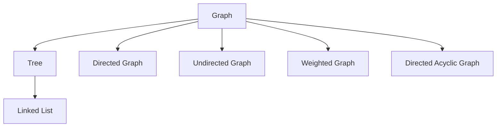

# Advantages and Limitations of Graph Data Structures

## Introduction

Graphs constitute a fundamental data structure in computer science, distinguished by their capacity to model pairwise relationships between entities. The versatility of graphs enables representation of diverse real-world systems including social networks, transportation infrastructure, communication networks, and dependency hierarchies. However, this expressive power introduces complexities in implementation, scalability, and algorithmic analysis that warrant careful consideration.

This document examines the advantages and disadvantages of graph data structures, with particular attention to performance characteristics, practical applications, and the ecosystem of tools that facilitate graph-based solutions in production environments.

## Advantages of Graph Data Structures

### Unparalleled Relational Modeling Capability

Graphs provide the most natural and intuitive abstraction for systems characterized by interconnected entities. Certain problem domains inherently require graph representations; alternative data structures cannot adequately capture the relational semantics.

**Key Domains Requiring Graph Structures:**

| Domain | Graph Representation |
|--------|---------------------|
| Social Networks | Users as vertices, friendships/follows as edges |
| Navigation Systems | Locations as vertices, roads as weighted edges |
| Dependency Resolution | Modules as vertices, dependencies as directed edges |
| Recommendation Engines | Users and items as vertices, interactions as edges |
| Network Topology | Devices as vertices, connections as edges |
| Knowledge Graphs | Concepts as vertices, semantic relationships as edges |

In these contexts, attempting to use linear or hierarchical structures would result in loss of critical relational information or excessive computational overhead to simulate graph-like behavior.

### Rich Algorithmic Ecosystem

Graphs support a mature and extensive collection of algorithms that address fundamental computational problems. These algorithms enable operations that are impractical or impossible with other data structures.

**Prominent Graph Algorithms:**

- **Shortest Path Algorithms:** Dijkstra's algorithm, Bellman-Ford algorithm, A* search
- **Traversal Algorithms:** Breadth-First Search (BFS), Depth-First Search (DFS)
- **Minimum Spanning Tree Algorithms:** Prim's algorithm, Kruskal's algorithm
- **Connectivity Analysis:** Strongly connected components, articulation points
- **Flow Network Algorithms:** Ford-Fulkerson method, Edmonds-Karp algorithm
- **Cycle Detection:** Topological sorting, union-find based approaches

These algorithms form the backbone of numerous applications, from GPS navigation systems computing optimal routes to social platforms identifying community structures and influential users.

### Flexible Abstraction Hierarchy

Graphs represent the most general form within the data structure hierarchy. This generality enables a unified framework for reasoning about diverse structures.



Every linked list is a tree, every tree is a graph. Understanding graphs therefore provides conceptual foundation for comprehending more restricted data structures.

### Multiple Representation Options

Graphs can be represented using various storage schemes, each optimized for different usage patterns. This flexibility allows developers to select representations that align with specific operational requirements.

| Representation | Advantages | Disadvantages |
|----------------|------------|---------------|
| Adjacency List | Space-efficient for sparse graphs, fast neighbor iteration | Slower edge existence queries |
| Adjacency Matrix | O(1) edge queries, simple implementation | O(V²) space regardless of density |
| Edge List | Minimal storage, ideal for edge-centric algorithms | Poor for connectivity queries |
| Incidence Matrix | Useful for certain graph theory applications | Rarely used in practical implementations |

## Disadvantages and Challenges

### Implementation Complexity

Building robust, production-grade graph data structures presents significant engineering challenges. The simplicity of basic graph implementations belies the complexity of handling edge cases, ensuring data integrity, and optimizing for scale.

**Sources of Complexity:**

- **Cycle Management:** Algorithms must guard against infinite loops during traversal of cyclic graphs.
- **Disconnected Components:** Many algorithms require special handling for graphs with multiple connected components.
- **Dynamic Modifications:** Adding or removing vertices and edges while maintaining consistency is non-trivial.
- **Memory Management:** Dense graphs can consume substantial memory, requiring careful allocation strategies.
- **Concurrent Access:** Graph structures with shared mutable state necessitate sophisticated synchronization mechanisms.

### Scalability Difficulties

Scaling graph-based systems to handle massive datasets demands substantial engineering resources and expertise. The interconnected nature of graphs complicates horizontal scaling strategies that work effectively for tabular or document-oriented data.

**Scaling Challenges:**

- **Graph Partitioning:** Distributing a graph across multiple machines while minimizing cross-partition edges is an NP-hard problem.
- **Distributed Traversal:** Algorithms like BFS and DFS require coordination across network boundaries, introducing latency and complexity.
- **Consistency Maintenance:** Ensuring eventual consistency in distributed graph databases requires careful trade-off analysis.
- **Query Optimization:** Graph queries that traverse multiple hops may exhibit exponential complexity without sophisticated optimization.

Large technology companies such as Google, Facebook, and Amazon invest considerable resources in building and maintaining proprietary graph infrastructure to address these scaling challenges.

### Performance Analysis Complexity

The performance characteristics of graph operations defy simple characterization due to the diversity of graph types and representations. Big O notation for graph algorithms often depends on multiple variables and graph properties.

**Factors Influencing Performance:**

| Factor | Impact |
|--------|--------|
| Graph Density | Sparse vs. dense graphs affect algorithm efficiency |
| Representation Choice | Adjacency list vs. matrix yields different operation costs |
| Graph Type | Directed, weighted, cyclic properties alter algorithmic behavior |
| Traversal Pattern | BFS vs. DFS exhibits different memory and runtime profiles |
| Graph Size | Vertex count (V) and edge count (E) jointly determine complexity |

### Learning Curve and Cognitive Overhead

Graph concepts require a mental shift from linear and hierarchical thinking to network-based reasoning. Students and practitioners often find graph algorithms more challenging to visualize, implement, and debug compared to operations on arrays or trees.

## Performance Considerations and Big O Analysis

The time and space complexity of graph operations varies significantly based on representation and graph characteristics. The following table summarizes typical complexities for fundamental operations.

### Adjacency List Representation

| Operation | Time Complexity | Space Complexity |
|-----------|-----------------|------------------|
| Add Vertex | O(1) | O(V) |
| Add Edge | O(1) | O(E) |
| Remove Vertex | O(V + E) | O(V + E) |
| Remove Edge | O(degree(v)) | O(V + E) |
| Query Edge Existence | O(degree(v)) | O(1) |
| Find All Neighbors | O(degree(v)) | O(1) |
| Graph Traversal (BFS/DFS) | O(V + E) | O(V) |

### Adjacency Matrix Representation

| Operation | Time Complexity | Space Complexity |
|-----------|-----------------|------------------|
| Add Vertex | O(V²) | O(V²) |
| Add Edge | O(1) | O(1) |
| Remove Vertex | O(V²) | O(V²) |
| Remove Edge | O(1) | O(1) |
| Query Edge Existence | O(1) | O(1) |
| Find All Neighbors | O(V) | O(1) |
| Graph Traversal (BFS/DFS) | O(V²) | O(V) |

### Algorithmic Complexity Examples

```javascript
/**
 * Demonstrates performance characteristics of common graph operations
 * using an adjacency list implementation.
 */
class GraphPerformanceDemo {
    constructor() {
        this.adjacencyList = new Map();
    }

    // O(1) - Constant time vertex addition
    addVertex(vertex) {
        if (!this.adjacencyList.has(vertex)) {
            this.adjacencyList.set(vertex, []);
        }
    }

    // O(1) - Constant time edge addition (assuming vertices exist)
    addEdge(vertex1, vertex2) {
        this.adjacencyList.get(vertex1).push(vertex2);
        this.adjacencyList.get(vertex2).push(vertex1);
    }

    // O(degree) - Linear in number of neighbors for existence check
    hasEdge(vertex1, vertex2) {
        return this.adjacencyList.get(vertex1).includes(vertex2);
    }

    // O(V + E) - Must process all vertices and edges during traversal
    breadthFirstSearch(startVertex) {
        const visited = new Set();
        const queue = [startVertex];
        const result = [];

        while (queue.length) {
            const current = queue.shift();
            if (!visited.has(current)) {
                visited.add(current);
                result.push(current);
                // Each edge considered once - contributes to O(E) component
                queue.push(...this.adjacencyList.get(current));
            }
        }
        return result; // O(V + E) total time complexity
    }
}
```

## Graph Databases and Production Tools

The challenges associated with building scalable graph infrastructure have led to the development of specialized graph database systems. These tools abstract away low-level implementation concerns and provide optimized storage, query, and traversal capabilities.

### Neo4j

Neo4j represents one of the most widely adopted native graph databases. It implements the labeled property graph model and provides the Cypher query language for expressive graph pattern matching.

**Key Features:**
- ACID compliance for transactional integrity
- High-performance traversal using index-free adjacency
- Declarative query language optimized for graph patterns
- Scalability through causal clustering and sharding

**Example Cypher Query:**
```cypher
// Find all friends of friends within 2 hops
MATCH (user:Person {name: 'Alice'})-[:FRIEND*1..2]-(friendOfFriend)
RETURN DISTINCT friendOfFriend.name
```

### Alternative Graph Database Solutions

| Database | Primary Use Case | Distinguishing Features |
|----------|------------------|-------------------------|
| Amazon Neptune | Cloud-native graph applications | Fully managed, supports both RDF and Property Graph |
| JanusGraph | Large-scale distributed graphs | Scalable to billions of vertices and edges |
| ArangoDB | Multi-model database | Combines graph, document, and key-value stores |
| OrientDB | Multi-model database | Supports both graph and document paradigms |
| TigerGraph | Real-time deep link analytics | Native parallel graph computation engine |

### When to Use Graph Databases

Graph databases offer compelling advantages when:

- The domain model is inherently connected with complex relationships
- Queries require traversal of multiple relationship hops
- The schema evolves frequently with new relationship types
- Real-time recommendations or pattern matching is required
- Data volume reaches scales where traditional JOIN operations become prohibitively expensive

For the majority of developers, leveraging existing graph database solutions provides a more practical approach than implementing custom graph infrastructure. These tools encapsulate decades of optimization research and production hardening.

## Summary

Graphs occupy a unique position in the data structure landscape, offering unparalleled expressiveness for relational modeling at the cost of increased implementation and scaling complexity.

### Summary of Pros and Cons

| Advantages | Disadvantages |
|------------|---------------|
| Natural representation of relational data | Implementation complexity |
| Rich algorithmic ecosystem | Scaling challenges |
| Flexible abstraction hierarchy | Complex performance analysis |
| Multiple representation options | Steep learning curve |
| Foundation for advanced analytics | Memory overhead for dense graphs |
| Mature tooling and database support | Distributed processing difficulties |

### Practical Guidance

For most software development scenarios, the following guidance applies:

- **Academic and Learning Contexts:** Implementing basic graph structures and algorithms provides valuable foundational knowledge.
- **Small to Medium Applications:** Custom graph implementations using adjacency lists suffice for limited-scale requirements.
- **Production Systems:** Leveraging established graph databases (Neo4j, Neptune, etc.) is strongly recommended.
- **Interview Preparation:** Understanding graph fundamentals, representation trade-offs, and basic traversal algorithms constitutes adequate preparation for most technical interviews.

The study of graphs represents a significant milestone in data structure education, bridging foundational concepts with advanced algorithmic techniques. While the practical implementation of production graph systems remains a specialized domain, the conceptual understanding of graph properties and behaviors enriches problem-solving capabilities across the breadth of computer science.