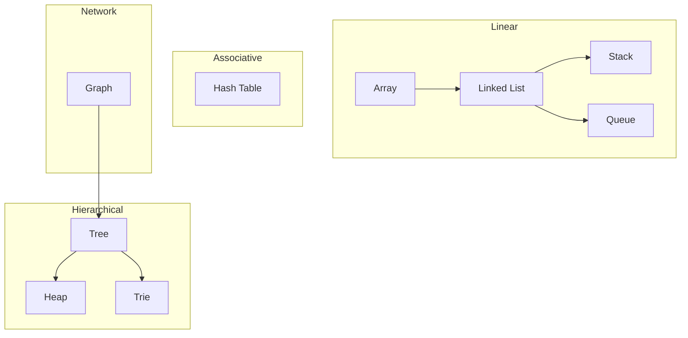

# Data Structures Section: Summary and Conclusion

## Introduction

The study of data structures constitutes a foundational pillar in computer science education, equipping engineers with the conceptual frameworks and practical tools necessary for efficient algorithm design and system implementation. This section has systematically examined the essential data structures that underpin modern software systems, progressing from fundamental linear structures to advanced non-linear organizations.

The journey through data structures transforms abstract computational concepts into tangible, applicable knowledge. Each structure presented offers distinct trade-offs in terms of memory utilization, access patterns, and operational complexity, enabling informed architectural decisions in software development.

## Comprehensive Review of Data Structures Covered

### Linear Data Structures

**Arrays**
Arrays provide contiguous memory allocation with constant-time indexed access. They serve as the primitive building block for numerous higher-level abstractions and algorithms.

**Linked Lists**
Linked lists organize elements through node-based references, enabling efficient insertions and deletions at the cost of direct positional access. Variants include singly linked, doubly linked, and circular linked lists.

**Stacks**
Stacks implement Last-In-First-Out (LIFO) semantics, finding application in function call management, expression evaluation, and undo mechanisms within software applications.

**Queues**
Queues enforce First-In-First-Out (FIFO) ordering, essential for task scheduling, breadth-first traversal, and buffering operations in concurrent systems.

### Hash-Based Structures

**Hash Tables**
Hash tables achieve average-case constant-time insertion, deletion, and lookup through key-value mapping using hash functions. Collision resolution strategies include chaining and open addressing techniques.

### Hierarchical Structures

**Trees**
Trees represent hierarchical relationships through parent-child associations. The section covered binary trees, binary search trees, AVL trees, red-black trees, and heap structures, each optimized for specific access and modification patterns.

**Trie (Prefix Tree)**
Tries provide efficient string storage and retrieval, commonly employed in autocomplete systems, spell checkers, and IP routing tables.

### Network Structures

**Graphs**
Graphs model pairwise relationships through vertices and edges. The coverage included directed versus undirected graphs, weighted versus unweighted edges, cyclic versus acyclic topologies, and representation strategies including adjacency lists, adjacency matrices, and edge lists.

## Visual Summary of Data Structure Relationships

This diagram illustrates the progressive complexity and relationships among data structures. Linear structures form the basis for stacks and queues. Trees extend linear concepts into branching hierarchies. Graphs represent the most general case, encompassing trees as a specialized subset.

## Real-World Manifestations of Data Structures

The principles learned throughout this section manifest ubiquitously across contemporary technology landscapes. Understanding these fundamentals demystifies complex systems and reveals the elegant simplicity underlying sophisticated applications.

### Blockchain Technology

Blockchain, a transformative distributed ledger technology, synthesizes multiple data structures covered in this curriculum:

| Component | Data Structure | Function |
|-----------|----------------|----------|
| Block Chain | Linked List | Sequential linking of blocks via hash pointers |
| Merkle Tree | Binary Tree | Efficient verification of transaction inclusion |
| Transaction Storage | Trie (Modified Patricia Trie) | Space-efficient state representation |
| Cryptographic Hashing | Hash Functions | Data integrity and proof-of-work mechanisms |
| Peer Network | Graph | Representation of node connectivity |

This composition demonstrates how fundamental data structures combine to create novel, powerful systems.

### Web Infrastructure

- **DNS Resolution:** Hierarchical tree structure for domain name delegation
- **Browser History:** Stack-based implementation for back/forward navigation
- **Event Loop:** Queue management for asynchronous task scheduling
- **DOM Representation:** Tree structure modeling HTML document hierarchy

### Database Systems

- **B-Trees and B+ Trees:** Index structures enabling efficient range queries
- **Hash Indexes:** Constant-time equality lookups in database engines
- **Graph Databases:** Relationship-centric storage for social and recommendation systems

### Operating Systems

- **Process Scheduling:** Priority queues for CPU time allocation
- **Memory Management:** Linked lists for free block tracking
- **File Systems:** Hierarchical tree structures for directory organization

## Overcoming Initial Intimidation

The visual complexity of certain data structures, particularly graphs and balanced trees, can provoke apprehension among learners. However, systematic decomposition reveals that these structures are built upon comprehensible primitives.

**Key Insights for Continued Growth:**

1. **Compositionality:** Complex structures arise from combining simpler ones with well-defined rules.
2. **Pattern Recognition:** Similar operations (insertion, deletion, traversal) recur across structures with context-specific variations.
3. **Abstraction Layers:** High-level understanding of behavior often suffices; implementation details can be referenced when needed.
4. **Incremental Mastery:** Proficiency develops through iterative exposure and practical application.

The emoji of apprehension at the section's commencement may now be replaced with confident familiarity.

## Practical Engineering Implications

The selection of an appropriate data structure profoundly influences software quality attributes:

| Consideration | Impact of Data Structure Choice |
|---------------|--------------------------------|
| Performance | Determines time complexity of critical operations |
| Memory Efficiency | Affects resource consumption and cache behavior |
| Scalability | Influences ability to handle growing data volumes |
| Maintainability | Impacts code clarity and modification ease |
| Correctness | Ensures appropriate invariants for problem domain |

Engineers equipped with data structure literacy make superior design decisions, anticipate performance bottlenecks, and communicate effectively with technical peers.

## Future Directions

The foundational knowledge acquired in this section enables exploration of advanced topics:

- **Algorithm Analysis:** Formal study of algorithmic complexity and optimization
- **Graph Algorithms:** Shortest path, minimum spanning tree, and network flow computations
- **Advanced Tree Structures:** Segment trees, Fenwick trees, and suffix trees
- **Concurrent Data Structures:** Thread-safe implementations for parallel execution
- **Persistent Data Structures:** Immutable versions supporting versioning and rollback

The forthcoming algorithms section will extend these data structure foundations, examining traversal strategies, searching techniques, and optimization methodologies applicable to both trees and graphs.

## Conclusion

The data structures section has systematically traversed the landscape of computational organization, from simple arrays to complex graphs. Each structure presented addresses specific access patterns and operational requirements, forming a toolkit for effective software engineering.

The initial apprehension often associated with these topics dissipates upon recognizing that all complex systems decompose into comprehensible components. Hash tables, arrays, linked lists, queues, stacks, graphs, and trees are not esoteric abstractions but practical instruments for modeling and manipulating information.

Contemporary and future technologies—blockchain, artificial intelligence, distributed systems, and beyond—will continue to leverage these fundamental building blocks. Mastery of data structures provides the conceptual foundation upon which novel innovations may be constructed.

The journey through data structures marks not an endpoint but a gateway to deeper computational understanding and more sophisticated problem-solving capabilities.