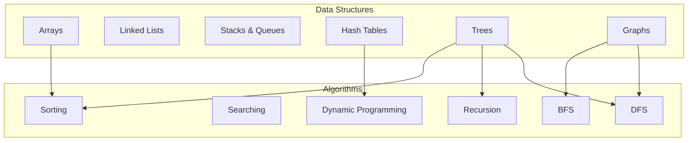

# Completion of Data Structures Section and Introduction to Algorithms

## Section Overview

The study of data structures forms the foundational bedrock upon which algorithmic thinking and efficient software design are constructed. This document marks the culmination of the comprehensive data structures curriculum and establishes the transition toward algorithmic analysis and implementation. The journey through data structures has equipped learners with the essential vocabulary and conceptual frameworks required to engage meaningfully with algorithmic problem-solving.

## Data Structures Covered

The following data structures have been examined in detail throughout this section, each accompanied by implementation exercises, performance analysis, and practical application contexts.

### Linear Data Structures

| Data Structure | Key Characteristics | Primary Operations |
|----------------|---------------------|-------------------|
| Arrays | Contiguous memory allocation, O(1) indexed access | Access, insertion, deletion, traversal |
| Linked Lists | Node-based dynamic allocation, O(1) insertion/deletion at ends | Traversal, insertion, deletion, reversal |
| Stacks | Last-In-First-Out (LIFO) discipline | Push, pop, peek, isEmpty |
| Queues | First-In-First-Out (FIFO) discipline | Enqueue, dequeue, front, isEmpty |

### Associative Data Structures

| Data Structure | Key Characteristics | Primary Operations |
|----------------|---------------------|-------------------|
| Hash Tables | Key-value mapping, average O(1) operations | Insert, lookup, delete, rehash |

### Hierarchical Data Structures

| Data Structure | Key Characteristics | Primary Operations |
|----------------|---------------------|-------------------|
| Binary Trees | Hierarchical structure with up to two children per node | Traversal (preorder, inorder, postorder), insertion, deletion |
| Binary Search Trees | Ordered binary tree enabling O(log n) average search | Search, insert, delete, successor, predecessor |
| AVL Trees | Self-balancing BST with strict height balance | Rotations, balanced insertion/deletion |
| Red-Black Trees | Self-balancing BST with color-based invariants | Rotations, color flips, balanced insertion/deletion |
| Heaps | Complete binary tree satisfying heap property | Insert, extract-max/min, heapify |
| Tries | Prefix tree for efficient string operations | Insert, search, startsWith, delete |

### Network Data Structures

| Data Structure | Key Characteristics | Primary Operations |
|----------------|---------------------|-------------------|
| Graphs | Vertices connected by edges, general relationship model | Add vertex, add edge, traversal, path finding |

### Graph Classification

The graph section covered multiple taxonomies:

- **Directed vs. Undirected:** Determines whether edges possess orientation
- **Weighted vs. Unweighted:** Determines whether edges carry numerical values
- **Cyclic vs. Acyclic:** Determines presence of closed traversal paths
- **Representation Methods:** Adjacency list, adjacency matrix, edge list

## Mind Map Visualization

The following diagram illustrates the hierarchical organization of data structures covered, along with the algorithmic topics that build upon them:

## Transition to Algorithms

The mastery of data structures provides the necessary context for engaging with algorithmic concepts. Algorithms are the procedural counterparts to data structures—they define the operations that manipulate, traverse, and transform stored information.

### Interdependence of Data Structures and Algorithms

The efficacy of an algorithm is intrinsically linked to the choice of underlying data structure. The following relationships illustrate this interdependence:

| Algorithmic Domain | Associated Data Structures | Application |
|--------------------|---------------------------|-------------|
| Sorting Algorithms | Arrays, Trees | Rearranging elements according to ordering criteria |
| Searching Algorithms | Arrays, Binary Search Trees, Hash Tables | Locating specific elements efficiently |
| Dynamic Programming | Arrays, Hash Tables (Memoization) | Solving optimization problems with overlapping subproblems |
| Graph Traversal (BFS/DFS) | Graphs, Trees, Queues, Stacks | Systematic visitation of vertices |
| Recursive Algorithms | Trees, Graphs, Stack (Call Stack) | Problem decomposition using self-reference |

### Upcoming Algorithmic Topics

The subsequent section will address the following algorithmic paradigms:

**Sorting Algorithms**
- Comparison-based sorting (Quick Sort, Merge Sort, Heap Sort)
- Non-comparison sorting (Counting Sort, Radix Sort)
- Performance analysis and stability considerations

**Searching Algorithms**
- Linear search and binary search
- Tree-based searching
- Hashing-based retrieval

**Graph and Tree Traversal**
- Breadth-First Search (BFS) using queue structures
- Depth-First Search (DFS) using stack or recursion
- Applications in pathfinding and connectivity analysis

**Dynamic Programming**
- Memoization techniques utilizing hash tables and arrays
- Tabulation methods for bottom-up computation
- Classic problems: Knapsack, Longest Common Subsequence, Matrix Chain Multiplication

**Recursion**
- Recursive problem decomposition
- Base case identification and induction
- Relationship with tree and graph traversal

## Synthesis of Knowledge

The data structures section has transformed abstract computational concepts into practical engineering tools. The progression from simple linear collections to complex networked structures mirrors the evolution of computational thinking.

### Key Takeaways

1. **Abstraction Hierarchy:** Every complex structure builds upon simpler primitives, enabling systematic understanding.

2. **Performance Awareness:** Time and space complexity analysis guides appropriate structure selection.

3. **Trade-off Recognition:** No single data structure is universally optimal; each excels in specific contexts.

4. **Implementation Competence:** Practical coding exercises reinforce theoretical understanding.

5. **Interview Preparedness:** Familiarity with fundamental structures constitutes essential interview knowledge.

## Conclusion

The completion of the data structures curriculum marks a significant milestone in computer science education. The foundational knowledge acquired—spanning arrays, linked lists, stacks, queues, hash tables, trees, and graphs—establishes the prerequisite understanding necessary for algorithmic exploration.

The upcoming algorithms section will leverage this foundation to examine the procedures that animate data structures, transforming static storage into dynamic computation. The interplay between data organization and algorithmic manipulation forms the essence of efficient software design.

The journey continues with the study of algorithms, where the structures mastered thus far become the stage upon which computational solutions are enacted.