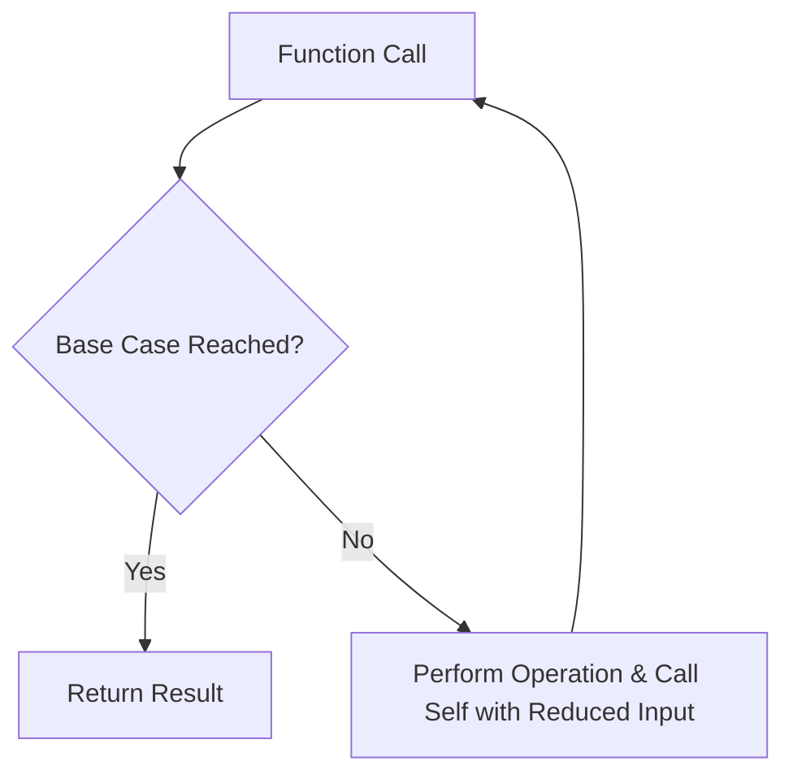

# Recursion: Fundamental Concept in Algorithm Design

## 1. Introduction

Recursion is a fundamental programming concept rather than a standalone algorithm. It serves as a powerful technique for solving problems by breaking them down into smaller, self-similar subproblems. Recursion is extensively utilized in the implementation of various algorithms, particularly those involving tree and graph traversal, searching, and sorting.

A recursive solution expresses a computation in terms of itself. While the initial definition may appear circular or abstract, recursion becomes intuitive when understood as a method for handling tasks composed of repetitive subtasks.

## 2. Definition and Core Principle

**Recursion** is defined as a process in which a function invokes itself, either directly or indirectly, to solve a problem. A recursive function typically consists of two essential components:

1. **Base Case**: A condition that terminates the recursion, preventing infinite self-calls.
2. **Recursive Case**: The portion of the function where it calls itself with a modified argument, moving progressively toward the base case.

Without a properly defined base case, recursive calls continue indefinitely, eventually leading to a stack overflow error.



## 3. Understanding Recursion Through Examples

### 3.1 File System Traversal

Consider the task of listing all files within a directory hierarchy. A non-recursive approach would require manual navigation into each subdirectory. A recursive solution, as implemented in commands like `ls -R` (Unix/Linux), automatically descends into each folder encountered and repeats the listing operation.

```
Desktop/
├── Project/
│   ├── controllers/
│   │   ├── userController.js
│   │   └── authController.js
│   └── database/
│       ├── migrations/
│       │   └── init.sql
│       └── schema.sql
└── Notes.txt
```

A recursive listing function processes the top-level directory, identifies subdirectories, and invokes itself on each subdirectory until all nested levels are exhausted.

### 3.2 Simple Recursive Function Structure

```javascript
// A basic recursive function that calls itself
function inception() {
    // Without a base case, this leads to infinite recursion
    inception(); // Recursive call
}

// Properly structured recursive function with base case
function countdown(n) {
    // Base Case: Stop when n reaches 0 or below
    if (n <= 0) {
        console.log("Done!");
        return;
    }
    
    // Recursive Case: Process current value and call with reduced argument
    console.log(n);
    countdown(n - 1); // Progress toward base case
}

// Example usage
countdown(5);
// Output: 5, 4, 3, 2, 1, Done!
```

## 4. The Call Stack and Recursion

Recursive function calls are managed using the **call stack**, a data structure that tracks active function invocations. Each recursive call pushes a new stack frame containing local variables and the return address. When the base case is reached, frames are popped sequentially, and execution resumes from the point of each call.

**Stack Overflow**: A runtime error occurring when the call stack exceeds its memory limit due to excessive recursion depth (e.g., missing or unreachable base case).

```javascript
// Factorial calculation demonstrates stack behavior
function factorial(n) {
    // Base Case: factorial of 0 or 1 is 1
    if (n <= 1) {
        return 1;
    }
    // Recursive Case: n * factorial(n-1)
    return n * factorial(n - 1);
}

/*
Call Stack for factorial(3):
---------------------------------
Step 1: factorial(3) calls factorial(2)
Step 2: factorial(2) calls factorial(1)
Step 3: factorial(1) returns 1
Step 4: factorial(2) returns 2 * 1 = 2
Step 5: factorial(3) returns 3 * 2 = 6
*/
```

## 5. Common Applications of Recursion

Recursion is particularly effective for problems that exhibit self-similarity or hierarchical structure.

### 5.1 Tree Traversal

Binary trees and general tree structures are naturally traversed using recursion. Each node's children are subtrees, making recursive descent a logical choice.

```javascript
// Node definition for a simple binary tree
class TreeNode {
    constructor(value) {
        this.value = value;
        this.left = null;
        this.right = null;
    }
}

// Recursive in-order traversal (Left, Root, Right)
function inOrderTraversal(node) {
    if (node === null) {
        return; // Base case: empty subtree
    }
    
    inOrderTraversal(node.left);   // Traverse left subtree
    console.log(node.value);       // Process current node
    inOrderTraversal(node.right);  // Traverse right subtree
}
```

### 5.2 Document Object Model (DOM) Traversal

In web development, the DOM is a tree structure representing HTML elements. Recursion enables comprehensive traversal and manipulation of nested elements.

```javascript
// Recursive function to find all elements with a specific tag
function findAllElementsByTag(rootElement, tagName) {
    let results = [];
    
    // Check current element
    if (rootElement.tagName === tagName.toUpperCase()) {
        results.push(rootElement);
    }
    
    // Recursively search child nodes
    for (let child of rootElement.children) {
        results = results.concat(findAllElementsByTag(child, tagName));
    }
    
    return results;
}
```

### 5.3 Searching and Sorting Algorithms

Many efficient algorithms rely on recursion, including:

- **Binary Search**: Recursively divides the search interval.
- **Merge Sort**: Recursively splits the array and merges sorted halves.
- **Quick Sort**: Recursively partitions the array around a pivot.

### 5.4 Nested Object Processing

JavaScript objects can contain other objects to arbitrary depths. Recursion simplifies operations on such nested structures.

```javascript
// Deep clone a nested object using recursion
function deepClone(obj) {
    // Base case: primitive values or null
    if (obj === null || typeof obj !== 'object') {
        return obj;
    }
    
    // Handle arrays separately
    if (Array.isArray(obj)) {
        return obj.map(item => deepClone(item));
    }
    
    // Recursive case: clone object properties
    const clonedObj = {};
    for (let key in obj) {
        if (obj.hasOwnProperty(key)) {
            clonedObj[key] = deepClone(obj[key]);
        }
    }
    return clonedObj;
}
```

## 6. Advantages and Considerations

### 6.1 Benefits

- **Elegance**: Recursive solutions often mirror the problem definition closely, resulting in cleaner, more readable code.
- **Simplifies Complex Problems**: Problems involving trees, graphs, and divide-and-conquer strategies become more manageable.
- **Reduced Code Size**: Recursion can eliminate the need for explicit stack management in iterative solutions.

### 6.2 Limitations

- **Performance Overhead**: Each recursive call consumes stack memory and incurs function call overhead.
- **Stack Overflow Risk**: Deep recursion may exhaust available stack space.
- **Debugging Complexity**: Tracing recursive calls can be more challenging than iterative loops.

### 6.3 When to Use Recursion

- The problem is defined recursively (e.g., tree traversal, factorial).
- The data structure is inherently recursive (e.g., linked lists, trees, graphs).
- Iterative solutions require explicit stack management and become cumbersome.

For performance-critical applications with large input sizes, tail recursion optimization (supported in some JavaScript engines) or converting recursion to iteration may be considered.

## 7. Summary

Recursion is a foundational technique that enables elegant solutions to problems characterized by repetitive subtasks and hierarchical structures. Mastery of recursion is essential for understanding advanced algorithms in searching, sorting, and data structure manipulation. Through consistent practice and careful attention to base cases, recursion transitions from an intimidating abstraction to an intuitive and indispensable tool in algorithmic problem-solving.