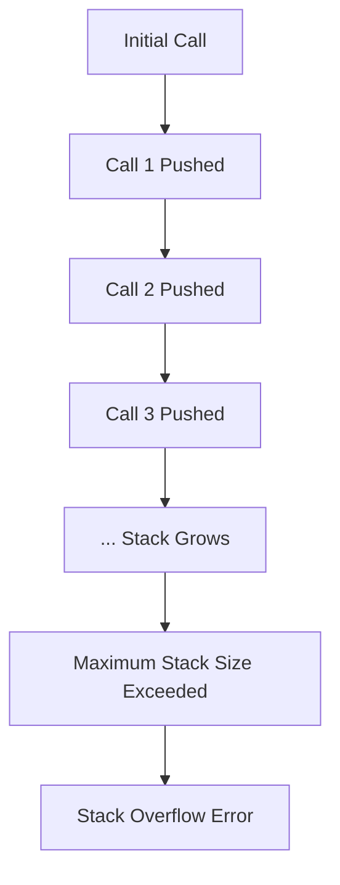

# Recursion: Stack Overflow and the Call Stack

## 1. Introduction

Recursion is a powerful programming technique wherein a function calls itself to solve progressively smaller instances of a problem. While recursion enables elegant solutions for tasks involving hierarchical or repetitive structures, it introduces specific challenges related to memory management and termination. The most prominent risk associated with recursion is **stack overflow**, a condition that arises when recursive calls continue indefinitely without a terminating condition.

## 2. The Call Stack Mechanism

The **call stack** is a data structure used by programming language runtimes to manage function invocations. It operates on the Last-In-First-Out (LIFO) principle, analogous to the stack abstract data type. Each time a function is called, a new **stack frame** is created and pushed onto the call stack. This frame contains:

- The function's local variables.
- The return address (the point in the code where execution resumes after the function completes).
- Any arguments passed to the function.

When a function completes its execution, its frame is **popped** from the stack, and control returns to the calling function.

### 2.1 Recursion and Stack Growth

In a recursive function, each self-invocation results in the allocation of a new stack frame. Since these calls are nested, the stack grows linearly with the depth of recursion.



## 3. Stack Overflow Explained

**Stack overflow** occurs when the call stack exceeds its allocated memory limit. In most runtime environments, the call stack has a finite size. When a recursive function lacks a proper termination condition, it invokes itself endlessly, pushing frames onto the stack until memory is exhausted. At this point, the runtime environment raises an error to prevent system instability or crash.

### 3.1 Example of Unbounded Recursion

Consider a function that calls itself unconditionally:

```javascript
function inception() {
    inception(); // Recursive call without base case
}

inception(); // Invocation triggers stack overflow
```

Execution of this code in a browser console results in an error message such as:

```
Uncaught RangeError: Maximum call stack size exceeded
```

This safeguard, implemented by modern JavaScript engines (e.g., V8 in Chrome), prevents the browser from crashing due to infinite recursion.

## 4. Visualizing Recursive Calls with Debugger Tools

Modern browsers provide developer tools that allow direct observation of the call stack during recursive execution. Using the `debugger` statement, one can pause execution and inspect stack frames incrementally.

```javascript
function inception() {
    debugger;      // Pauses execution at each invocation
    inception();   // Recursive call
}

inception();
```

Upon running this code in Chrome DevTools:

- Execution halts at the `debugger` statement.
- The **Call Stack** panel displays the current function invocation.
- Stepping over the recursive call (`inception()`) pushes a new frame onto the stack, replicating the same process.

Each step adds another `inception` frame to the stack, visually confirming the unbounded growth. Without a mechanism to pop frames, the stack ultimately overflows.

## 5. Consequences of Missing Base Case

### 5.1 Memory Exhaustion

The primary resource consumed during deep recursion is stack memory. Because each frame occupies space, infinite recursion consumes available memory entirely, leading to program termination or runtime errors.

### 5.2 Performance Overhead

Even when recursion terminates correctly, deep recursion imposes overhead due to the allocation and deallocation of numerous stack frames. This overhead can become significant for very deep recursive structures, making iterative solutions more efficient in certain contexts.

### 5.3 Necessity of a Base Case

To prevent stack overflow, every recursive function must include a **base case**—a condition under which the function returns a value without making a further recursive call. The base case ensures that the recursion depth is finite and that frames are eventually popped from the stack.

**Structure of a Well-Formed Recursive Function:**

```javascript
function recursiveFunction(input) {
    // Base Case: Condition to stop recursion
    if (terminationCondition(input)) {
        return baseValue;
    }
    
    // Recursive Case: Modify input and call self
    return recursiveFunction(modifiedInput);
}
```

## 6. Summary

Recursion relies on the call stack to manage nested function invocations. While this mechanism enables elegant solutions, it also introduces the risk of stack overflow when a base case is absent or unreachable. Understanding the call stack's behavior and the importance of termination conditions is essential for writing robust recursive algorithms. Properly implemented recursion with a well-defined base case avoids memory exhaustion and ensures predictable, correct program execution.