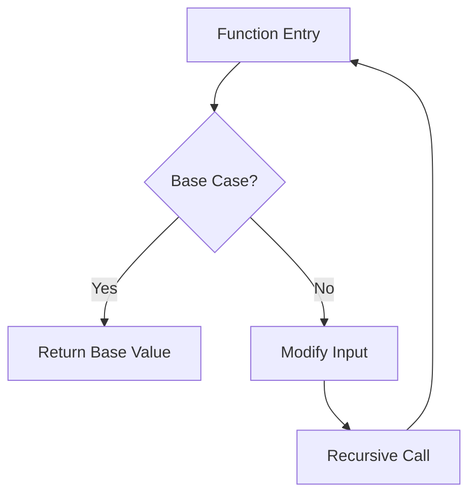

# Recursion: Base Case and Return Value Propagation

## 1. Introduction

A well-formed recursive function must include a termination condition to prevent infinite self-invocation and stack overflow. This condition is known as the **base case**. Without a base case, the recursive process continues indefinitely, exhausting system memory and resulting in a runtime error. The base case defines the simplest instance of the problem that can be solved directly without further recursion.

Equally important is the proper handling of return values as recursive calls unwind from the call stack. Failure to propagate return values through the chain of recursive invocations leads to unexpected results, typically `undefined` in JavaScript.

## 2. Base Case and Recursive Case

Every recursive function comprises two distinct paths:

- **Recursive Case**: The portion of the function that invokes itself with modified arguments, moving the computation closer to the base case.
- **Base Case**: The condition under which the function ceases recursive calls and returns a concrete value.

### 2.1 Conceptual Flow



### 2.2 Example with Counter-Based Termination

The following example demonstrates a recursive function with an explicit base case that limits the depth of recursion.

```javascript
let counter = 0;

function inception() {
    // Base Case: Stop recursion when counter exceeds threshold
    if (counter > 3) {
        return 'Done';
    }
    
    // Recursive Case: Increment counter and call self
    counter++;
    return inception();
}
```

**Analysis**:
- The base case condition `counter > 3` ensures that the function terminates after a finite number of calls.
- The `counter` variable is incremented before each recursive call, guaranteeing progress toward the base case.
- The `return inception()` statement passes the final result back up the call chain.

## 3. The Call Stack and Return Value Propagation

Understanding recursion requires familiarity with the call stack behavior during nested function invocations.

### 3.1 Stack Frame Creation and Destruction

Each recursive call pushes a new stack frame containing the function's execution context. When the base case is reached, the deepest frame returns a value and is popped. Control then returns to the previous frame, which may also return a value, continuing until the initial call resolves.

### 3.2 The Importance of Returning the Recursive Call

Consider a modified version of the previous function where the recursive call is not returned:

```javascript
function inceptionWithoutReturn() {
    if (counter > 3) {
        return 'Done';
    }
    counter++;
    inceptionWithoutReturn(); // No return statement
}
```

**Execution Outcome**:
- When `counter` reaches 4, the innermost call returns `'Done'`.
- This value is returned to its immediate caller, but that caller does not capture or return the value.
- Consequently, each unwinding frame returns `undefined` implicitly, and the original invocation yields `undefined`.

To ensure the desired value propagates to the top-level call, each recursive invocation must return the result of the subsequent call:

```javascript
return inception();
```

### 3.3 Visualizing Stack Unwinding with Return Propagation

```
Call inception()  [counter=0]
 |-- Call inception() [counter=1]
      |-- Call inception() [counter=2]
           |-- Call inception() [counter=3]
                |-- Call inception() [counter=4]
                     |-- Base case reached: return 'Done'
                |-- Return 'Done' upward
           |-- Return 'Done' upward
      |-- Return 'Done' upward
 |-- Return 'Done' upward
Result: 'Done'
```

Without the `return` before the recursive call, the upward arrows would carry `undefined` instead.

## 4. Rules for Constructing Recursive Functions

Effective recursive functions adhere to three fundamental rules:

1. **Identify the Base Case**: Determine the simplest input for which the answer is known without recursion. This condition stops the recursion.
2. **Identify the Recursive Case**: Define how the problem reduces toward the base case. Each recursive call should operate on a smaller or simpler input.
3. **Ensure Progress and Return Appropriately**:
   - Modify arguments such that the base case becomes reachable.
   - Return the result of the recursive call to propagate values correctly.
   - Both the base case and recursive case should include return statements where a value is expected.

## 5. Practical Debugging with Developer Tools

Modern browsers offer debugging facilities to inspect recursive call stacks. The `debugger` statement can be inserted to pause execution at each invocation, allowing step-by-step observation of:

- Stack frame accumulation.
- Variable state (via the Scope panel).
- Return value propagation during stack unwinding.

```javascript
function inceptionDebug() {
    debugger; // Execution pauses here
    if (counter > 3) {
        return 'Done';
    }
    counter++;
    return inceptionDebug();
}
```

Using the debugger confirms that without a `return` on the recursive call, the return value is lost as frames are popped.

## 6. Summary

- A **base case** is mandatory to prevent infinite recursion and stack overflow.
- Recursive functions alternate between recursive calls (reducing the problem) and the base case (providing a direct answer).
- Return values must be explicitly propagated up the call chain; otherwise, the top-level invocation receives `undefined`.
- Mastering recursion involves internalizing the call stack behavior and rigorously applying the three rules of recursive design.

Proper implementation of recursion enables elegant solutions for problems involving nested structures, divide-and-conquer strategies, and hierarchical data traversal.