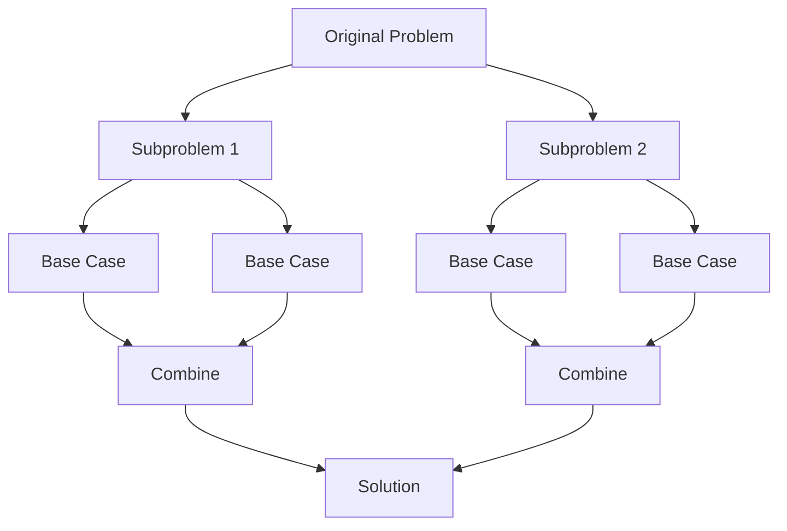

# Guidelines for Applying Recursion in Software Development

## 1. Introduction

While recursion and iteration are theoretically equivalent in computational power, practical software engineering demands a nuanced approach to selecting the appropriate technique. Recursion excels in specific problem domains where the structure of the data or the nature of the algorithm naturally lends itself to self-referential decomposition. This document establishes a systematic framework for identifying scenarios where recursion is not merely an alternative, but often the superior design choice.

## 2. Primary Use Cases for Recursion

Recursion is particularly advantageous in the following categories of problems:

### 2.1 Hierarchical Data Structure Traversal
When operating on data structures with inherent parent-child relationships or branching logic, recursion provides a clean and intuitive mechanism for navigation. Examples include:
- **Tree Data Structures**: Binary trees, N-ary trees, DOM (Document Object Model) trees.
- **Graph Traversal**: Depth-First Search (DFS) algorithms.
- **File System Navigation**: Directory structures with unknown depth.

### 2.2 Divide and Conquer Algorithms
Problems that can be recursively partitioned into smaller, independent subproblems of identical structure are prime candidates for recursive implementation. This category includes:
- Sorting algorithms: Merge Sort, Quick Sort.
- Searching algorithms: Binary Search.
- Mathematical computations: Factorial, Fibonacci sequence generation.

## 3. Identifying Recursive Problem Patterns

During technical interviews and system design, three specific characteristics indicate that a recursive solution should be strongly considered. These criteria serve as a heuristic for evaluating problem suitability.

### 3.1 Problem Decomposition into Self-Similar Subproblems
The problem must be divisible into smaller instances of the exact same problem. This is the foundational property of recursion.

- **Definition**: A problem `P(n)` can be expressed in terms of `P(k)` where `k < n`.
- **Example**: Calculating `n!` (factorial) relies on the relationship `n! = n * (n-1)!`. The calculation of `(n-1)!` is a smaller instance of the identical factorial problem.

### 3.2 Identical Nature of Subproblem Computations
The operations required to solve each subproblem are uniform and repetitive. The algorithm applies the same set of rules or transformations regardless of the size or position of the subproblem within the recursive tree.

- **Implication**: This uniformity allows a single function definition to handle the entire recursive descent.
- **Example**: In a binary tree traversal, the action of "visiting a node and then traversing its children" is identical whether the node is the root or a deep leaf.

### 3.3 Aggregation of Subproblem Solutions
The solutions to the smaller subproblems (the "leaf nodes" or base cases) can be combined through a defined operation to produce the solution for the original, larger problem.

- **Mechanism**: This is the "conquer" phase of divide-and-conquer.
- **Example**: In Merge Sort, two independently sorted sub-arrays are merged together to produce a fully sorted array. The base case (an array of size 1) is trivially sorted.

The following diagram illustrates the recursive decomposition of a problem into subproblems that eventually reach base cases, where the solutions are then combined upwards.



## 4. Recursion vs. Iteration in Tree Traversal

Tree traversal serves as an instructive case study contrasting the complexity of recursive and iterative implementations.

### 4.1 Recursive Traversal (Java Example)

The recursive approach to traversing a binary tree (in-order traversal) is concise and mirrors the structural definition of the tree.

```java
class Node {
    int data;
    Node left, right;
    Node(int item) {
        data = item;
        left = right = null;
    }
}

public class TreeTraversal {
    /**
     * Performs in-order traversal of a binary tree recursively.
     * Visits left subtree, then root, then right subtree.
     */
    public static void inOrderRecursive(Node node) {
        // Base case: if node is null, stop recursion
        if (node == null) {
            return;
        }
        // Recursive step: traverse left, process current, traverse right
        inOrderRecursive(node.left);
        System.out.print(node.data + " ");
        inOrderRecursive(node.right);
    }

    public static void main(String[] args) {
        // Construct a simple tree:      1
        //                             / \
        //                            2   3
        Node root = new Node(1);
        root.left = new Node(2);
        root.right = new Node(3);
        
        System.out.print("In-order Traversal: ");
        inOrderRecursive(root);
        // Output: 2 1 3
    }
}
```

### 4.2 Iterative Traversal Complexity

An iterative solution for the same in-order traversal requires explicit maintenance of a **Stack** data structure to simulate the call stack managed automatically by recursion. This introduces additional state management and increases code complexity significantly.

```java
import java.util.Stack;

public class TreeTraversalIterative {
    /**
     * Performs in-order traversal iteratively using an explicit stack.
     * This simulates the recursive call stack manually.
     */
    public static void inOrderIterative(Node root) {
        Stack<Node> stack = new Stack<>();
        Node current = root;
        
        // Continue while there are nodes to process or stack is not empty
        while (current != null || !stack.isEmpty()) {
            // Reach the leftmost node of the current subtree
            while (current != null) {
                stack.push(current);
                current = current.left;
            }
            // Current is null, pop from stack (backtrack)
            current = stack.pop();
            System.out.print(current.data + " ");
            
            // Move to the right subtree
            current = current.right;
        }
    }
}
```

**Analysis**: The recursive version directly reflects the mathematical definition of tree traversal, requiring minimal code and no manual stack manipulation. The iterative version, while avoiding function call overhead, demands careful management of a stack pointer, making it more error-prone and less readable.

## 5. Summary

Recursion is the preferred methodology when the problem domain exhibits hierarchical structure or can be cleanly decomposed into self-similar subproblems. The decision to use recursion should be guided by the presence of three key indicators: divisibility into smaller identical problems, uniform computation across subproblems, and the ability to aggregate results.

In contexts such as tree and graph traversal, recursion drastically reduces code complexity compared to iterative alternatives that require explicit stack management. Understanding these guidelines allows developers to leverage recursion effectively, producing code that is both maintainable and conceptually aligned with the underlying problem structure.