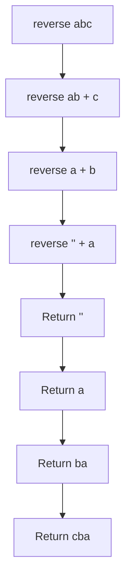

# Exercise: String Reversal Using Recursion

## 1. Problem Statement

**Task**: Implement a function that reverses a given string using a recursive approach.

**Input**: A string `str` of arbitrary length.

**Output**: A new string containing the characters of `str` in reverse order.

**Example**:
- Input: `"hello"` → Output: `"olleh"`
- Input: `"recursion"` → Output: `"noisrucer"`

This exercise demonstrates the application of recursive problem-solving to a linear data structure, illustrating how a problem can be decomposed into smaller, self-similar subproblems.

## 2. Problem Analysis

### 2.1 Identifying Recursive Characteristics

Applying the three criteria for recursive problem identification:

| Criterion | Application to String Reversal |
| :--- | :--- |
| **Divisible into smaller self-similar subproblems** | A string of length `n` can be reversed by taking the last character and appending the reversal of the remaining substring of length `n-1`. |
| **Identical nature of subproblem computations** | The operation "reverse a string" is identical regardless of the string's length. |
| **Solutions to subproblems combine to solve the original** | The result of reversing the substring combines with the extracted character to produce the complete reversed string. |

### 2.2 Recursive Formulation

The recursive definition for string reversal can be expressed as:

- **Base Case**: If the string is empty or contains a single character, return the string unchanged.
- **Recursive Step**: Return the last character concatenated with the reverse of the substring excluding the last character.

Mathematically:
```
reverse("") = ""
reverse("a") = "a"
reverse(str) = str.charAt(str.length() - 1) + reverse(str.substring(0, str.length() - 1))
```

### 2.3 Call Stack Visualization

The following diagram illustrates the recursive call stack for reversing the string `"abc"`:



## 3. Implementation

### 3.1 Recursive Solution (Java)

```java
public class StringReversal {
    
    /**
     * Reverses a string using recursion.
     * 
     * @param str The input string to be reversed
     * @return The reversed string
     */
    public static String reverseRecursive(String str) {
        // Base case: empty string or single character
        // An empty string or string of length 1 is already reversed
        if (str == null || str.length() <= 1) {
            return str;
        }
        
        // Recursive step:
        // 1. Extract the last character
        // 2. Recursively reverse the remaining substring (excluding last char)
        // 3. Concatenate last character with the reversed substring
        int lastIndex = str.length() - 1;
        char lastChar = str.charAt(lastIndex);
        String remainingSubstring = str.substring(0, lastIndex);
        
        return lastChar + reverseRecursive(remainingSubstring);
    }
    
    public static void main(String[] args) {
        String test1 = "hello";
        String test2 = "recursion";
        String test3 = "a";
        String test4 = "";
        
        System.out.println("Input: " + test1 + " → Output: " + reverseRecursive(test1));
        System.out.println("Input: " + test2 + " → Output: " + reverseRecursive(test2));
        System.out.println("Input: " + test3 + " → Output: " + reverseRecursive(test3));
        System.out.println("Input: " + test4 + " → Output: " + reverseRecursive(test4));
    }
}
```

**Sample Output**:
```
Input: hello → Output: olleh
Input: recursion → Output: noisrucer
Input: a → Output: a
Input:  → Output: 
```

### 3.2 Iterative Solution (Java) - For Comparison

```java
public class StringReversalIterative {
    
    /**
     * Reverses a string using iteration.
     * This approach uses a simple loop and avoids function call overhead.
     * 
     * @param str The input string to be reversed
     * @return The reversed string
     */
    public static String reverseIterative(String str) {
        if (str == null) {
            return null;
        }
        
        // Use StringBuilder for efficient string concatenation
        StringBuilder reversed = new StringBuilder();
        
        // Iterate from the end of the string to the beginning
        for (int i = str.length() - 1; i >= 0; i--) {
            reversed.append(str.charAt(i));
        }
        
        return reversed.toString();
    }
    
    public static void main(String[] args) {
        String test = "hello";
        System.out.println("Input: " + test + " → Output: " + reverseIterative(test));
        // Output: Input: hello → Output: olleh
    }
}
```

### 3.3 Comparative Analysis

| Aspect | Recursive Solution | Iterative Solution |
| :--- | :--- | :--- |
| **Code Length** | Concise, self-descriptive | Slightly more verbose |
| **Memory Usage** | Each recursive call adds a stack frame; O(n) space complexity | O(n) space for StringBuilder, but O(1) call stack overhead |
| **Time Complexity** | O(n) for substring operations | O(n) for single traversal |
| **Readability** | Matches mathematical definition closely | Straightforward loop logic |
| **Risk** | Stack overflow for very long strings (>10,000 characters) | No stack overflow risk |

## 4. Real-World Applications of Recursion

The string reversal exercise, while simple, illustrates a pattern applicable to more complex real-world scenarios. Recursion is extensively employed in production systems where hierarchical or nested data structures must be processed.

### 4.1 Directory Tree Traversal
File system operations require navigating directories of unknown depth. Recursive functions are ideal for tasks such as calculating total directory size, searching for files by pattern, or performing batch operations on nested folders【1†L5-L7】.

### 4.2 Parsing Nested Structures
Recursion is the standard approach for processing inherently recursive data formats:
- **JSON and XML Parsing**: Documents containing nested objects or elements are naturally traversed using recursive descent parsers.
- **Abstract Syntax Tree (AST) Evaluation**: Compilers and interpreters use recursion to evaluate expressions and execute code by walking the tree representation of source code【2†L3-L7】.

### 4.3 Graph and Tree Algorithms
Many fundamental computer science algorithms rely on recursion:
- **Depth-First Search (DFS)**: Used in pathfinding, cycle detection, and topological sorting.
- **Tree Traversals**: Pre-order, in-order, and post-order traversals for binary trees.
- **Backtracking Algorithms**: Solving puzzles such as Sudoku, N-Queens problem, or generating permutations and combinations【4†L1-L3】【5†L5-L7】.

### 4.4 Mathematical and Sorting Applications
- **Divide-and-Conquer Sorting**: Merge Sort and Quick Sort recursively partition arrays for efficient sorting.
- **Fractal Generation**: Graphics applications use recursion to generate self-similar patterns like the Koch snowflake or Sierpinski triangle.

## 5. Exercise Extensions

For further practice and deeper understanding, consider implementing the following variations:

1. **Reverse a String Using Two-Pointer Recursion**  
   Implement a recursive function that swaps characters from both ends of the string, moving inward until the pointers meet.

2. **Reverse a Sentence (Word Order)**  
   Given a sentence (e.g., `"Hello World"`), reverse the order of words using recursion to produce `"World Hello"`.

3. **Check Palindrome Using Recursion**  
   Write a recursive function that determines whether a given string is a palindrome (reads the same forward and backward).

4. **Reverse a Linked List Recursively**  
   Extend the concept to reverse a singly linked list using a recursive approach.

## 6. Summary

String reversal using recursion demonstrates the fundamental principles of recursive problem-solving: identifying a base case, decomposing the problem into a smaller self-similar subproblem, and combining results to form the solution. While the iterative approach may be more memory-efficient for this specific linear problem, the recursive implementation provides clarity and serves as an accessible introduction to recursion patterns that become essential when working with hierarchical data structures such as trees and graphs.

The ability to recognize problems that benefit from recursive solutions is a valuable skill in algorithm design and technical interviews.