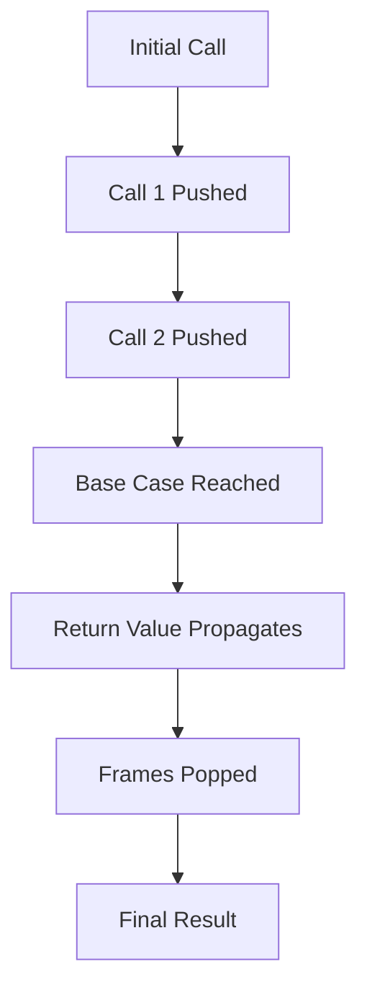

# Recursion vs Iteration: Trade-offs and Use Cases

## 1. Introduction

Recursion is a programming technique in which a function invokes itself to solve a problem by breaking it into smaller, self-similar subproblems. While recursion offers elegant solutions for certain classes of problems, it is not universally superior to iterative approaches. A comprehensive understanding of the trade-offs between recursion and iteration is essential for making informed design decisions in algorithm development.

## 2. Core Characteristics of Recursion

### 2.1 State Management Across Call Levels

Recursion inherently maintains state through the call stack. Each recursive invocation creates a new stack frame containing local variables and the execution context. This mechanism allows the function to "remember" intermediate values without explicit data structures, enabling concise solutions for problems with nested or hierarchical structure.

### 2.2 Call Stack Behavior

The call stack operates on a Last-In-First-Out (LIFO) principle. Recursive calls push frames onto the stack, and upon reaching a base case, frames are popped sequentially as return values propagate upward. This behavior can be visualized as a glass being filled with water (stack frames) and then emptied from the top down.

## 3. Risks and Limitations of Recursion

### 3.1 Stack Overflow

The most significant risk associated with recursion is stack overflow. Since each recursive call consumes stack memory, deep recursion can exhaust the available stack space, leading to a runtime error. Modern JavaScript engines enforce a maximum call stack size to prevent system crashes.

### 3.2 Space Complexity

Recursion incurs a space complexity proportional to the maximum depth of the call stack. For an input of size `n`, a recursive function may require O(n) auxiliary stack space, whereas an equivalent iterative solution often operates in O(1) space.

### 3.3 Performance Overhead

Function call overhead in recursion includes the cost of creating and destroying stack frames, which can make recursive implementations slower than their iterative counterparts for certain problems.

## 4. Comparison of Recursive and Iterative Approaches

| Aspect                | Recursion                                      | Iteration                              |
|-----------------------|------------------------------------------------|----------------------------------------|
| **State Management**  | Implicit via call stack                        | Explicit via loop variables            |
| **Code Readability**  | Often more declarative and closer to mathematical definition | May require manual stack management    |
| **Space Complexity**  | O(depth) due to call stack                     | Typically O(1) or O(n) with explicit structures |
| **Risk of Overflow**  | Present for deep recursion                     | None                                   |
| **Suitability**       | Problems with recursive structure (trees, graphs) | Linear or simple repetitive tasks      |

## 5. When to Use Recursion

Recursion is particularly advantageous in scenarios where the problem definition or data structure is inherently recursive. Common applications include:

- **Tree Traversal**: In-order, pre-order, and post-order traversals of binary trees.
- **Graph Traversal**: Depth-First Search (DFS) implementations.
- **Divide-and-Conquer Algorithms**: Merge Sort and Quick Sort rely on recursive partitioning.
- **Backtracking Problems**: Generating permutations, solving mazes, and constraint satisfaction.

In these contexts, recursive solutions often yield clearer, more maintainable code compared to iterative alternatives that require explicit stack management.

## 6. Principle of Equivalence

Any algorithm implemented using recursion can also be implemented iteratively, and vice versa. This principle stems from the fact that recursion is essentially a way of leveraging the call stack, which can be simulated explicitly using a stack data structure in an iterative loop.

**Example Transformation:**
- A recursive tree traversal can be converted to an iterative version by maintaining an explicit stack of nodes to visit.

The choice between recursion and iteration should be guided by considerations of readability, performance constraints, and the nature of the problem.

## 7. Recursion in Upcoming Algorithms

The following algorithms, which are central to this course, rely heavily on recursion:

- **Merge Sort**: Recursively divides the array and merges sorted subarrays.
- **Quick Sort**: Recursively partitions the array around a pivot element.
- **Tree Traversal**: Navigating binary search trees and general tree structures.
- **Graph Traversal**: Depth-First Search and related graph algorithms.

Mastery of recursion is therefore a prerequisite for understanding and implementing these fundamental algorithms effectively.

## 8. Decision Framework

When evaluating whether to use recursion for a given problem, consider the following guidelines:

1. **Does the problem exhibit self-similarity?** If the problem can be naturally divided into smaller, identical subproblems, recursion is often a good fit.
2. **What is the expected depth of recursion?** If the maximum depth is small or bounded, recursion is safe. For unbounded or very deep recursion, an iterative approach may be necessary to avoid stack overflow.
3. **Is code clarity a priority?** For complex recursive structures like trees and graphs, recursion typically yields more readable and maintainable code.
4. **Are there strict memory or performance constraints?** In resource-constrained environments, the overhead of recursion may warrant an iterative solution.

## 9. Summary

Recursion is a powerful and elegant technique that simplifies the implementation of algorithms operating on recursive data structures. However, it introduces trade-offs in terms of space complexity and the risk of stack overflow. A disciplined approach to recursion—ensuring a well-defined base case and managing return value propagation—mitigates many common pitfalls. While iteration remains the more performant and memory-efficient choice for linear problems, recursion is indispensable for tree, graph, and divide-and-conquer algorithms. Understanding both paradigms equips developers to select the most appropriate tool for each computational task.