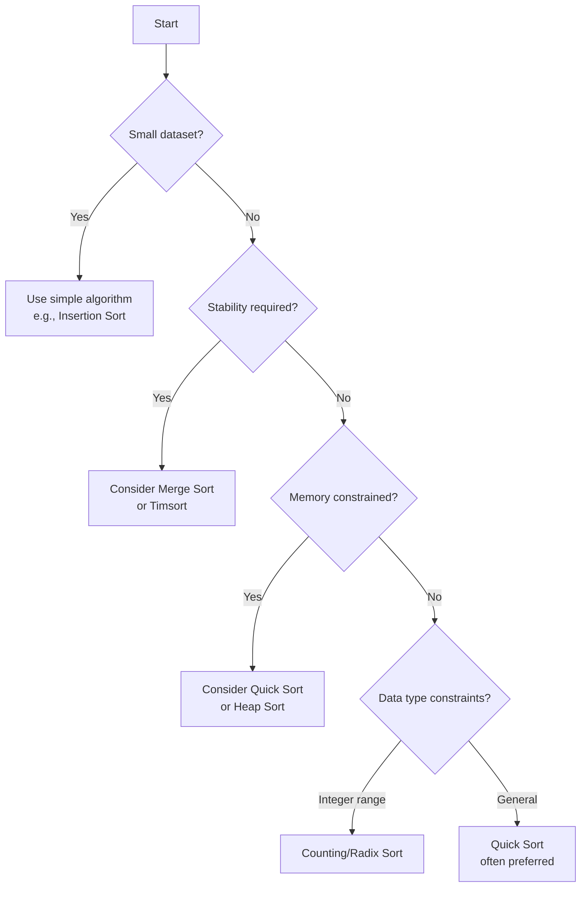

# Sorting Algorithms: Fundamentals and Significance

## 1. Introduction to Sorting

Sorting is the process of arranging data elements in a specific order, typically ascending or descending, based on a defined comparison criterion. It is one of the most fundamental operations in computer science and serves as a prerequisite for numerous other algorithms and data processing tasks. While modern programming languages provide built-in sorting functions that suffice for small datasets, a deeper understanding of sorting algorithms is essential for engineers working with large-scale systems where computational efficiency directly impacts operational costs and user experience.

## 2. The Critical Importance of Sorting in Computing

### 2.1 Limitations of Built-in Sort Functions

Most high-level programming languages offer convenient sorting methods. For instance, in Java, one can simply invoke `Arrays.sort()` or `Collections.sort()` to order a collection of elements:

```java
import java.util.Arrays;

public class SimpleSortExample {
    public static void main(String[] args) {
        char[] letters = {'a', 'd', 'x', 'z', 'e', 'r', 'b'};
        System.out.println("Before sorting: " + Arrays.toString(letters));
        
        // Built-in sorting method
        Arrays.sort(letters);
        
        System.out.println("After sorting: " + Arrays.toString(letters));
    }
}
```

**Output:**
```
Before sorting: [a, d, x, z, e, r, b]
After sorting: [a, b, d, e, r, x, z]
```

While this approach is perfectly adequate for small inputs, it becomes impractical when dealing with massive datasets characteristic of enterprise-level applications. Built-in sorting routines are implemented as general-purpose solutions and may not leverage specific properties of the data being processed.

### 2.2 Real-World Significance of Efficient Sorting

The impact of sorting algorithms extends far beyond academic exercises. Consider the following industry scenarios:

| Company | Sorting Application | Scale |
|---------|---------------------|-------|
| Google | Indexing and ranking search results, sorting news articles by timestamp | Billions of web pages |
| Amazon | Product categorization, price-based sorting, customer rating ordering | Millions of products |
| Apple | App Store listings, podcast episode ordering, media library organization | Global user base |
| Microsoft | Data center log analysis for incident detection and resolution | Worldwide infrastructure |
| Netflix | Content catalog arrangement by genre, release date, or personalized recommendations | Extensive media library |

In each case, inefficient sorting implementations would result in:
- Increased server processing time and energy consumption
- Higher infrastructure costs
- Degraded user experience due to latency
- Inability to meet real-time processing requirements

### 2.3 Preprocessing and Data Accessibility

Sorted data enables significantly faster subsequent operations. Binary search, for example, operates in **O(log n)** time on sorted arrays but degrades to **O(n)** linear search on unsorted data. Many algorithms and data structures—such as merge operations, set intersections, and B-tree indexing—presume or perform optimally with sorted inputs. Therefore, sorting is frequently employed as a preprocessing step to enhance overall system performance.

## 3. Foundational Concepts in Sorting Algorithms

### 3.1 Categories of Sorting Algorithms

Sorting algorithms are broadly classified based on their operational characteristics:

- **Comparison-based sorts:** Determine element order by comparing pairs of elements (e.g., Bubble Sort, Quick Sort, Merge Sort)
- **Non-comparison sorts:** Exploit specific properties of the data, such as integer ranges (e.g., Counting Sort, Radix Sort)

- **In-place sorts:** Require minimal additional memory beyond the input array (e.g., Quick Sort, Heap Sort)
- **Out-of-place sorts:** Utilize auxiliary data structures proportional to input size (e.g., Merge Sort)

- **Stable sorts:** Preserve the relative order of equal elements (e.g., Merge Sort, Insertion Sort)
- **Unstable sorts:** May alter the relative order of equal elements (e.g., Quick Sort, Heap Sort)

### 3.2 Evaluation Criteria

When selecting a sorting algorithm for a particular application, the following metrics must be considered:

1. **Time Complexity:** Expressed using Big O notation for best, average, and worst-case scenarios.
2. **Space Complexity:** The amount of additional memory required during execution.
3. **Stability:** Whether the original ordering of equivalent elements is maintained.
4. **Adaptability:** Efficiency improvement when processing partially sorted data.
5. **Implementation Complexity:** Practical considerations for development and maintenance.

## 4. Overview of Common Sorting Algorithms

This section introduces the sorting algorithms that will be examined in detail throughout the subsequent chapters. Each algorithm presents unique trade-offs that influence its suitability for different scenarios.

### 4.1 Elementary Sorting Algorithms

These algorithms are conceptually simple and suitable for educational purposes or very small datasets. However, their quadratic time complexity renders them impractical for large-scale applications.

| Algorithm | Time Complexity (Average) | Space Complexity | Stability |
|-----------|---------------------------|------------------|-----------|
| Bubble Sort | O(n²) | O(1) | Stable |
| Selection Sort | O(n²) | O(1) | Unstable |
| Insertion Sort | O(n²) | O(1) | Stable |

### 4.2 Efficient Comparison-Based Algorithms

These algorithms achieve significantly better average-case performance and form the foundation of most production sorting implementations.

| Algorithm | Time Complexity (Average) | Worst-Case | Space Complexity | Stability |
|-----------|---------------------------|------------|------------------|-----------|
| Merge Sort | O(n log n) | O(n log n) | O(n) | Stable |
| Quick Sort | O(n log n) | O(n²) | O(log n) | Unstable |
| Heap Sort | O(n log n) | O(n log n) | O(1) | Unstable |

### 4.3 Specialized Non-Comparison Algorithms

When the input data satisfies specific constraints, these algorithms can achieve linear time complexity, surpassing the theoretical lower bound of **Ω(n log n)** for comparison-based sorts.

| Algorithm | Time Complexity | Applicable Data Types |
|-----------|-----------------|----------------------|
| Counting Sort | O(n + k) | Integers with small range |
| Radix Sort | O(d · (n + b)) | Integers or fixed-length strings |
| Bucket Sort | O(n) average | Uniformly distributed data |

## 5. Decision Framework for Sorting Algorithm Selection

The choice of sorting algorithm should be guided by a systematic evaluation of the problem context. The following decision tree outlines a logical approach:



**Key Considerations:**

- **Small datasets (n < 50):** The constant factors of simple algorithms like Insertion Sort often outperform asymptotically superior methods.
- **Nearly sorted data:** Adaptive algorithms such as Insertion Sort or Timsort (used in Java and Python) demonstrate near-linear performance.
- **Stability requirements:** Essential when sorting objects by multiple keys (e.g., first by department, then by name).
- **Memory limitations:** In-place algorithms are necessary for embedded systems or environments with restricted heap space.

## 6. Conclusion

Sorting algorithms constitute a cornerstone of computer science education and professional software engineering practice. While the existence of built-in language functions may obscure their underlying complexity, a thorough understanding of sorting mechanisms empowers engineers to:

- Make informed architectural decisions that optimize resource utilization
- Recognize and exploit sorted input properties in algorithm design
- Perform effectively in technical interviews where sorting knowledge is frequently assessed

The subsequent chapters will provide in-depth analyses of individual sorting algorithms, complete with implementation examples, complexity derivations, and comparative benchmarks. Mastery of these concepts equips the practitioner with the analytical skills necessary to address the sorting challenges prevalent in modern computing environments.